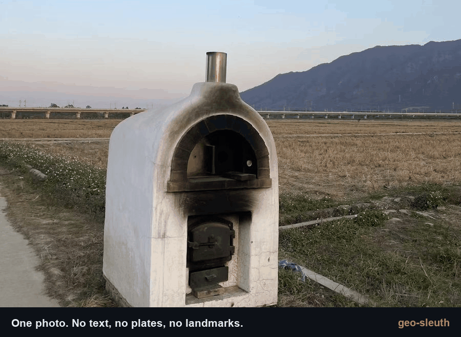
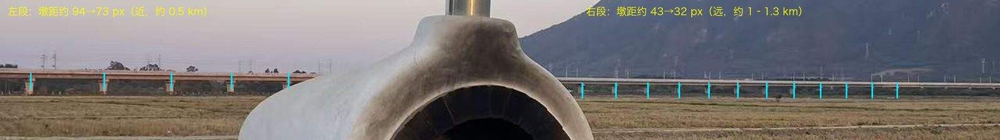
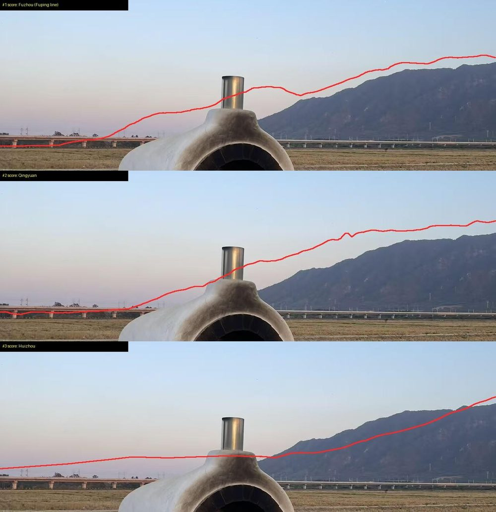
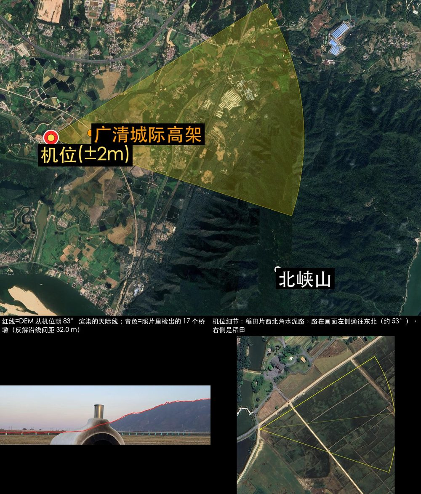
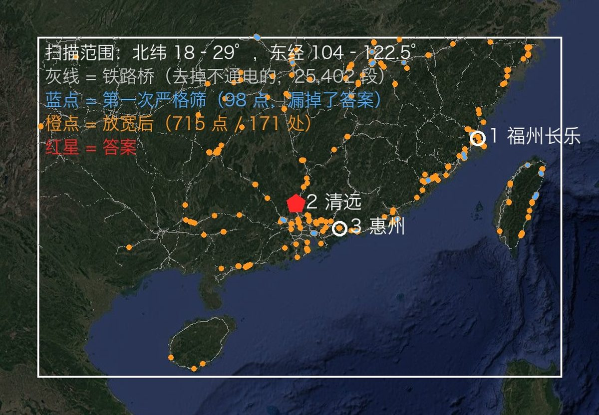
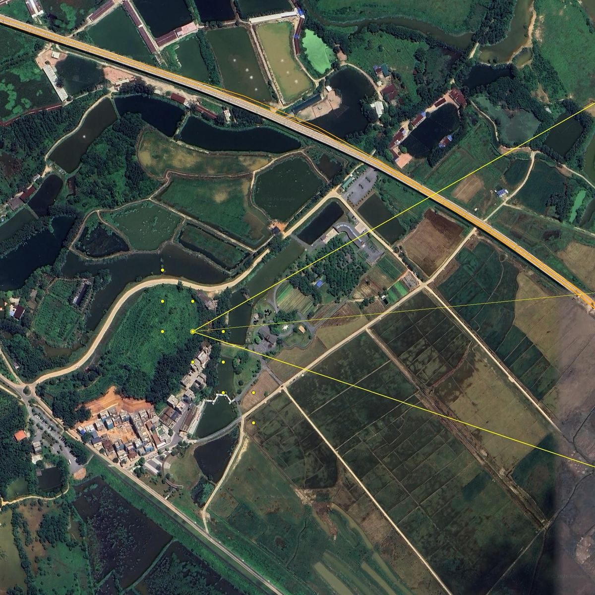
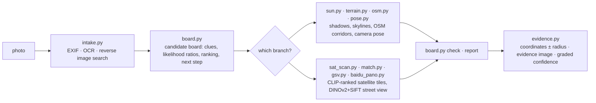

<div align="center">

# 🧭 geo-sleuth

**Ein Agent-Skill, der herausfindet, wo ein Foto aufgenommen wurde — und seinen Lösungsweg offenlegt.**

<p align="center">
  <a href="README.md"></a>
  <a href="README.zh-CN.md"></a>
  <a href="README.zh-TW.md"></a>
  <a href="README.ja.md"></a>
  <a href="README.ko.md"></a>
  <a href="README.es.md"></a>
  <a href="README.fr.md"></a>
  <a href="README.de.md"></a>
  <a href="README.ru.md"></a>
  <a href="README.pt-BR.md"></a>
</p>

<p align="center">
  <a href="LICENSE"></a>
  <a href="https://www.python.org/downloads/"></a>
  <a href="https://agentskills.io"></a>
  <a href="CONTRIBUTING.md"></a>
  <a href="https://github.com/Oldcircle/geo-sleuth/stargazers"></a>
</p>

<p align="center">
  <b>Funktioniert mit</b><br>
  <a href="https://code.claude.com/docs/en/skills"></a>
  <a href="https://developers.openai.com/codex/skills"></a>
  <a href="https://cursor.com/docs/skills"></a>
  <a href="https://geminicli.com/docs/cli/skills/"></a>
  <a href="https://opencode.ai/docs/skills/"></a>
  <a href="https://docs.github.com/en/copilot/concepts/agents/about-agent-skills"></a>
  <br><sub>…und mit jedem anderen Agenten, der <code>SKILL.md</code> liest und Shell-Befehle ausführt.</sub>
</p>



*Kein Text. Keine Kennzeichen. Keine Wahrzeichen. Eine Brücke, ein Berg. Auf 2 m genau lokalisiert.*

</div>

---

## Schnellstart

```bash
npx skills add Oldcircle/geo-sleuth
```

Bei der Nachfrage die gewünschten Agenten auswählen. Dann dem Agenten ein Foto geben und sagen:

> finde heraus, wo dieses Foto aufgenommen wurde

Das ist die gesamte Bedienung. Der Agent liest `SKILL.md`, führt die Skripte aus und liefert die Kameraposition, die Blickrichtung und ein Satellitenbild als Beleg. Den Ordner lieber selbst kopieren? Siehe [Installation](#installation).

## Warum geo-sleuth

- **Ein Foto, ein Satz.** Dem Agenten ein Foto geben und sagen: *finde heraus, wo dieses Foto aufgenommen wurde*. Zurück kommen die Kameraposition, die Blickrichtung und ein Satellitenbild als Beleg.
- **Funktioniert auch, wenn es nichts zu lesen gibt.** Kein Schild, kein Kennzeichen, kein Wahrzeichen: OpenStreetMap-Geometrie, Höhendaten, Satellitenkacheln und Street View tragen die Suche allein.
- **Geometrie statt Rätselraten.** Der Pfeilerabstand wird zum Entfernungsmaßstab, Schatten werden zur Peilung, eine Gratlinie wird zum Fingerabdruck, der mit Höhendaten abgeglichen werden kann.
- **Jede Behauptung verweist auf eine Datei.** Eine Schlussfolgerung muss den in der Sitzung ausgeführten Befehl und die von ihm erzeugte Datei benennen. Einwohnerzahl und Bekanntheit sind kein Beweis.
- **Skripte ranken, das Modell urteilt.** Zwanzig Skripte mit je einer Aufgabe suchen, bewerten und sortieren; das Modell wählt nur unter den besten wenigen.
- **Ein Skill für jeden Agenten.** Ein standardkonformer Agent Skill aus `SKILL.md` und schlichten Python-Skripten, sodass derselbe Ordner in Claude Code, Codex, Cursor, Gemini CLI, OpenCode und GitHub Copilot läuft.
- **Antworten tragen einen Fehlerradius.** Koordinaten ± Radius, die Blickrichtung der Kamera, ein Belegbild und eine abgestufte Konfidenz.

## Der Fall: ein Foto, nichts zu lesen

Ein Handyfoto ohne EXIF-Daten: ein weißer Ofen am Rand eines abgeernteten Reisfelds, im Hintergrund ein langes Viadukt, rechts ein steiler Berg. Kein einziges Schriftzeichen im Bild. Eine Nachricht an einen Agenten mit installiertem Skill, und zurück kamen die Kameraposition und die Blickrichtung der Kamera.

**Foto → 27,335 → 171 → 14,372 → 22 → 3 → 1 → ±2 m**

| Schritt | Was passiert ist | Verbleibende Kandidaten |
|---|---|---|
| **Foto lesen** | Die Masten auf dem Viadukt sind Oberleitungsmasten, also handelt es sich um eine elektrifizierte Bahnstrecke. Der Pfeilerabstand wurde als Maßstab genutzt (Spannweite 32 m, *angenommen*): Das linke Segment ist etwa 0.5 km entfernt, das rechte über 1 km. Ein steiler Berg in etwa 3 km Entfernung. Der Reis ist bereits geerntet, das Gras aber noch grün, also noch kein Frost. | Südchina, eine Vermutung, kein Beweis |
| **Regionsscan** | Alle Eisenbahnbrücken der Region aus OpenStreetMap gezogen: **27,335 Segmente**. Alle 400 m ein Punkt abgetastet und an jedem der 360°-Horizont aus Höhendaten berechnet. Behalten wurden Punkte mit flachem Gelände in der Nähe, einem klar erkennbaren Berg innerhalb weniger km und einem flachen Horizont direkt daneben. | **171 Standorte** |
| **Skyline-Anpassung** | An jedem Standort wurden Kandidaten-Kamerapositionen platziert und die von dort sichtbare Gratlinie gerendert: **14,372 Positionen**. Die Top 20 lagen innerhalb von 0.1° zueinander, also kam eine Bedingung hinzu: Die Brücke muss links nah und rechts fern sein. | **22** |
| **Overlay-Abgleich** | Die drei bestplatzierten Gratlinien wurden zurück auf das Foto gezeichnet. Platz 1 (Fuzhou) hatte eine Erhebung, die hinter dem Ofen versteckt war — deshalb die gute Bewertung. Platz 3 (Huizhou) verlief schräg, wo das Foto flach ist. Platz 2 (Qingyuan) passte vom Fuß des Bergs bis zum Bildrand. | **1** |
| **Pfeileranzahl** | 17 Pfeiler im Foto werden zu 17 Peilungen von der Kamera aus. Dort, wo sie die Bahnlinie treffen, müssen die Schnittpunkte gleichmäßig verteilt sein. Kombiniert mit der Skyline: zunächst ein Band von etwa 300 m Länge, dann ein einzelner Punkt. | **±2 m** |

<div align="center">
<br>
<sub>Pfeiler als Maßstab: weiter Abstand links bedeutet nah, enger Abstand rechts bedeutet fern.</sub><br><br>
 <br>
<sub>Links: die drei bestplatzierten Gratlinien, auf das Foto gezeichnet. Rechts: das vom Skill erzeugte Belegbild.</sub>
</div>

<details>
<summary>Weitere Abbildungen aus diesem Durchlauf</summary>
<br>
<br>
<sub>Regionsscan: alle Eisenbahnbrücken der Region (grau), Standorte, die den Horizonttest bestehen (orange).</sub><br><br>
<br>
<sub>Pfeileranzahl: Peilungen zu den 17 Pfeilern schneiden die Linie; nur eine Kameraposition ergibt gleichmäßige Abstände.</sub><br><br>
<sub>Der Durchlauf dauerte insgesamt etwa 72 Minuten, rund die Hälfte davon Wartezeit auf Berechnungen.</sub>
</details>

## Installation

geo-sleuth ist ein standardkonformer [Agent Skill](https://agentskills.io): ein Ordner mit `SKILL.md`, `scripts/`, `references/` und `data/`. Installieren lässt er sich mit der CLI [`skills`](https://github.com/vercel-labs/skills) oder durch einfaches Kopieren des Ordners.

**Alle sechs Agenten, benutzerweit, mit einem Befehl:**

```bash
npx skills add Oldcircle/geo-sleuth -g -a claude-code -a codex -a cursor -a gemini-cli -a opencode -a github-copilot -y
```

**Von Hand:**

```bash
git clone https://github.com/Oldcircle/geo-sleuth
mkdir -p ~/.agents/skills ~/.claude/skills
cp -r geo-sleuth/skills/geo-sleuth ~/.agents/skills/              # Codex, Cursor, Gemini CLI, OpenCode, GitHub Copilot
ln -s ~/.agents/skills/geo-sleuth ~/.claude/skills/geo-sleuth     # Claude Code
```

`~/.agents/skills/` wird von Codex, Cursor, Gemini CLI, OpenCode und GitHub Copilot gelesen, eine Kopie dort deckt also alle fünf ab. Die eigenen Ordner der einzelnen Agenten laut ihrer Dokumentation:

| Agent | Benutzerweit | Pro Projekt |
|---|---|---|
| [Claude Code](https://code.claude.com/docs/en/skills) | `~/.claude/skills/` | `.claude/skills/` |
| [Codex](https://developers.openai.com/codex/skills) | `~/.agents/skills/` | `.agents/skills/` |
| [Cursor](https://cursor.com/docs/skills) | `~/.cursor/skills/` oder `~/.agents/skills/` | `.cursor/skills/` oder `.agents/skills/` |
| [Gemini CLI](https://geminicli.com/docs/cli/skills/) | `~/.gemini/skills/` oder `~/.agents/skills/` | `.gemini/skills/` oder `.agents/skills/` |
| [OpenCode](https://opencode.ai/docs/skills/) | `~/.config/opencode/skills/` oder `~/.agents/skills/` | `.opencode/skills/` oder `.agents/skills/` |
| [GitHub Copilot](https://docs.github.com/en/copilot/concepts/agents/about-agent-skills) | `~/.copilot/skills/` oder `~/.agents/skills/` | `.github/skills/` oder `.agents/skills/` |

Jeder andere Agent, der `SKILL.md` liest und Shell-Befehle ausführt, funktioniert genauso: den Ordner dort ablegen, wo er nach Skills sucht.

## So funktioniert es

Die Arbeit ist in drei Schichten aufgeteilt. Skripte entscheiden, Skripte nehmen wahr und ranken, das Modell urteilt nur unter den besten wenigen.



| Schicht | Wer | Werkzeuge |
|---|---|---|
| **Entscheiden**: welche Kandidaten, wie Evidenz bewertet wird, was ausgeschlossen werden kann, wo als Nächstes gescannt wird | Skripte (das Kandidaten-Board) | `board.py` |
| **Wahrnehmen**: Text lesen, Tabellen nachschlagen, Ziele in Satellitenkacheln finden, Street View vergleichen | Skripte ranken zuerst, eine Person betrachtet die besten wenigen | `intake.py` `ocr.py` `clues.py` `sat_scan.py` `match.py` `geo.py` |
| **Urteilen**: Hinweise aus dem Bild ziehen, Hypothesen aufstellen, unter den gerankten wenigen wählen | das Modell | `SKILL.md` + `references/` |

Jede Schlussfolgerung muss auf einen Befehl verweisen, der tatsächlich in der Sitzung ausgeführt wurde, und auf die Datei, die er erzeugt hat. Ausschlüsse brauchen gelesene oder berechnete Evidenz; Beobachtungen und Vermutungen können das Gewicht eines Kandidaten nur senken.

## Werkzeugkasten

Zwanzig Skripte, je eine Aufgabe. Die vollständige Tabelle mit Datenquellen steht in `skills/geo-sleuth/references/data-sources.md`.

| Was es macht | Skript |
|---|---|
| EXIF: GPS, Aufnahmezeit, äquivalente Brennweite, Blickrichtung | `exif.py` |
| OCR auf dem gesamten Bild, gezoomten Ausschnitten und Kacheln (Apple Vision unter macOS, sonst RapidOCR) | `ocr.py` |
| Rückwärtsbildsuche auf Baidu und Yandex, ähnliche Bilder als nummeriertes Kachelblatt; Bildsuche per Stichwort | `revimg.py` |
| Schritte 0–3 in einem Befehl: Metadaten, Randausschnitte, Varianten, OCR, Rückwärtssuche → `intake.md` | `intake.py` |
| Zoom-Ausschnitte, Rand- und Eckausschnitte, Kachelung, Pixelspalten gleichmäßig verteilter Strukturen wie Pfeiler | `imgprep.py` |
| Nachschlagetabellen: Kennzeichenpräfixe, Vorwahlen für Festnetz, Ländervorwahlen, Fahrbahnseite, abhängige Gebiete, Verwaltungsgliederung | `clues.py` + `data/` |
| Kandidaten-Board: Kandidaten, Hinweise, Likelihood-Verhältnisse, Ausschluss, Ranking, Scan-Reihenfolge, Prüfungen vor dem Report | `board.py` |
| Gazetteer: Unterverwaltungseinheiten mit Begrenzungsrahmen auflisten, Ausdehnung bebauter Flächen | `gazetteer.py` |
| Orts-, Komplex- oder Ladenname → Koordinatenkandidaten, jeder Namensvetter aufgelistet | `poi.py` |
| Sonne und Schatten: Breitengradband, Tageszeit, Straßenausrichtung, Blickrichtung aus beleuchteten Fassaden, wahre Peilungen | `sun.py` |
| OSM Overpass: Merkmals-Kookkurrenz, Linie-zu-Punkt, Routenkorridore, Linienschnittpunkte, Straßenraster-Vorlagen | `osm.py` |
| Satellitenkachel-Mosaike, Markierungen, nummerierte Vorschaubilder-Blätter | `tiles.py` |
| CLIP-Zero-Shot-Bewertung von Satelliten-Rasterzellen oder Kandidatenpunkten (Bahnstrecken, Fabriken, Silos, Staudämme…) | `sat_scan.py` |
| Baidu-Panoramen / Google Street View: Punkte finden, Blickrichtungen rendern, Vorschaubilder-Blätter, historische Batches | `baidu_pano.py` `gsv.py` |
| Kandidaten-Bodenbilder gegen das Foto ranken: globale DINOv2-Ähnlichkeit + SIFT-Inlier | `match.py` |
| Höhendaten: synthetische Bergansichten, Skyline-Overlays, Profile; Scan linearer Strukturen × Gelände, Gratextraktion, Batch-Skyline-Bewertung | `terrain.py` |
| Kamerapose aus mehreren Punkten: Lat/Lon, Höhe, Blickrichtung, Nick-, Rollwinkel, mit Fehlerradius | `pose.py` |
| Peilungen, Entfernungen, Sichtlinien-Schnittpunkte, Fluchtlinien, Rahmen-/Verdeckungsprüfungen, Kameraposition aus gleichmäßig verteilten Strukturen | `geo.py` |
| Belegbild: Satellitenkachel + Kamera-Sichtfeld + Vergleichsraster | `evidence.py` |

Die drei Schritte aus dem obigen Fall (Regionsscan, Batch-Skyline-Bewertung, Kameraposition aus Pfeilerabstand) sind als Subkommandos in den Skill eingebaut: `terrain.py scan / ridge / fit`, `imgprep.py piers`, `geo.py spacing`. Die auf dieses Foto abgestimmten Fallskripte liegen zum Nachschlagen in `examples/rail-skyline-session/`.

## Benchmarks

Messungen je Operator:

| Skript | Test | Ergebnis |
|---|---|---|
| `match.py` | 8 Fälle: ein historisches Baidu-Panorama-Batch als Foto gerendert, Panoramen innerhalb von 150 m als Kandidaten (Shenzhen) | Ground Truth rangierte auf 1/2/4/1/1 und 5/1/6, alle in den Top 6, die Hälfte auf #1 |
| `sat_scan.py` | 4×8 km, 364 Zellen bei z17, 40 in OSM getaggte Laufbahnen als Ground Truth, multiskalig (Shenzhen) | recall@20 17/40, @30 22/40, @100 32/40, Median-Rang 23 |
| `terrain.py scan / fit` + `geo.py spacing` | begrenzter Re-Run auf dem obigen Fallfoto | wahrer Cluster rangiert auf #1, Endposition etwa 2 m von der Ground Truth entfernt |
| `clues.py` | 6 Tabellen, 9 Werte stichprobenartig geprüft | 9/9 korrekt |

Die Methode entstand aus der Analyse von 14 Videos von Online-Geolocation-Creators, 22 Rätseln und einer Reihe echter Durchläufe; was funktioniert, wurde in Regeln und Skripte übersetzt. v2 verlagert jede Regel, die sich als Code ausdrücken lässt, nach `board.py`, damit die Regeln ausgeführt und nicht nur gelesen werden.

## Voraussetzungen

Python 3.10+, [`uv`](https://docs.astral.sh/uv/) und ein Agent, der Shell-Befehle ausführen kann. Jedes Skript deklariert seine eigenen Abhängigkeiten, `uv run` installiert sie beim ersten Aufruf.

Optional: Google Chrome für die Rückwärtsbildsuche (`uvx playwright install chromium` geht auch) sowie `export GEO_PROXY=socks5h://127.0.0.1:<port>`, um alle Skripte mit Netzwerkzugriff über einen Proxy zu leiten.

## Roadmap

- [ ] Test auf Operator-Ebene mit synthetischen Geländefällen für `terrain.py scan / fit`
- [ ] Google Lens als dritte Rückwärtssuch-Engine
- [ ] CI unter Linux und Windows
- [ ] Ein öffentliches Blindtest-Set aus ungesehenen Fotos mit einer End-to-End-Genauigkeitszahl

## Mitwirken

Issues und Pull Requests sind willkommen, siehe [CONTRIBUTING.md](CONTRIBUTING.md). Am nützlichsten sind ein übertragbarer Hinweis für `references/clues/` (mit Quelle), eine neue Datenquelle mit ihrer Lizenz oder ein Durchlauf mit einem eigenen Foto, bei dem der Skill danebenlag, samt Grund.

## Star-Verlauf

<a href="https://star-history.com/#Oldcircle/geo-sleuth&Date">
  
</a>

## Danksagungen

- OpenStreetMap-Mitwirkende (ODbL). Dieses Repository enthält keine OSM-Daten; die Skripte fragen sie live ab. Beim Veröffentlichen von Abfrageergebnissen bitte © OpenStreetMap-Mitwirkende angeben.
- AWS Terrain Tiles (Terrarium-Höhendaten).
- [modood/Administrative-divisions-of-China](https://github.com/modood/Administrative-divisions-of-China).
- DINOv2 (Meta AI), CLIP (OpenAI).
- Quellen und Lizenzen für die Nachschlagetabellen stehen in `skills/geo-sleuth/data/README.md`.

## Lizenz

MIT, siehe [LICENSE](LICENSE). Tabellen in `data/`, die von Wikipedia abgeleitet sind, stehen unter CC BY-SA 4.0; siehe `skills/geo-sleuth/data/README.md`.

<sub>**Verantwortungsvolle Nutzung:** Nur auf eigene Fotos anwenden oder auf solche, für deren Analyse eine Erlaubnis vorliegt — niemals, um Menschen aufzuspüren, die nicht zugestimmt haben, gefunden zu werden.</sub>
