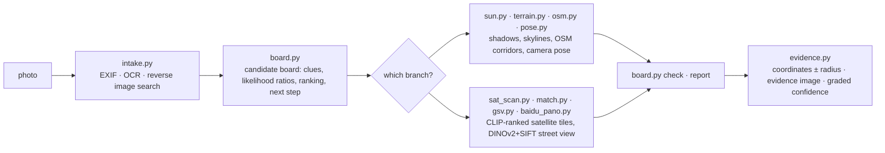

<div align="center">

# 🧭 geo-sleuth

**Una skill para agentes que encuentra dónde se tomó una foto — y muestra su razonamiento.**

<p align="center">
  <a href="README.md"></a>
  <a href="README.zh-CN.md"></a>
  <a href="README.zh-TW.md"></a>
  <a href="README.ja.md"></a>
  <a href="README.ko.md"></a>
  <a href="README.es.md"></a>
  <a href="README.fr.md"></a>
  <a href="README.de.md"></a>
  <a href="README.ru.md"></a>
  <a href="README.pt-BR.md"></a>
</p>

<p align="center">
  <a href="LICENSE"></a>
  <a href="https://www.python.org/downloads/"></a>
  <a href="https://agentskills.io"></a>
  <a href="CONTRIBUTING.md"></a>
  <a href="https://github.com/Oldcircle/geo-sleuth/stargazers"></a>
</p>

<p align="center">
  <b>Funciona con</b><br>
  <a href="https://code.claude.com/docs/en/skills"></a>
  <a href="https://developers.openai.com/codex/skills"></a>
  <a href="https://cursor.com/docs/skills"></a>
  <a href="https://geminicli.com/docs/cli/skills/"></a>
  <a href="https://opencode.ai/docs/skills/"></a>
  <a href="https://docs.github.com/en/copilot/concepts/agents/about-agent-skills"></a>
  <br><sub>…y con cualquier otro agente que lea <code>SKILL.md</code> y ejecute comandos de shell.</sub>
</p>


*Sin texto. Sin matrículas. Sin monumentos. Un puente, una montaña. Localizado con un margen de 2 m.*

</div>

---

## Inicio rápido

```bash
npx skills add Oldcircle/geo-sleuth
```

Elegir los agentes cuando el instalador lo pida. Después, pasarle una foto al agente y decir:

> encuentra dónde se tomó esta foto

Esa es toda la interfaz. El agente lee `SKILL.md`, ejecuta los scripts y devuelve la posición de la cámara, la dirección hacia la que apuntaba y una imagen satelital de evidencia. Para copiar la carpeta a mano, ver [Instalación](#instalación).

## Por qué geo-sleuth

- **Una foto, una frase.** Pasarle una foto al agente y decir *encuentra dónde se tomó esta foto*. El resultado: la posición de la cámara, la dirección hacia la que apuntaba y una imagen satelital de evidencia.
- **Funciona cuando no hay nada que leer.** Sin carteles, sin matrículas, sin monumentos: la geometría de OpenStreetMap, los datos de elevación, las teselas satelitales y las vistas de calle llevan la búsqueda por sí solos.
- **Geometría en vez de conjeturas.** El espaciado entre pilares se convierte en una regla de distancia, las sombras se convierten en un rumbo, una línea de cresta se convierte en una huella que puede compararse con los datos de elevación.
- **Cada afirmación señala un archivo.** Una conclusión debe nombrar el comando que se ejecutó en la sesión y el archivo que produjo. La población y la fama no son evidencia.
- **Los scripts clasifican, el modelo juzga.** Veinte scripts de propósito único buscan, puntúan y ordenan; el modelo solo elige entre los primeros de la lista.
- **Una skill, todos los agentes.** Una Agent Skill estándar — `SKILL.md` más scripts de Python normales — así que la misma carpeta funciona en Claude Code, Codex, Cursor, Gemini CLI, OpenCode y GitHub Copilot.
- **Las respuestas incluyen un radio de error.** Coordenadas ± radio, el rumbo de la cámara, una imagen de evidencia y un nivel de confianza graduado.

## El caso: una foto, nada que leer

Una foto de teléfono con el EXIF eliminado: un horno blanco al borde de un arrozal ya cosechado, un viaducto largo a lo lejos, una montaña escarpada a la derecha. Ni un solo carácter en el encuadre. Un mensaje a un agente con esta skill instalada, y devolvió la posición de la cámara y la dirección hacia la que apuntaba.

**foto → 27,335 → 171 → 14,372 → 22 → 3 → 1 → ±2 m**

| Paso | Qué hizo | Candidatos restantes |
|---|---|---|
| **Leer la foto** | Los postes del viaducto son mástiles de catenaria, así que es un ferrocarril electrificado. Espaciado de pilares usado como regla (vano de 32 m *asumido*): el segmento izquierdo está a unos 0.5 km, el derecho a más de 1 km. Una montaña escarpada a unos 3 km. Arroz cosechado pero la hierba aún verde, así que todavía no ha helado. | el sur de China, como apuesta, no como prueba |
| **Escaneo regional** | Extrajo todos los puentes ferroviarios de la región desde OpenStreetMap: **27,335 segmentos**. Muestreó un punto cada 400 m y calculó el horizonte de 360° a partir de datos de elevación en cada uno. Conservó los puntos con terreno plano cerca, una montaña despejada a pocos km y un horizonte plano junto a ella. | **171 sitios** |
| **Ajuste de la línea de horizonte** | Colocó posiciones candidatas de cámara alrededor de cada sitio y renderizó la línea de cresta vista desde cada una: **14,372 posiciones**. Las 20 mejores estaban a menos de 0.1° entre sí, así que se añadió una restricción: el puente debe estar cerca a la izquierda y lejos a la derecha. | **22** |
| **Comprobación de superposición** | Dibujó las tres mejores líneas de cresta de nuevo sobre la foto. El #1 (Fuzhou) tenía una protuberancia oculta detrás del horno, por eso puntuó bien. El #3 (Huizhou) tenía pendiente donde la foto es plana. El #2 (Qingyuan) encajaba desde la base de la montaña hasta el borde del encuadre. | **1** |
| **Conteo de pilares** | 17 pilares en la foto se convierten en 17 rumbos desde la cámara. Donde inciden en la línea ferroviaria, las intersecciones deben estar espaciadas de forma uniforme. Combinado con la línea de horizonte: primero una franja de unos 300 m de largo, luego un único punto. | **±2 m** |

<div align="center">
<br>
<sub>Los pilares como regla: espaciado ancho a la izquierda significa cerca, espaciado estrecho a la derecha significa lejos.</sub><br><br>
 <br>
<sub>Izquierda: las tres mejores líneas de cresta dibujadas sobre la foto. Derecha: la imagen de evidencia que produjo la skill.</sub>
</div>

<details>
<summary>Más figuras de esta ejecución</summary>
<br>
<br>
<sub>Escaneo regional: todos los puentes ferroviarios de la región (gris), sitios que pasan la prueba del horizonte (naranja).</sub><br><br>
<br>
<sub>Conteo de pilares: los rumbos hacia los 17 pilares cruzan la línea; solo una posición de cámara hace que el espaciado sea uniforme.</sub><br><br>
<sub>La ejecución tardó unos 72 minutos de principio a fin, aproximadamente la mitad esperando cómputo.</sub>
</details>

## Instalación

geo-sleuth es una [Agent Skill](https://agentskills.io) estándar: una sola carpeta que contiene `SKILL.md`, `scripts/`, `references/` y `data/`. Se instala con la CLI [`skills`](https://github.com/vercel-labs/skills) o copiando la carpeta a mano.

**Los seis agentes, a nivel de usuario, con un solo comando:**

```bash
npx skills add Oldcircle/geo-sleuth -g -a claude-code -a codex -a cursor -a gemini-cli -a opencode -a github-copilot -y
```

**A mano:**

```bash
git clone https://github.com/Oldcircle/geo-sleuth
mkdir -p ~/.agents/skills ~/.claude/skills
cp -r geo-sleuth/skills/geo-sleuth ~/.agents/skills/              # Codex, Cursor, Gemini CLI, OpenCode, GitHub Copilot
ln -s ~/.agents/skills/geo-sleuth ~/.claude/skills/geo-sleuth     # Claude Code
```

Codex, Cursor, Gemini CLI, OpenCode y GitHub Copilot leen `~/.agents/skills/`, así que una sola copia ahí sirve para los cinco. Las carpetas propias de cada agente, según su documentación:

| Agente | A nivel de usuario | Por proyecto |
|---|---|---|
| [Claude Code](https://code.claude.com/docs/en/skills) | `~/.claude/skills/` | `.claude/skills/` |
| [Codex](https://developers.openai.com/codex/skills) | `~/.agents/skills/` | `.agents/skills/` |
| [Cursor](https://cursor.com/docs/skills) | `~/.cursor/skills/` o `~/.agents/skills/` | `.cursor/skills/` o `.agents/skills/` |
| [Gemini CLI](https://geminicli.com/docs/cli/skills/) | `~/.gemini/skills/` o `~/.agents/skills/` | `.gemini/skills/` o `.agents/skills/` |
| [OpenCode](https://opencode.ai/docs/skills/) | `~/.config/opencode/skills/` o `~/.agents/skills/` | `.opencode/skills/` o `.agents/skills/` |
| [GitHub Copilot](https://docs.github.com/en/copilot/concepts/agents/about-agent-skills) | `~/.copilot/skills/` o `~/.agents/skills/` | `.github/skills/` o `.agents/skills/` |

Cualquier otro agente que lea `SKILL.md` y ejecute comandos de shell funciona igual: basta con poner la carpeta donde ese agente busca sus skills.

## Cómo funciona

El trabajo se divide en tres capas. Los scripts deciden, los scripts perciben y clasifican, el modelo solo juzga entre los primeros de la lista.



| Capa | Quién | Herramientas |
|---|---|---|
| **Decide**: qué candidatos, cómo puntúa la evidencia, qué se puede excluir, dónde escanear a continuación | scripts (el tablero de candidatos) | `board.py` |
| **Percibe**: lee texto, consulta tablas, encuentra objetivos en teselas satelitales, compara vistas de calle | los scripts clasifican primero, una persona revisa los primeros | `intake.py` `ocr.py` `clues.py` `sat_scan.py` `match.py` `geo.py` |
| **Juzga**: extrae pistas del encuadre, propone hipótesis, elige entre los primeros clasificados | el modelo | `SKILL.md` + `references/` |

Cada conclusión debe señalar un comando que realmente se ejecutó en la sesión y el archivo que produjo. Las exclusiones necesitan evidencia leída o calculada; las observaciones y conjeturas solo pueden reducir el peso de un candidato.

## Caja de herramientas

Veinte scripts, una tarea cada uno. La tabla completa con las fuentes de datos está en `skills/geo-sleuth/references/data-sources.md`.

| Qué hace | Script |
|---|---|
| EXIF: GPS, hora de captura, distancia focal equivalente, rumbo | `exif.py` |
| OCR sobre la imagen completa, recortes ampliados y teselas (Apple Vision en macOS, RapidOCR en el resto) | `ocr.py` |
| Búsqueda inversa de imágenes en Baidu y Yandex, imágenes similares dispuestas en una hoja numerada; búsqueda de imágenes por palabra clave | `revimg.py` |
| Pasos 0–3 en un solo comando: metadatos, recortes de borde, variantes, OCR, búsqueda inversa → `intake.md` | `intake.py` |
| Recortes con zoom, recortes de bordes y esquinas, mosaico, columnas de píxeles de estructuras espaciadas de forma uniforme como los pilares | `imgprep.py` |
| Tablas de consulta: prefijos de matrícula, códigos de área de línea fija, códigos de llamada, lado de conducción, territorios dependientes, divisiones administrativas | `clues.py` + `data/` |
| Tablero de candidatos: candidatos, pistas, razones de verosimilitud, exclusión, clasificación, orden de escaneo, comprobaciones previas al informe | `board.py` |
| Nomenclátor: enumera subdivisiones con cajas delimitadoras, extensión del área urbanizada | `gazetteer.py` |
| Nombre de lugar, urbanización o comercio → candidatos de coordenadas, se enumeran todos los homónimos | `poi.py` |
| Sol y sombras: franja de latitud, hora del día, orientación de la calle, rumbo a partir de las caras iluminadas, rumbos verdaderos | `sun.py` |
| OSM Overpass: coocurrencia de elementos, de línea a punto, corredores de ruta, intersecciones de líneas, plantillas de trama de calles | `osm.py` |
| Mosaicos de teselas satelitales, marcadores, hojas de miniaturas numeradas | `tiles.py` |
| Puntuación zero-shot con CLIP de celdas de la cuadrícula satelital o puntos candidatos (pistas, fábricas, silos, presas…) | `sat_scan.py` |
| Panoramas de Baidu / Google Street View: localiza puntos, renderiza rumbos, hojas de miniaturas, lotes históricos | `baidu_pano.py` `gsv.py` |
| Clasifica imágenes candidatas a nivel de calle frente a la foto: similitud global DINOv2 + inliers SIFT | `match.py` |
| Elevación: vistas sintéticas de montañas, superposiciones de línea de horizonte, perfiles; escaneo de elemento lineal × terreno, extracción de línea de cresta, puntuación por lotes de la línea de horizonte | `terrain.py` |
| Pose de cámara multipunto: lat/lon, altura, rumbo, cabeceo, alabeo, con radio de error | `pose.py` |
| Rumbos, distancias, intersecciones de línea de visión, líneas de alineación, comprobaciones de encuadre/oclusión, posición de cámara a partir de estructuras espaciadas de forma uniforme | `geo.py` |
| Imagen de evidencia: tesela satelital + abanico de cámara + cuadrícula comparativa | `evidence.py` |

Los tres pasos del caso anterior (escaneo regional, puntuación por lotes de la línea de horizonte, posición de cámara a partir del espaciado de pilares) vienen integrados en el skill como subcomandos: `terrain.py scan / ridge / fit`, `imgprep.py piers`, `geo.py spacing`. Los scripts del caso, ajustados a esa foto, están en `examples/rail-skyline-session/` como referencia.

## Evaluación

Mediciones por operador:

| Script | Prueba | Resultado |
|---|---|---|
| `match.py` | 8 casos: un lote histórico de panoramas de Baidu renderizado como la foto, panoramas a menos de 150 m como candidatos (Shenzhen) | la verdad de referencia se clasificó en 1/2/4/1/1 y 5/1/6, todos entre los 6 primeros, la mitad en el #1 |
| `sat_scan.py` | 4×8 km, 364 celdas en z17, 40 pistas de atletismo etiquetadas en OSM como verdad de referencia, multiescala (Shenzhen) | recall@20 17/40, @30 22/40, @100 32/40, rango mediano 23 |
| `terrain.py scan / fit` + `geo.py spacing` | reejecución acotada sobre la foto del caso anterior | el grupo correcto se clasifica en el #1, posición final a unos 2 m de la ubicación real |
| `clues.py` | 6 tablas, 9 valores verificados puntualmente | 9/9 correctos |

El método surge de descomponer 14 videos de creadores de geolocalización en línea, 22 acertijos y una serie de ejecuciones reales, y de convertir en reglas y scripts lo que funciona. La v2 traslada a `board.py` toda regla que pueda convertirse en código, para que las reglas se ejecuten y no solo se lean.

## Requisitos

Python 3.10+, [`uv`](https://docs.astral.sh/uv/) y un agente capaz de ejecutar comandos de shell. Cada script declara sus propias dependencias y `uv run` las instala en el primer uso.

Opcional: Google Chrome para la búsqueda inversa de imágenes (también sirve `uvx playwright install chromium`) y `export GEO_PROXY=socks5h://127.0.0.1:<port>` para que todos los scripts que acceden a la red pasen por un proxy.

## Hoja de ruta

- [ ] Prueba a nivel de operador sobre casos de terreno sintético para `terrain.py scan / fit`
- [ ] Google Lens como tercer motor de búsqueda inversa
- [ ] CI en Linux y Windows
- [ ] Un conjunto público de prueba ciega de fotos no vistas con una cifra de precisión de extremo a extremo

## Contribuir

Los issues y pull requests son bienvenidos, ver [CONTRIBUTING.md](CONTRIBUTING.md). Las contribuciones más útiles son una pista transferible para `references/clues/` (con su fuente), una nueva fuente de datos con su licencia, o una ejecución sobre una foto propia donde la skill se equivocó y por qué.

## Historial de estrellas

<a href="https://star-history.com/#Oldcircle/geo-sleuth&Date">
  
</a>

## Agradecimientos

- Colaboradores de OpenStreetMap (ODbL). Este repositorio no incluye datos de OSM; los scripts los consultan en vivo. Atribuir © OpenStreetMap contributors al publicar resultados de las consultas.
- AWS Terrain Tiles (elevación Terrarium).
- [modood/Administrative-divisions-of-China](https://github.com/modood/Administrative-divisions-of-China).
- DINOv2 (Meta AI), CLIP (OpenAI).
- Las fuentes y licencias de las tablas de consulta están en `skills/geo-sleuth/data/README.md`.

## Licencia

MIT, ver [LICENSE](LICENSE). Las tablas en `data/` derivadas de Wikipedia son CC BY-SA 4.0; ver `skills/geo-sleuth/data/README.md`.

<sub>**Uso responsable:** usarlo con fotos propias o con fotos que se tenga permiso para analizar, nunca para encontrar a personas que no hayan aceptado ser encontradas.</sub>
