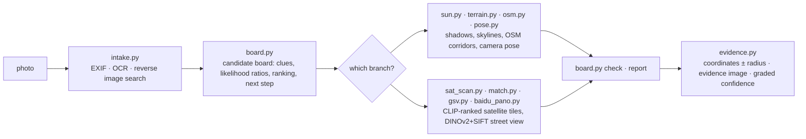

<div align="center">

# 🧭 geo-sleuth

**Une skill pour agents qui trouve où une photo a été prise — et qui montre son raisonnement.**

<p align="center">
  <a href="README.md"></a>
  <a href="README.zh-CN.md"></a>
  <a href="README.zh-TW.md"></a>
  <a href="README.ja.md"></a>
  <a href="README.ko.md"></a>
  <a href="README.es.md"></a>
  <a href="README.fr.md"></a>
  <a href="README.de.md"></a>
  <a href="README.ru.md"></a>
  <a href="README.pt-BR.md"></a>
</p>

<p align="center">
  <a href="LICENSE"></a>
  <a href="https://www.python.org/downloads/"></a>
  <a href="https://agentskills.io"></a>
  <a href="CONTRIBUTING.md"></a>
  <a href="https://github.com/Oldcircle/geo-sleuth/stargazers"></a>
</p>

<p align="center">
  <b>Fonctionne avec</b><br>
  <a href="https://code.claude.com/docs/en/skills"></a>
  <a href="https://developers.openai.com/codex/skills"></a>
  <a href="https://cursor.com/docs/skills"></a>
  <a href="https://geminicli.com/docs/cli/skills/"></a>
  <a href="https://opencode.ai/docs/skills/"></a>
  <a href="https://docs.github.com/en/copilot/concepts/agents/about-agent-skills"></a>
  <br><sub>…et avec tout autre agent qui lit <code>SKILL.md</code> et exécute des commandes shell.</sub>
</p>


*Pas de texte. Pas de plaques. Pas de repères. Un pont, une montagne. Localisé à 2 m près.*

</div>

---

## Démarrage rapide

```bash
npx skills add Oldcircle/geo-sleuth
```

Choisir ses agents quand l'outil le demande. Puis confier une photo à son agent et dire :

> trouve où cette photo a été prise

C'est toute l'interface. L'agent lit `SKILL.md`, exécute les scripts, puis renvoie la position de la caméra, la direction qu'elle visait et une image satellite comme preuve. Pour copier le dossier soi-même, voir [Installation](#installation).

## Pourquoi geo-sleuth

- **Une photo, une phrase.** Confier une photo à son agent et dire *trouve où cette photo a été prise*. En retour : la position de la caméra, la direction qu'elle visait, et une image satellite comme preuve.
- **Fonctionne même quand il n'y a rien à lire.** Pas de panneau, pas de plaque, pas de repère : la géométrie OpenStreetMap, les données d'élévation, les tuiles satellite et la vue de rue mènent la recherche à elles seules.
- **De la géométrie plutôt que des conjectures.** L'espacement des piles devient une règle de distance, les ombres deviennent un relèvement, une ligne de crête devient une empreinte comparable aux données d'élévation.
- **Chaque affirmation pointe vers un fichier.** Une conclusion doit citer la commande exécutée dans la session et le fichier qu'elle a produit. La population et la notoriété ne sont pas des preuves.
- **Les scripts classent, le modèle juge.** Vingt scripts à but unique cherchent, notent et trient ; le modèle ne fait que choisir parmi les meilleurs.
- **Une skill, tous les agents.** Une Agent Skill standard — `SKILL.md` et de simples scripts Python — si bien que le même dossier fonctionne dans Claude Code, Codex, Cursor, Gemini CLI, OpenCode et GitHub Copilot.
- **Les réponses portent un rayon d'erreur.** Coordonnées ± rayon, le cap de la caméra, une image de preuve et un niveau de confiance gradué.

## L'affaire : une photo, rien à lire

Une photo de téléphone à l'EXIF supprimé : un four blanc en bordure d'une rizière moissonnée, un long viaduc au loin, une montagne escarpée à droite. Pas un seul caractère dans le cadre. Un message à un agent avec cette skill installée, et la réponse est arrivée avec la position de la caméra et la direction qu'elle visait.

**photo → 27,335 → 171 → 14,372 → 22 → 3 → 1 → ±2 m**

| Étape | Ce qui a été fait | Candidats restants |
|---|---|---|
| **Lire la photo** | Les poteaux du viaduc sont des mâts caténaires, donc c'est une ligne ferroviaire électrifiée. Espacement des piles utilisé comme règle (travée de 32 m *supposée*) : le segment de gauche est à environ 0.5 km, celui de droite à plus de 1 km. Une montagne escarpée à environ 3 km. Riz moissonné mais l'herbe encore verte, donc pas encore de gel. | le sud de la Chine, comme un pari, pas une preuve |
| **Balayage régional** | A extrait tous les ponts ferroviaires de la région depuis OpenStreetMap : **27,335 segments**. A échantillonné un point tous les 400 m et calculé l'horizon à 360° à partir des données d'élévation à chacun. A conservé les points avec un terrain plat à proximité, une montagne dégagée à quelques km et un horizon plat juste à côté. | **171 sites** |
| **Ajustement de la ligne d'horizon** | A placé des positions de caméra candidates autour de chaque site et a rendu la ligne de crête vue depuis chacune : **14,372 positions**. Les 20 meilleures étaient à moins de 0.1° l'une de l'autre, donc une contrainte a été ajoutée : le pont doit être proche à gauche et loin à droite. | **22** |
| **Vérification des superpositions** | A redessiné les trois meilleures lignes de crête sur la photo. Le n°1 (Fuzhou) avait une bosse cachée derrière le four, ce qui explique son bon score. Le n°3 (Huizhou) était en pente là où la photo est plate. Le n°2 (Qingyuan) correspondait du pied de la montagne jusqu'au bord du cadre. | **1** |
| **Comptage des piles** | 17 piles sur la photo deviennent 17 relèvements depuis la caméra. Là où ils croisent la ligne ferroviaire, les intersections doivent être régulièrement espacées. Combiné à la ligne d'horizon : d'abord une bande d'environ 300 m de long, puis un point unique. | **±2 m** |

<div align="center">
<br>
<sub>Les piles comme règle : un espacement large à gauche signifie proche, un espacement serré à droite signifie loin.</sub><br><br>
 <br>
<sub>Gauche : les trois meilleures lignes de crête dessinées sur la photo. Droite : l'image de preuve produite par la skill.</sub>
</div>

<details>
<summary>Autres figures de cette exécution</summary>
<br>
<br>
<sub>Balayage régional : tous les ponts ferroviaires de la région (gris), sites qui passent le test d'horizon (orange).</sub><br><br>
<br>
<sub>Comptage des piles : les relèvements vers les 17 piles croisent la ligne ; une seule position de caméra rend l'espacement régulier.</sub><br><br>
<sub>L'exécution a pris environ 72 minutes de bout en bout, environ la moitié en attente de calcul.</sub>
</details>

## Installation

geo-sleuth est une [Agent Skill](https://agentskills.io) standard : un seul dossier qui contient `SKILL.md`, `scripts/`, `references/` et `data/`. On l'installe avec la CLI [`skills`](https://github.com/vercel-labs/skills), ou en copiant soi-même le dossier.

**Les six agents, au niveau utilisateur, en une seule commande :**

```bash
npx skills add Oldcircle/geo-sleuth -g -a claude-code -a codex -a cursor -a gemini-cli -a opencode -a github-copilot -y
```

**À la main :**

```bash
git clone https://github.com/Oldcircle/geo-sleuth
mkdir -p ~/.agents/skills ~/.claude/skills
cp -r geo-sleuth/skills/geo-sleuth ~/.agents/skills/              # Codex, Cursor, Gemini CLI, OpenCode, GitHub Copilot
ln -s ~/.agents/skills/geo-sleuth ~/.claude/skills/geo-sleuth     # Claude Code
```

`~/.agents/skills/` est lu par Codex, Cursor, Gemini CLI, OpenCode et GitHub Copilot : une seule copie à cet endroit suffit donc pour les cinq. Les dossiers propres à chaque agent, d'après sa documentation :

| Agent | Niveau utilisateur | Par projet |
|---|---|---|
| [Claude Code](https://code.claude.com/docs/en/skills) | `~/.claude/skills/` | `.claude/skills/` |
| [Codex](https://developers.openai.com/codex/skills) | `~/.agents/skills/` | `.agents/skills/` |
| [Cursor](https://cursor.com/docs/skills) | `~/.cursor/skills/` ou `~/.agents/skills/` | `.cursor/skills/` ou `.agents/skills/` |
| [Gemini CLI](https://geminicli.com/docs/cli/skills/) | `~/.gemini/skills/` ou `~/.agents/skills/` | `.gemini/skills/` ou `.agents/skills/` |
| [OpenCode](https://opencode.ai/docs/skills/) | `~/.config/opencode/skills/` ou `~/.agents/skills/` | `.opencode/skills/` ou `.agents/skills/` |
| [GitHub Copilot](https://docs.github.com/en/copilot/concepts/agents/about-agent-skills) | `~/.copilot/skills/` ou `~/.agents/skills/` | `.github/skills/` ou `.agents/skills/` |

Tout autre agent qui lit `SKILL.md` et exécute des commandes shell fonctionne de la même façon : il suffit de placer le dossier là où il cherche ses skills.

## Comment ça fonctionne

Le travail est réparti en trois couches. Les scripts décident, les scripts perçoivent et classent, le modèle ne fait que juger parmi les meilleurs.



| Couche | Qui | Outils |
|---|---|---|
| **Décide** : quels candidats, comment la preuve est notée, ce qui peut être exclu, où scanner ensuite | scripts (le tableau des candidats) | `board.py` |
| **Perçoit** : lit le texte, consulte des tables, trouve des cibles dans les tuiles satellite, compare la vue de rue | les scripts classent d'abord, une personne regarde les meilleurs | `intake.py` `ocr.py` `clues.py` `sat_scan.py` `match.py` `geo.py` |
| **Juge** : extrait des indices du cadre, propose des hypothèses, choisit parmi les mieux classés | le modèle | `SKILL.md` + `references/` |

Chaque conclusion doit pointer vers une commande réellement exécutée dans la session et le fichier qu'elle a produit. Les exclusions nécessitent des preuves lues ou calculées ; les observations et suppositions ne peuvent que réduire le poids d'un candidat.

## Boîte à outils

Vingt scripts, une tâche chacun. Le tableau complet avec les sources de données se trouve dans `skills/geo-sleuth/references/data-sources.md`.

| Ce qu'il fait | Script |
|---|---|
| EXIF : GPS, heure de capture, focale équivalente, cap | `exif.py` |
| OCR sur l'image entière, recadrages zoomés et tuiles (Apple Vision sur macOS, RapidOCR ailleurs) | `ocr.py` |
| Recherche inversée d'image sur Baidu et Yandex, images similaires disposées en planche numérotée ; recherche d'image par mot-clé | `revimg.py` |
| Étapes 0–3 en une seule commande : métadonnées, recadrages de bord, variantes, OCR, recherche inversée → `intake.md` | `intake.py` |
| Recadrages zoomés, recadrages de bords et de coins, mosaïquage, colonnes de pixels de structures régulièrement espacées comme les piles | `imgprep.py` |
| Tables de référence : préfixes de plaques d'immatriculation, indicatifs régionaux de téléphonie fixe, indicatifs d'appel, sens de circulation, territoires dépendants, divisions administratives | `clues.py` + `data/` |
| Tableau des candidats : candidats, indices, rapports de vraisemblance, exclusion, classement, ordre de balayage, vérifications avant rapport | `board.py` |
| Répertoire géographique : liste les subdivisions avec leurs boîtes englobantes, étendue de la zone bâtie | `gazetteer.py` |
| Nom de lieu, de résidence ou de commerce → candidats de coordonnées, tous les homonymes recensés | `poi.py` |
| Soleil et ombres : bande de latitude, heure de la journée, orientation de la rue, cap déduit des façades éclairées, relèvements vrais | `sun.py` |
| OSM Overpass : co-occurrence d'éléments, ligne vers point, corridors d'itinéraire, intersections de lignes, modèles de trame de rues | `osm.py` |
| Mosaïques de tuiles satellite, marqueurs, planches de vignettes numérotées | `tiles.py` |
| Notation zero-shot par CLIP des cellules de la grille satellite ou des points candidats (pistes, usines, silos, barrages…) | `sat_scan.py` |
| Panoramas Baidu / Google Street View : localise des points, rend des caps, planches de vignettes, lots historiques | `baidu_pano.py` `gsv.py` |
| Classe les images candidates au niveau du sol par rapport à la photo : similarité globale DINOv2 + inliers SIFT | `match.py` |
| Élévation : vues synthétiques de montagnes, superpositions de ligne d'horizon, profils ; balayage élément linéaire × terrain, extraction de la ligne de crête, notation par lots de la ligne d'horizon | `terrain.py` |
| Pose de caméra multipoint : lat/lon, hauteur, cap, tangage, roulis, avec rayon d'erreur | `pose.py` |
| Relèvements, distances, intersections de ligne de visée, lignes d'alignement, vérifications de cadrage/occlusion, position de caméra à partir de structures régulièrement espacées | `geo.py` |
| Image de preuve : tuile satellite + éventail de caméra + grille de comparaison | `evidence.py` |

Les trois étapes du cas ci-dessus (balayage régional, notation par lots de la ligne d'horizon, position de caméra à partir de l'espacement des piles) sont intégrées au skill sous forme de sous-commandes : `terrain.py scan / ridge / fit`, `imgprep.py piers`, `geo.py spacing`. Les scripts du cas, réglés sur cette photo, sont conservés dans `examples/rail-skyline-session/` à titre de référence.

## Évaluation

Mesures par opérateur :

| Script | Test | Résultat |
|---|---|---|
| `match.py` | 8 cas : un lot historique de panoramas Baidu rendu comme la photo, panoramas à moins de 150 m comme candidats (Shenzhen) | la vérité terrain classée 1/2/4/1/1 et 5/1/6, toutes dans le top 6, la moitié à la 1ère place |
| `sat_scan.py` | 4×8 km, 364 cellules à z17, 40 pistes d'athlétisme balisées OSM comme vérité terrain, multi-échelle (Shenzhen) | recall@20 17/40, @30 22/40, @100 32/40, rang médian 23 |
| `terrain.py scan / fit` + `geo.py spacing` | ré-exécution bornée sur la photo du cas ci-dessus | le cluster correct classé 1er, position finale à environ 2 m de la vérité terrain |
| `clues.py` | 6 tables, 9 valeurs vérifiées ponctuellement | 9/9 corrects |

La méthode vient de la décomposition de 14 vidéos de créateurs de géolocalisation en ligne, de 22 énigmes et d'une série d'exécutions réelles ; ce qui fonctionne a ensuite été transcrit en règles et en scripts. La v2 déplace dans `board.py` toute règle qui peut devenir du code, pour que les règles soient exécutées, et pas seulement lues.

## Prérequis

Python 3.10+, [`uv`](https://docs.astral.sh/uv/) et un agent capable d'exécuter des commandes shell. Chaque script déclare ses propres dépendances et `uv run` les installe à la première utilisation.

Facultatif : Google Chrome pour la recherche inversée d'image (`uvx playwright install chromium` convient aussi), et `export GEO_PROXY=socks5h://127.0.0.1:<port>` pour faire passer par un proxy tous les scripts qui accèdent au réseau.

## Feuille de route

- [ ] Test au niveau de l'opérateur sur des cas de terrain synthétique pour `terrain.py scan / fit`
- [ ] Google Lens comme troisième moteur de recherche inversée
- [ ] CI sous Linux et Windows
- [ ] Un jeu public de test à l'aveugle de photos inédites avec un chiffre de précision de bout en bout

## Contribuer

Les issues et les pull requests sont les bienvenues, voir [CONTRIBUTING.md](CONTRIBUTING.md). Les contributions les plus utiles sont un indice transférable pour `references/clues/` (avec sa source), une nouvelle source de données avec sa licence, ou une exécution sur une photo personnelle où la skill s'est trompée, et pourquoi.

## Historique des étoiles

<a href="https://star-history.com/#Oldcircle/geo-sleuth&Date">
  
</a>

## Remerciements

- Contributeurs d'OpenStreetMap (ODbL). Ce dépôt ne contient aucune donnée OSM ; les scripts l'interrogent en direct. Créditer © OpenStreetMap contributors lors de la publication des résultats de requête.
- AWS Terrain Tiles (élévation Terrarium).
- [modood/Administrative-divisions-of-China](https://github.com/modood/Administrative-divisions-of-China).
- DINOv2 (Meta AI), CLIP (OpenAI).
- Les sources et licences des tables de référence se trouvent dans `skills/geo-sleuth/data/README.md`.

## Licence

MIT, voir [LICENSE](LICENSE). Les tables dans `data/` dérivées de Wikipédia sont sous licence CC BY-SA 4.0 ; voir `skills/geo-sleuth/data/README.md`.

<sub>**Usage responsable :** l'utiliser sur ses propres photos ou sur des photos qu'on a l'autorisation d'analyser, jamais pour retrouver des personnes qui n'ont pas accepté d'être retrouvées.</sub>
