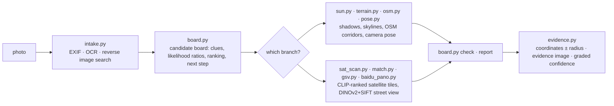

<div align="center">

# 🧭 geo-sleuth

**写真の撮影場所を特定し、その根拠を示すエージェントスキル。**

<p align="center">
  <a href="README.md"></a>
  <a href="README.zh-CN.md"></a>
  <a href="README.zh-TW.md"></a>
  <a href="README.ja.md"></a>
  <a href="README.ko.md"></a>
  <a href="README.es.md"></a>
  <a href="README.fr.md"></a>
  <a href="README.de.md"></a>
  <a href="README.ru.md"></a>
  <a href="README.pt-BR.md"></a>
</p>

<p align="center">
  <a href="LICENSE"></a>
  <a href="https://www.python.org/downloads/"></a>
  <a href="https://agentskills.io"></a>
  <a href="CONTRIBUTING.md"></a>
  <a href="https://github.com/Oldcircle/geo-sleuth/stargazers"></a>
</p>

<p align="center">
  <b>対応エージェント</b><br>
  <a href="https://code.claude.com/docs/en/skills"></a>
  <a href="https://developers.openai.com/codex/skills"></a>
  <a href="https://cursor.com/docs/skills"></a>
  <a href="https://geminicli.com/docs/cli/skills/"></a>
  <a href="https://opencode.ai/docs/skills/"></a>
  <a href="https://docs.github.com/en/copilot/concepts/agents/about-agent-skills"></a>
  <br><sub>…など、<code>SKILL.md</code> を読み込んでシェルコマンドを実行できるエージェントならどれでも使えます。</sub>
</p>


*文字なし。ナンバープレートなし。ランドマークなし。橋ひとつ、山ひとつ。誤差2 m以内で特定。*

</div>

---

## クイックスタート

```bash
npx skills add Oldcircle/geo-sleuth
```

聞かれたら、使っているエージェントを選びます。あとはエージェントに写真を渡して、こう言います:

> この写真がどこで撮影されたか調べて

インターフェースはこれだけです。エージェントが `SKILL.md` を読み、スクリプトを実行して、カメラの位置、向いていた方向、衛星画像による証拠を返してきます。フォルダーを自分でコピーしたい場合は、[インストール](#インストール)を参照してください。

## なぜ geo-sleuth なのか

- **写真1枚、指示1文。** エージェントに写真を渡して「この写真がどこで撮影されたか調べて」と言うだけです。カメラの位置、向いていた方向、そして衛星画像による証拠が返ってきます。
- **手がかりが何もなくても機能する。** 看板もナンバープレートもランドマークもなくても、OpenStreetMap のジオメトリ、標高データ、衛星タイル、ストリートビューだけで探索が進みます。
- **当て推量ではなく幾何学。** 橋脚の間隔が距離の物差しになり、影が方位になり、稜線が標高データと照合できる指紋になります。
- **すべての主張はファイルを指し示す。** 結論はセッション内で実行したコマンドと、それが生成したファイルを明示しなければなりません。人口や知名度は証拠になりません。
- **スクリプトがランク付けし、モデルが判断する。** 単機能のスクリプト20本が検索・採点・並べ替えを行い、モデルは上位候補の中から選ぶだけです。
- **スキル1つで、どのエージェントでも。** 標準的な Agent Skill(`SKILL.md` と素の Python スクリプト)なので、同じフォルダーが Claude Code、Codex、Cursor、Gemini CLI、OpenCode、GitHub Copilot で動きます。
- **回答には誤差半径が付く。** 座標 ± 半径、カメラの向き、証拠画像、段階的な信頼度。

## 実例:写真1枚、読み取れるものなし

EXIF情報を削除したスマートフォンの写真。刈り取り後の水田の端に白いオーブン、遠くに長い高架橋、右手に急な山。フレーム内に文字は一つもありません。このスキルを導入したエージェントにメッセージを1通送ると、カメラの位置と向いていた方向を返してきました。

**写真 → 27,335 → 171 → 14,372 → 22 → 3 → 1 → ±2 m**

| ステップ | 内容 | 残った候補数 |
|---|---|---|
| **写真を読む** | 高架橋の柱はカテナリー(架線)支柱なので、電化鉄道だとわかります。橋脚の間隔を物差しとして使うと(支間32 mと*仮定*)、左側の区間は約0.5 km先、右側は1 km超先。急な山は約3 km先。稲は刈り取り済みだが草はまだ緑で、霜はまだ降りていません。 | 華南――証拠ではなく賭けとして |
| **範囲スキャン** | OpenStreetMap からその地域のすべての鉄道橋を取得:**27,335 セグメント**。400 mごとに地点をサンプリングし、各地点で標高データから360°の地平線を算出。近くに平地があり、数km以内に山がはっきり見え、隣に平坦な地平線がある地点だけを残しました。 | **171 地点** |
| **スカイライン照合** | 各地点の周囲に候補カメラ位置を配置し、それぞれから見える稜線を描画:**14,372 地点**。上位20件が互いに0.1°以内に収まったため、「橋は左側が近く、右側が遠い」という制約を追加しました。 | **22** |
| **重ね合わせ確認** | 上位3件の稜線を写真に重ねて描画。スコア1位(福州)はオーブンの陰に隆起が隠れていたため高得点でした。3位(恵州)は写真が平坦な箇所で傾斜していました。2位(清遠)は山の麓からフレーム端まで一致しました。 | **1** |
| **橋脚カウント** | 写真に写る17本の橋脚が、カメラからの17本の方位線になります。それらが鉄道線と交わる点は等間隔でなければなりません。スカイラインと組み合わせると、まず長さ約300 mの帯に、続いて1地点にまで絞り込めました。 | **±2 m** |

<div align="center">
<br>
<sub>橋脚を物差しとして使う:左側の広い間隔は近い、右側の狭い間隔は遠いことを意味します。</sub><br><br>
 <br>
<sub>左:写真に描画した上位3件の稜線。右:スキルが生成した証拠画像。</sub>
</div>

<details>
<summary>このセッションのその他の図</summary>
<br>
<br>
<sub>範囲スキャン:地域内のすべての鉄道橋(グレー)、地平線テストに通過した地点(オレンジ)。</sub><br><br>
<br>
<sub>橋脚カウント:17本の橋脚への方位線が線路と交わる。間隔が等しくなるカメラ位置はひとつだけです。</sub><br><br>
<sub>このセッションは全体で約72分かかり、その半分ほどは計算待ちでした。</sub>
</details>

## インストール

geo-sleuth は標準的な [Agent Skill](https://agentskills.io) です。`SKILL.md`、`scripts/`、`references/`、`data/` を収めた1つのフォルダーでできています。[`skills`](https://github.com/vercel-labs/skills) CLI でインストールするか、フォルダーを自分でコピーしてください。

**コマンド1つで、6つのエージェントすべてにユーザー単位でインストール:**

```bash
npx skills add Oldcircle/geo-sleuth -g -a claude-code -a codex -a cursor -a gemini-cli -a opencode -a github-copilot -y
```

**手動でインストール:**

```bash
git clone https://github.com/Oldcircle/geo-sleuth
mkdir -p ~/.agents/skills ~/.claude/skills
cp -r geo-sleuth/skills/geo-sleuth ~/.agents/skills/              # Codex, Cursor, Gemini CLI, OpenCode, GitHub Copilot
ln -s ~/.agents/skills/geo-sleuth ~/.claude/skills/geo-sleuth     # Claude Code
```

`~/.agents/skills/` は Codex、Cursor、Gemini CLI、OpenCode、GitHub Copilot が読み込むので、ここに1つコピーすれば5つすべてをカバーできます。各エージェント固有のフォルダーは次のとおりです(各公式ドキュメントより):

| エージェント | ユーザー単位 | プロジェクト単位 |
|---|---|---|
| [Claude Code](https://code.claude.com/docs/en/skills) | `~/.claude/skills/` | `.claude/skills/` |
| [Codex](https://developers.openai.com/codex/skills) | `~/.agents/skills/` | `.agents/skills/` |
| [Cursor](https://cursor.com/docs/skills) | `~/.cursor/skills/` または `~/.agents/skills/` | `.cursor/skills/` または `.agents/skills/` |
| [Gemini CLI](https://geminicli.com/docs/cli/skills/) | `~/.gemini/skills/` または `~/.agents/skills/` | `.gemini/skills/` または `.agents/skills/` |
| [OpenCode](https://opencode.ai/docs/skills/) | `~/.config/opencode/skills/` または `~/.agents/skills/` | `.opencode/skills/` または `.agents/skills/` |
| [GitHub Copilot](https://docs.github.com/en/copilot/concepts/agents/about-agent-skills) | `~/.copilot/skills/` または `~/.agents/skills/` | `.github/skills/` または `.agents/skills/` |

`SKILL.md` を読み込んでシェルコマンドを実行できるエージェントであれば、ほかのものでも同じです。そのエージェントがスキルを探す場所にフォルダーを置いてください。

## 仕組み

作業は3つの層に分かれています。スクリプトが決定し、スクリプトが知覚してランク付けし、モデルは上位候補の中から判断するだけです。



| 層 | 担当 | ツール |
|---|---|---|
| **決定**:どの候補か、証拠がどう採点されるか、何を除外できるか、次にどこをスキャンするか | スクリプト(候補ボード) | `board.py` |
| **知覚**:テキストを読む、テーブルを参照する、衛星タイルで対象を見つける、ストリートビューを比較する | まずスクリプトがランク付けし、人が上位候補を確認する | `intake.py` `ocr.py` `clues.py` `sat_scan.py` `match.py` `geo.py` |
| **判断**:フレームから手がかりを引き出し、仮説を立て、ランク付けされた候補の中から選ぶ | モデル | `SKILL.md` + `references/` |

すべての結論は、セッション内で実際に実行されたコマンドと、それが生成したファイルを指し示さなければなりません。除外には読み取りまたは計算による証拠が必要です。観察や推測は候補の重みを下げることしかできません。

## ツールボックス

20本のスクリプト、それぞれが単一の役割を持ちます。データソースを含む完全な表は `skills/geo-sleuth/references/data-sources.md` にあります。

| 内容 | スクリプト |
|---|---|
| EXIF:GPS、撮影時刻、35mm換算焦点距離、方位 | `exif.py` |
| 画像全体、拡大クロップ、タイルに対するOCR(macOSではApple Vision、それ以外ではRapidOCR) | `ocr.py` |
| Baidu と Yandex での逆画像検索、類似画像を番号付きシートにタイル表示;キーワード画像検索 | `revimg.py` |
| ステップ0–3をひとつのコマンドで実行:メタデータ、端のクロップ、バリアント、OCR、逆検索 → `intake.md` | `intake.py` |
| ズームクロップ、端と角のクロップ、タイル分割、橋脚のような等間隔構造物のピクセル列抽出 | `imgprep.py` |
| 参照テーブル:ナンバープレートの接頭辞、固定電話の市外局番、国番号、通行区分、属領、行政区画 | `clues.py` + `data/` |
| 候補ボード:候補、手がかり、尤度比、除外、ランク付け、スキャン順序、レポート前チェック | `board.py` |
| 地名辞典:行政下位区分をバウンディングボックス付きで列挙、市街地の範囲 | `gazetteer.py` |
| 地名・施設名・店名 → 座標候補、同名のものをすべて列挙 | `poi.py` |
| 太陽と影:緯度帯、時刻、通りの向き、日の当たる面からの方位、真方位 | `sun.py` |
| OSM Overpass:地物の共起、線から点への変換、経路回廊、線の交差、街路網テンプレート | `osm.py` |
| 衛星タイルのモザイク、マーカー、番号付きサムネイルシート | `tiles.py` |
| 衛星グリッドセルや候補地点に対する CLIP ゼロショット採点(トラック、工場、サイロ、ダムなど) | `sat_scan.py` |
| Baidu パノラマ / Google ストリートビュー:地点検索、方位のレンダリング、サムネイルシート、過去データの一括取得 | `baidu_pano.py` `gsv.py` |
| 地上レベルの候補画像を写真と照合してランク付け:DINOv2 のグローバル類似度 + SIFT インライア数 | `match.py` |
| 標高:合成された山の眺望、スカイラインの重ね合わせ、断面図;線状地物×地形スキャン、稜線抽出、バッチ式スカイライン採点 | `terrain.py` |
| 多地点カメラ姿勢:緯度経度、高さ、方位、ピッチ、ロール、誤差半径付き | `pose.py` |
| 方位、距離、視線交差、整列線、フレーム/遮蔽チェック、等間隔構造物からのカメラ位置算出 | `geo.py` |
| 証拠画像:衛星タイル + カメラの視野扇形 + 比較グリッド | `evidence.py` |

上記の実例の3つの手順(範囲スキャン、バッチ式スカイライン採点、橋脚間隔からのカメラ位置算出)は、skill にサブコマンドとして組み込まれています:`terrain.py scan / ridge / fit`、`imgprep.py piers`、`geo.py spacing`。その写真に合わせてパラメータを調整した事例スクリプトは、参考として `examples/rail-skyline-session/` に置いています。

## ベンチマーク

個々のスクリプト(オペレーター)単位での測定結果:

| スクリプト | テスト | 結果 |
|---|---|---|
| `match.py` | 8ケース:過去の Baidu パノラマの一括データを写真としてレンダリングし、150 m以内のパノラマを候補とする(Shenzhen) | 正解の順位は 1/2/4/1/1 および 5/1/6、すべて上位6位以内、半数が1位 |
| `sat_scan.py` | 4×8 km、z17で364セル、OSMタグ付き陸上トラック40件を正解データとして、マルチスケール(Shenzhen) | recall@20 17/40、@30 22/40、@100 32/40、中央値順位23 |
| `terrain.py scan / fit` + `geo.py spacing` | 上記の実例写真で範囲を限定して再実行 | 正解クラスターが1位、最終位置は正解から約 2 m |
| `clues.py` | 6個のテーブル、9個の値を抜き取り検査 | 9/9 正解 |

この手法は、オンラインの位置特定クリエイターによる動画14本、パズル22問、そして一連の実際のセッションを分解し、うまくいったやり方をルールとスクリプトに落とし込んだものです。v2 ではコード化できるルールをすべて `board.py` に移しているため、ルールは読まれるだけでなく、実際に実行されます。

## 動作要件

必要なのは Python 3.10+、[`uv`](https://docs.astral.sh/uv/)、そしてシェルコマンドを実行できるエージェントです。依存関係は各スクリプトのヘッダーで宣言されており、初回実行時に `uv run` がインストールします。

オプション:逆画像検索用の Google Chrome(`uvx playwright install chromium` でも可)と、ネットワークを使うすべてのスクリプトをプロキシ経由にするための `export GEO_PROXY=socks5h://127.0.0.1:<port>`。

## ロードマップ

- [ ] `terrain.py scan / fit` の合成地形ケースによるオペレーター単位のテスト
- [ ] 3つ目の逆検索エンジンとしての Google Lens
- [ ] Linux・Windows での CI
- [ ] エンドツーエンドの精度指標を伴う、未見の写真による公開ブラインドテストセット

## コントリビューション

Issue やプルリクエストを歓迎します。詳細は [CONTRIBUTING.md](CONTRIBUTING.md) を参照してください。特に役立つ貢献は、`references/clues/` 向けの(出典付きの)転用可能な手がかり、ライセンス情報付きの新しいデータソース、あるいは自分の写真でスキルが誤った結果を出した際の実行記録とその原因分析です。

## スター履歴

<a href="https://star-history.com/#Oldcircle/geo-sleuth&Date">
  
</a>

## 謝辞

- OpenStreetMap contributors(ODbL)。本リポジトリには OSM データは含まれておらず、スクリプトがライブで問い合わせます。クエリ結果を公開する際は © OpenStreetMap contributors とクレジットしてください。
- AWS Terrain Tiles(Terrarium 標高データ)。
- [modood/Administrative-divisions-of-China](https://github.com/modood/Administrative-divisions-of-China)。
- DINOv2(Meta AI)、CLIP(OpenAI)。
- 参照テーブルの出典とライセンスは `skills/geo-sleuth/data/README.md` にあります。

## ライセンス

MIT ライセンス。詳細は [LICENSE](LICENSE) を参照してください。Wikipedia に由来する `data/` 内のテーブルは CC BY-SA 4.0 です。`skills/geo-sleuth/data/README.md` を参照してください。

<sub>**責任ある利用:** 自分の写真、または分析の許可を得た写真にだけ使ってください。見つけられることに同意していない人を探す目的では、決して使わないでください。</sub>
