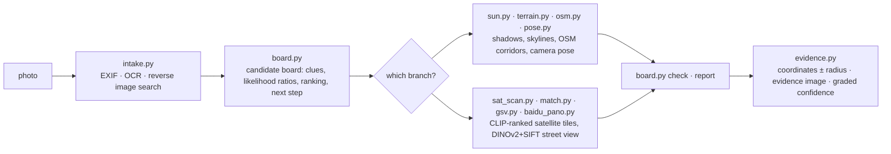

<div align="center">

# 🧭 geo-sleuth

**사진이 촬영된 위치를 찾아내고 그 근거를 제시하는 에이전트 스킬입니다.**

<p align="center">
  <a href="README.md"></a>
  <a href="README.zh-CN.md"></a>
  <a href="README.zh-TW.md"></a>
  <a href="README.ja.md"></a>
  <a href="README.ko.md"></a>
  <a href="README.es.md"></a>
  <a href="README.fr.md"></a>
  <a href="README.de.md"></a>
  <a href="README.ru.md"></a>
  <a href="README.pt-BR.md"></a>
</p>

<p align="center">
  <a href="LICENSE"></a>
  <a href="https://www.python.org/downloads/"></a>
  <a href="https://agentskills.io"></a>
  <a href="CONTRIBUTING.md"></a>
  <a href="https://github.com/Oldcircle/geo-sleuth/stargazers"></a>
</p>

<p align="center">
  <b>지원 에이전트</b><br>
  <a href="https://code.claude.com/docs/en/skills"></a>
  <a href="https://developers.openai.com/codex/skills"></a>
  <a href="https://cursor.com/docs/skills"></a>
  <a href="https://geminicli.com/docs/cli/skills/"></a>
  <a href="https://opencode.ai/docs/skills/"></a>
  <a href="https://docs.github.com/en/copilot/concepts/agents/about-agent-skills"></a>
  <br><sub>…그 밖에 <code>SKILL.md</code>를 읽고 셸 명령을 실행할 수 있는 모든 에이전트.</sub>
</p>


*텍스트 없음. 번호판 없음. 랜드마크 없음. 다리 하나, 산 하나. 오차 2 m 이내로 특정.*

</div>

---

## 빠른 시작

```bash
npx skills add Oldcircle/geo-sleuth
```

설치 중에 에이전트를 고르라는 안내가 나오면 사용할 에이전트를 선택하세요. 그다음 에이전트에게 사진을 건네고 이렇게 말하면 됩니다:

> 이 사진이 어디서 찍혔는지 찾아줘

인터페이스는 이것이 전부입니다. 에이전트가 `SKILL.md`를 읽고 스크립트를 실행한 뒤, 카메라 위치와 촬영 방향, 위성 증거 이미지를 돌려줍니다. 폴더를 직접 복사하고 싶다면 [설치](#설치)를 참고하세요.

## geo-sleuth를 쓰는 이유

- **사진 한 장, 문장 한 줄.** 에이전트에게 사진을 건네고 "이 사진이 어디서 찍혔는지 찾아줘"라고 말하기만 하면 됩니다. 카메라 위치, 촬영 방향, 위성 증거 이미지를 돌려받습니다.
- **읽을 것이 전혀 없어도 작동합니다.** 표지판도, 번호판도, 랜드마크도 없이 OpenStreetMap 지오메트리, 고도 데이터, 위성 타일, 스트리트 뷰만으로 탐색을 이어갑니다.
- **추측이 아니라 기하학.** 교각 간격은 거리 자를, 그림자는 방위를, 능선은 고도 데이터와 대조할 수 있는 지문을 만듭니다.
- **모든 주장은 파일을 가리킵니다.** 결론은 세션에서 실행된 명령과 그것이 만들어낸 파일을 명시해야 합니다. 인구나 지명도는 증거가 아닙니다.
- **스크립트가 순위를 매기고, 모델은 판단만 합니다.** 단일 목적 스크립트 20개가 검색·채점·정렬을 하고, 모델은 상위 후보 중에서 고르기만 합니다.
- **스킬 하나, 모든 에이전트.** `SKILL.md`와 평범한 Python 스크립트로 이루어진 표준 Agent Skill이라, 같은 폴더가 Claude Code, Codex, Cursor, Gemini CLI, OpenCode, GitHub Copilot에서 그대로 동작합니다.
- **답에는 오차 반경이 따라옵니다.** 좌표 ± 반경, 카메라가 향한 방위, 증거 이미지, 등급화된 신뢰도를 함께 제시합니다.

## 사례: 사진 한 장, 읽을 것이 없음

EXIF 정보를 제거한 스마트폰 사진. 추수를 마친 논 가장자리에 하얀 오븐, 멀리 긴 고가교, 오른쪽에 가파른 산. 프레임 안에 글자는 단 하나도 없습니다. 이 스킬을 설치한 에이전트에 메시지 하나를 보내자, 카메라 위치와 향하고 있던 방향을 알려주었습니다.

**사진 → 27,335 → 171 → 14,372 → 22 → 3 → 1 → ±2 m**

| 단계 | 수행 내용 | 남은 후보 |
|---|---|---|
| **사진 판독** | 고가교의 기둥은 가선(카테너리) 지주이므로 전철화된 철도임을 알 수 있습니다. 교각 간격을 자로 사용하면(경간 32 m로 *가정*) 왼쪽 구간은 약 0.5 km, 오른쪽은 1 km 이상 떨어져 있습니다. 가파른 산은 약 3 km 거리. 벼는 수확했지만 풀은 아직 푸르러 서리는 아직 내리지 않았습니다. | 중국 남부 — 증거가 아니라 추측으로 |
| **지역 스캔** | OpenStreetMap에서 해당 지역의 모든 철도 교량을 가져옵니다: **27,335개 구간**. 400 m 간격으로 지점을 샘플링하고, 각 지점에서 고도 데이터로 360° 지평선을 계산했습니다. 주변에 평지가 있고, 수 km 이내에 뚜렷한 산이 있으며, 그 옆에 평탄한 지평선이 있는 지점만 남겼습니다. | **171개 지점** |
| **스카이라인 매칭** | 각 지점 주변에 후보 카메라 위치를 배치하고, 각 위치에서 보이는 능선을 렌더링: **14,372개 위치**. 상위 20개가 서로 0.1° 이내로 근접해, "다리가 왼쪽은 가깝고 오른쪽은 멀다"는 제약을 추가했습니다. | **22** |
| **오버레이 검증** | 상위 3개의 능선을 사진 위에 다시 그렸습니다. 1위(Fuzhou)는 오븐 뒤에 봉우리가 가려져 있어 점수가 높게 나왔습니다. 3위(Huizhou)는 사진이 평탄한 부분에서 경사가 있었습니다. 2위(Qingyuan)는 산기슭부터 프레임 끝까지 일치했습니다. | **1** |
| **교각 개수** | 사진 속 교각 17개가 카메라 기준 방위선 17개가 됩니다. 이 방위선이 철도 선로와 만나는 교점은 일정한 간격이어야 합니다. 스카이라인과 결합하면 먼저 길이 약 300 m의 띠로, 이어서 한 지점으로 좁혀집니다. | **±2 m** |

<div align="center">
<br>
<sub>자로 사용한 교각: 왼쪽의 넓은 간격은 가깝다는 뜻이고, 오른쪽의 좁은 간격은 멀다는 뜻입니다.</sub><br><br>
 <br>
<sub>왼쪽: 사진 위에 그린 상위 3개의 능선. 오른쪽: 스킬이 생성한 증거 이미지.</sub>
</div>

<details>
<summary>이번 실행의 추가 이미지</summary>
<br>
<br>
<sub>지역 스캔: 해당 지역의 모든 철도 교량(회색), 지평선 테스트를 통과한 지점(주황색).</sub><br><br>
<br>
<sub>교각 개수: 교각 17개에 대한 방위선이 선로와 교차합니다. 간격이 균등해지는 카메라 위치는 단 하나뿐입니다.</sub><br><br>
<sub>이번 실행은 처음부터 끝까지 약 72분이 걸렸고, 그중 절반 정도는 계산 대기 시간이었습니다.</sub>
</details>

## 설치

geo-sleuth는 표준 [Agent Skill](https://agentskills.io)입니다. `SKILL.md`, `scripts/`, `references/`, `data/`가 담긴 폴더 하나로 되어 있습니다. [`skills`](https://github.com/vercel-labs/skills) CLI로 설치하거나 폴더를 직접 복사하면 됩니다.

**명령 한 줄로 여섯 에이전트 모두에 사용자 전역 설치:**

```bash
npx skills add Oldcircle/geo-sleuth -g -a claude-code -a codex -a cursor -a gemini-cli -a opencode -a github-copilot -y
```

**수동 설치:**

```bash
git clone https://github.com/Oldcircle/geo-sleuth
mkdir -p ~/.agents/skills ~/.claude/skills
cp -r geo-sleuth/skills/geo-sleuth ~/.agents/skills/              # Codex, Cursor, Gemini CLI, OpenCode, GitHub Copilot
ln -s ~/.agents/skills/geo-sleuth ~/.claude/skills/geo-sleuth     # Claude Code
```

`~/.agents/skills/`는 Codex, Cursor, Gemini CLI, OpenCode, GitHub Copilot이 모두 읽는 폴더라서, 여기에 한 번만 복사하면 다섯 에이전트에서 모두 쓸 수 있습니다. 각 에이전트가 자체적으로 읽는 폴더는 공식 문서 기준으로 다음과 같습니다:

| 에이전트 | 사용자 전역 | 프로젝트별 |
|---|---|---|
| [Claude Code](https://code.claude.com/docs/en/skills) | `~/.claude/skills/` | `.claude/skills/` |
| [Codex](https://developers.openai.com/codex/skills) | `~/.agents/skills/` | `.agents/skills/` |
| [Cursor](https://cursor.com/docs/skills) | `~/.cursor/skills/` 또는 `~/.agents/skills/` | `.cursor/skills/` 또는 `.agents/skills/` |
| [Gemini CLI](https://geminicli.com/docs/cli/skills/) | `~/.gemini/skills/` 또는 `~/.agents/skills/` | `.gemini/skills/` 또는 `.agents/skills/` |
| [OpenCode](https://opencode.ai/docs/skills/) | `~/.config/opencode/skills/` 또는 `~/.agents/skills/` | `.opencode/skills/` 또는 `.agents/skills/` |
| [GitHub Copilot](https://docs.github.com/en/copilot/concepts/agents/about-agent-skills) | `~/.copilot/skills/` 또는 `~/.agents/skills/` | `.github/skills/` 또는 `.agents/skills/` |

`SKILL.md`를 읽고 셸 명령을 실행할 수 있는 다른 에이전트도 방법은 같습니다. 그 에이전트가 스킬을 찾는 위치에 폴더를 넣으면 됩니다.

## 작동 방식

작업은 세 개의 층으로 나뉩니다. 스크립트가 결정하고, 스크립트가 인지하고 순위를 매기며, 모델은 상위 후보 중에서 판단만 합니다.



| 계층 | 담당 | 도구 |
|---|---|---|
| **결정**: 어떤 후보인지, 증거 점수를 어떻게 매기는지, 무엇을 배제할 수 있는지, 다음에 어디를 스캔할지 | 스크립트(후보 보드) | `board.py` |
| **인지**: 텍스트를 읽고, 표를 조회하고, 위성 타일에서 대상을 찾고, 스트리트 뷰를 비교 | 스크립트가 먼저 순위를 매기고 사람이 상위 몇 개를 확인 | `intake.py` `ocr.py` `clues.py` `sat_scan.py` `match.py` `geo.py` |
| **판단**: 프레임에서 단서를 뽑아내고, 가설을 세우고, 순위가 매겨진 후보 중에서 고름 | 모델 | `SKILL.md` + `references/` |

모든 결론은 세션에서 실제로 실행된 명령과 그것이 생성한 파일을 가리켜야 합니다. 배제하려면 읽거나 계산한 증거가 필요합니다. 관찰과 추측은 후보의 가중치를 낮추는 데만 쓰일 수 있습니다.

## 도구 상자

스크립트 20개, 각각 하나의 역할만 수행합니다. 데이터 출처까지 담은 전체 표는 `skills/geo-sleuth/references/data-sources.md`에 있습니다.

| 기능 | 스크립트 |
|---|---|
| EXIF: GPS, 촬영 시각, 환산 초점거리, 방위 | `exif.py` |
| 전체 이미지, 확대 크롭, 타일에 대한 OCR(macOS는 Apple Vision, 그 외에는 RapidOCR) | `ocr.py` |
| Baidu와 Yandex를 이용한 역이미지 검색, 유사 이미지를 번호가 매겨진 시트로 정리; 키워드 이미지 검색 | `revimg.py` |
| 0–3단계를 한 명령으로: 메타데이터, 가장자리 크롭, 변형, OCR, 역검색 → `intake.md` | `intake.py` |
| 확대 크롭, 가장자리·모서리 크롭, 타일 분할, 교각처럼 일정 간격의 구조물에 대한 픽셀 열 추출 | `imgprep.py` |
| 조회 테이블: 번호판 접두어, 유선전화 지역번호, 국가번호, 통행 방향, 속령, 행정구역 | `clues.py` + `data/` |
| 후보 보드: 후보, 단서, 우도비, 배제, 순위, 스캔 순서, 보고 전 점검 | `board.py` |
| 지명 사전: 하위 행정구역을 경계 상자와 함께 나열, 시가지 범위 | `gazetteer.py` |
| 지명·건물명·상호명 → 좌표 후보, 동명 장소 전부 나열 | `poi.py` |
| 태양과 그림자: 위도대, 시각, 도로 방향, 빛을 받는 면으로부터의 방위, 진방위 | `sun.py` |
| OSM Overpass: 지물 동시 출현, 선-점 변환, 경로 회랑, 선 교차, 도로망 템플릿 | `osm.py` |
| 위성 타일 모자이크, 마커, 번호가 매겨진 썸네일 시트 | `tiles.py` |
| 위성 그리드 셀 또는 후보 지점에 대한 CLIP 제로샷 채점(트랙, 공장, 사일로, 댐 등) | `sat_scan.py` |
| Baidu 파노라마 / Google 스트리트 뷰: 지점 찾기, 방위 렌더링, 썸네일 시트, 과거 이미지 일괄 조회 | `baidu_pano.py` `gsv.py` |
| 지상 후보 이미지를 사진과 비교해 순위 매기기: DINOv2 전역 유사도 + SIFT 인라이어 | `match.py` |
| 고도: 합성 산 조망, 스카이라인 오버레이, 단면도; 선형 지물 × 지형 스캔, 능선 추출, 일괄 스카이라인 채점 | `terrain.py` |
| 다지점 카메라 자세: 위도/경도, 높이, 방위, 피치, 롤, 오차 반경 포함 | `pose.py` |
| 방위, 거리, 시선 교차, 정렬선, 프레임/가림 확인, 등간격 구조물로부터의 카메라 위치 산출 | `geo.py` |
| 증거 이미지: 위성 타일 + 카메라 시야 부채꼴 + 비교 그리드 | `evidence.py` |

위 사례의 세 단계(지역 스캔, 일괄 스카이라인 채점, 교각 간격으로부터의 카메라 위치 산출)는 skill에 서브커맨드로 내장되어 있습니다: `terrain.py scan / ridge / fit`, `imgprep.py piers`, `geo.py spacing`. 그 사진에 맞춰 파라미터를 조정한 사례 스크립트는 참고용으로 `examples/rail-skyline-session/`에 있습니다.

## 벤치마크

개별 스크립트(오퍼레이터) 단위의 측정치:

| 스크립트 | 테스트 | 결과 |
|---|---|---|
| `match.py` | 8개 사례: 과거 Baidu 파노라마 배치를 사진처럼 렌더링하고, 150 m 이내 파노라마를 후보로 사용(Shenzhen) | 정답 순위 1/2/4/1/1 및 5/1/6, 전부 상위 6위 이내, 절반이 1위 |
| `sat_scan.py` | 4×8 km, z17에서 364개 셀, OSM 태그 육상 트랙 40개를 정답 데이터로, 멀티스케일(Shenzhen) | recall@20 17/40, @30 22/40, @100 32/40, 중앙값 순위 23 |
| `terrain.py scan / fit` + `geo.py spacing` | 위 사례 사진으로 범위를 한정해 재실행 | 정답 클러스터가 1위, 최종 위치는 정답에서 약 2 m |
| `clues.py` | 테이블 6개, 값 9개 표본 검사 | 9/9 정답 |

이 방법은 온라인 지오로케이션 크리에이터의 영상 14편, 퍼즐 22개, 그리고 여러 건의 실제 실행을 분해한 뒤, 효과가 있는 방식을 규칙과 스크립트로 옮겨 만든 것입니다. v2는 코드로 옮길 수 있는 규칙을 모두 `board.py`로 옮겨, 규칙이 읽히기만 하는 것이 아니라 실제로 실행되도록 합니다.

## 요구 사항

Python 3.10+, [`uv`](https://docs.astral.sh/uv/), 그리고 셸 명령을 실행할 수 있는 에이전트가 필요합니다. 각 스크립트가 자체 의존성을 선언하며, 처음 사용할 때 `uv run`이 이를 설치합니다.

선택 사항: 역이미지 검색용 Google Chrome(`uvx playwright install chromium`으로 대신해도 됩니다), 그리고 네트워크를 쓰는 모든 스크립트를 프록시로 경유시키는 `export GEO_PROXY=socks5h://127.0.0.1:<port>`.

## 로드맵

- [ ] `terrain.py scan / fit`에 대한 합성 지형 사례 기반 오퍼레이터 단위 테스트
- [ ] 세 번째 역검색 엔진으로 Google Lens 추가
- [ ] Linux 및 Windows CI
- [ ] 개발에 쓰지 않은 사진으로 구성한 공개 블라인드 테스트 세트와 엔드투엔드 정확도 수치

## 기여

이슈와 풀 리퀘스트를 환영합니다. 자세한 내용은 [CONTRIBUTING.md](CONTRIBUTING.md)를 참고하세요. 가장 유용한 기여는 `references/clues/`에 넣을 수 있는(출처가 있는) 전용 가능한 단서, 라이선스가 명시된 새로운 데이터 소스, 또는 자신의 사진에서 스킬이 틀린 사례와 그 원인을 정리한 실행 기록입니다.

## 스타 히스토리

<a href="https://star-history.com/#Oldcircle/geo-sleuth&Date">
  
</a>

## 감사의 말

- OpenStreetMap contributors(ODbL). 이 저장소에는 OSM 데이터가 포함되어 있지 않으며, 스크립트가 실시간으로 조회합니다. 조회 결과를 공개할 때는 © OpenStreetMap contributors로 출처를 표시하세요.
- AWS Terrain Tiles(Terrarium 고도 데이터).
- [modood/Administrative-divisions-of-China](https://github.com/modood/Administrative-divisions-of-China).
- DINOv2(Meta AI), CLIP(OpenAI).
- 조회 테이블의 출처와 라이선스는 `skills/geo-sleuth/data/README.md`에 있습니다.

## 라이선스

MIT 라이선스입니다. [LICENSE](LICENSE)를 참고하세요. Wikipedia에서 가져온 `data/` 내 테이블은 CC BY-SA 4.0이며, `skills/geo-sleuth/data/README.md`를 참고하세요.

<sub>**책임 있는 사용:** 직접 찍은 사진이나 분석 허락을 받은 사진에만 사용하고, 위치가 드러나는 데 동의하지 않은 사람을 찾는 데는 절대 사용하지 마세요.</sub>
