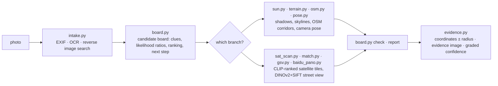

<div align="center">

# 🧭 geo-sleuth

**An agent skill that finds where a photo was taken — and shows its work.**

<p align="center">
  <a href="README.md"></a>
  <a href="README.zh-CN.md"></a>
</p>

<p align="center">
  <a href="LICENSE"></a>
  <a href="https://www.python.org/downloads/"></a>
  <a href="https://agentskills.io"></a>
  <a href="CONTRIBUTING.md"></a>
  <a href="https://github.com/Oldcircle/geo-sleuth/stargazers"></a>
</p>

<p align="center">
  <b>Works with</b><br>
  <a href="https://code.claude.com/docs/en/skills"></a>
  <a href="https://developers.openai.com/codex/skills"></a>
  <a href="https://cursor.com/docs/skills"></a>
  <a href="https://geminicli.com/docs/cli/skills/"></a>
  <a href="https://opencode.ai/docs/skills/"></a>
  <a href="https://docs.github.com/en/copilot/concepts/agents/about-agent-skills"></a>
  <br><sub>…and any other agent that reads <code>SKILL.md</code> and runs shell commands.</sub>
</p>


*No text. No plates. No landmarks. One bridge, one mountain. Located to within 2 m.*

</div>

---

## Quick start

```bash
npx skills add Oldcircle/geo-sleuth
```

Pick your agents when prompted. Then hand your agent a photo and say:

> find where this photo was taken

That is the whole interface. The agent reads `SKILL.md`, runs the scripts, and comes back with the camera position, the direction it was facing and a satellite evidence image. Prefer to copy the folder yourself? See [Installation](#installation).

## Why geo-sleuth

- **One photo, one sentence.** Give your agent a photo and say *find where this photo was taken*. You get back the camera position, the direction it was facing, and a satellite evidence image.
- **It works when there is nothing to read.** No sign, no plate, no landmark: OpenStreetMap geometry, elevation data, satellite tiles and street view carry the search on their own.
- **Geometry instead of guesswork.** Pier spacing becomes a distance ruler, shadows become a bearing, a ridge line becomes a fingerprint that elevation data can be matched against.
- **Every claim points at a file.** A conclusion has to name the command that ran in the session and the file it produced. Population and fame are not evidence.
- **Scripts rank, the model judges.** Twenty single-purpose scripts search, score and sort; the model only picks among the top few.
- **One skill, every agent.** A standard Agent Skill — `SKILL.md` plus plain Python scripts — so the same folder runs in Claude Code, Codex, Cursor, Gemini CLI, OpenCode and GitHub Copilot.
- **Answers carry an error radius.** Coordinates ± radius, the camera heading, an evidence image and a graded confidence.

## The case: one photo, nothing to read

A phone photo with the EXIF stripped: a white oven at the edge of a harvested rice paddy, a long viaduct in the distance, a steep mountain on the right. Not a single character in the frame. One message to an agent with this skill installed, and it came back with the camera position and the direction the camera was facing.

**photo → 27,335 → 171 → 14,372 → 22 → 3 → 1 → ±2 m**

| Step | What it did | Candidates left |
|---|---|---|
| **Read the photo** | Poles on the viaduct are catenary masts, so it is an electrified railway. Pier spacing used as a ruler (32 m span *assumed*): the left segment is about 0.5 km away, the right one over 1 km. A steep mountain about 3 km away. Rice harvested but grass still green, so no frost yet. | South China, as a bet, not a proof |
| **Region scan** | Pulled every railway bridge in the region from OpenStreetMap: **27,335 segments**. Sampled a point every 400 m and computed the 360° horizon from elevation data at each one. Kept points with flat ground nearby, a clear mountain within a few km, and a flat horizon next to it. | **171 sites** |
| **Skyline fit** | Placed candidate camera positions around each site and rendered the ridge line seen from each one: **14,372 positions**. The top 20 were within 0.1° of each other, so it added a constraint: the bridge must be near on the left and far on the right. | **22** |
| **Overlay check** | Drew the top three ridge lines back onto the photo. Score #1 (Fuzhou) had a bump hidden behind the oven, which is why it scored well. #3 (Huizhou) sloped where the photo is flat. #2 (Qingyuan) fit from the foot of the mountain to the edge of the frame. | **1** |
| **Pier count** | 17 piers in the photo become 17 bearings from the camera. Where they hit the railway line, the intersections must be evenly spaced. Combined with the skyline: first a band about 300 m long, then a single spot. | **±2 m** |

<div align="center">
<br>
<sub>Piers as a ruler: wide spacing on the left means near, tight spacing on the right means far.</sub><br><br>
 <br>
<sub>Left: the top three ridge lines drawn onto the photo. Right: the evidence image the skill produced.</sub>
</div>

<details>
<summary>More figures from this run</summary>
<br>
<br>
<sub>Region scan: every railway bridge in the region (grey), sites that pass the horizon test (orange).</sub><br><br>
<br>
<sub>Pier count: bearings to the 17 piers intersect the line; only one camera position makes the spacing even.</sub><br><br>
<sub>The run took about 72 minutes end to end, roughly half of it waiting on computation.</sub>
</details>

## Installation

geo-sleuth is a standard [Agent Skill](https://agentskills.io): one folder holding `SKILL.md`, `scripts/`, `references/` and `data/`. Install it with the [`skills`](https://github.com/vercel-labs/skills) CLI, or copy the folder yourself.

**All six agents, user-wide, one command:**

```bash
npx skills add Oldcircle/geo-sleuth -g -a claude-code -a codex -a cursor -a gemini-cli -a opencode -a github-copilot -y
```

**By hand:**

```bash
git clone https://github.com/Oldcircle/geo-sleuth
mkdir -p ~/.agents/skills ~/.claude/skills
cp -r geo-sleuth/skills/geo-sleuth ~/.agents/skills/              # Codex, Cursor, Gemini CLI, OpenCode, GitHub Copilot
ln -s ~/.agents/skills/geo-sleuth ~/.claude/skills/geo-sleuth     # Claude Code
```

`~/.agents/skills/` is read by Codex, Cursor, Gemini CLI, OpenCode and GitHub Copilot, so one copy there covers all five. Each agent's own folders, from its docs:

| Agent | User-wide | Per project |
|---|---|---|
| [Claude Code](https://code.claude.com/docs/en/skills) | `~/.claude/skills/` | `.claude/skills/` |
| [Codex](https://developers.openai.com/codex/skills) | `~/.agents/skills/` | `.agents/skills/` |
| [Cursor](https://cursor.com/docs/skills) | `~/.cursor/skills/` or `~/.agents/skills/` | `.cursor/skills/` or `.agents/skills/` |
| [Gemini CLI](https://geminicli.com/docs/cli/skills/) | `~/.gemini/skills/` or `~/.agents/skills/` | `.gemini/skills/` or `.agents/skills/` |
| [OpenCode](https://opencode.ai/docs/skills/) | `~/.config/opencode/skills/` or `~/.agents/skills/` | `.opencode/skills/` or `.agents/skills/` |
| [GitHub Copilot](https://docs.github.com/en/copilot/concepts/agents/about-agent-skills) | `~/.copilot/skills/` or `~/.agents/skills/` | `.github/skills/` or `.agents/skills/` |

Any other agent that reads `SKILL.md` and runs shell commands works the same way: put the folder where it looks for skills.

## How it works

The work is split into three layers. Scripts decide, scripts perceive and rank, the model only judges among the top few.



| Layer | Who | Tools |
|---|---|---|
| **Decide**: which candidates, how evidence scores, what can be excluded, where to scan next | scripts (the candidate board) | `board.py` |
| **Perceive**: read text, look up tables, find targets in satellite tiles, compare street view | scripts rank first, a person looks at the top few | `intake.py` `ocr.py` `clues.py` `sat_scan.py` `match.py` `geo.py` |
| **Judge**: pull clues from the frame, propose hypotheses, pick among the ranked few | the model | `SKILL.md` + `references/` |

Every conclusion has to point at a command that actually ran in the session and the file it produced. Exclusions need read or computed evidence; observations and guesses can only lower a candidate's weight.

## Toolbox

Twenty scripts, one job each. The full table with data sources is in `skills/geo-sleuth/references/data-sources.md`.

| What it does | Script |
|---|---|
| EXIF: GPS, capture time, equivalent focal length, heading | `exif.py` |
| OCR on the whole image, zoomed crops and tiles (Apple Vision on macOS, RapidOCR elsewhere) | `ocr.py` |
| Reverse image search on Baidu and Yandex, similar images tiled into a numbered sheet; keyword image search | `revimg.py` |
| Steps 0–3 in one command: metadata, edge crops, variants, OCR, reverse search → `intake.md` | `intake.py` |
| Zoom crops, edge and corner crops, tiling, pixel columns of evenly spaced structures such as piers | `imgprep.py` |
| Lookup tables: plate prefixes, landline area codes, calling codes, driving side, dependent territories, administrative divisions | `clues.py` + `data/` |
| Candidate board: candidates, clues, likelihood ratios, exclusion, ranking, scan order, pre-report checks | `board.py` |
| Gazetteer: list sub-divisions with bounding boxes, built-up area extent | `gazetteer.py` |
| Place, compound or shop name → coordinate candidates, every namesake listed | `poi.py` |
| Sun and shadows: latitude band, time of day, street orientation, heading from lit faces, true bearings | `sun.py` |
| OSM Overpass: feature co-occurrence, line-to-point, route corridors, line intersections, street grid templates | `osm.py` |
| Satellite tile mosaics, markers, numbered thumbnail sheets | `tiles.py` |
| CLIP zero-shot scoring of satellite grid cells or candidate points (tracks, factories, silos, dams…) | `sat_scan.py` |
| Baidu panoramas / Google Street View: find points, render headings, thumbnail sheets, historical batches | `baidu_pano.py` `gsv.py` |
| Rank candidate ground-level images against the photo: DINOv2 global similarity + SIFT inliers | `match.py` |
| Elevation: synthetic mountain views, skyline overlays, profiles; linear feature × terrain scan, ridge extraction, batch skyline scoring | `terrain.py` |
| Multi-point camera pose: lat/lon, height, heading, pitch, roll, with error radius | `pose.py` |
| Bearings, distances, line-of-sight intersections, alignment lines, frame/occlusion checks, camera position from evenly spaced structures | `geo.py` |
| Evidence image: satellite tile + camera fan + comparison grid | `evidence.py` |

The three steps from the case above (region scan, batch skyline scoring, camera position from pier spacing) are built into the skill as subcommands: `terrain.py scan / ridge / fit`, `imgprep.py piers`, `geo.py spacing`. Case scripts tuned to that photo are kept in `examples/rail-skyline-session/` for reference.

## Benchmarks

Per-operator measurements:

| Script | Test | Result |
|---|---|---|
| `match.py` | 8 cases: a historical Baidu panorama batch rendered as the photo, panoramas within 150 m as candidates (Shenzhen) | ground truth ranked 1/2/4/1/1 and 5/1/6, all in the top 6, half at #1 |
| `sat_scan.py` | 4×8 km, 364 cells at z17, 40 OSM-tagged running tracks as ground truth, multi-scale (Shenzhen) | recall@20 17/40, @30 22/40, @100 32/40, median rank 23 |
| `terrain.py scan / fit` + `geo.py spacing` | bounded re-run on the case photo above | true cluster ranks #1, final position about 2 m from ground truth |
| `clues.py` | 6 tables, 9 values spot-checked | 9/9 correct |

The method comes from breaking down 14 videos by online-geolocation creators, 22 puzzles and a set of real runs, then turning what works into rules and scripts. v2 moves every rule that can be code into `board.py`, so the rules get executed, not just read.

## Requirements

Python 3.10+, [`uv`](https://docs.astral.sh/uv/) and an agent that can run shell commands. Each script declares its own dependencies and `uv run` installs them on first use.

Optional: Google Chrome for reverse image search (`uvx playwright install chromium` works too), and `export GEO_PROXY=socks5h://127.0.0.1:<port>` to route every networked script through a proxy.

Language: the skill's instructions and script output are written in Chinese. Your agent reads them fine and replies in your language, and it has solved cases outside China too (e.g. a coastal road in Los Angeles).

## Roadmap

- [ ] Operator-level test on synthetic terrain cases for `terrain.py scan / fit`
- [ ] Google Lens as a third reverse-search engine
- [ ] CI on Linux and Windows
- [ ] A public blind-test set of unseen photos with an end-to-end accuracy number

## Contributing

Issues and pull requests are welcome, see [CONTRIBUTING.md](CONTRIBUTING.md). The most useful contributions are a transferable clue for `references/clues/` (with a source), a new data source with its licence, or a run on your own photo where the skill went wrong and why.

## Star History

<a href="https://star-history.com/#Oldcircle/geo-sleuth&Date">
  
</a>

## Acknowledgements

- OpenStreetMap contributors (ODbL). No OSM data ships in this repository; the scripts query it live. Credit © OpenStreetMap contributors when you publish query results.
- AWS Terrain Tiles (Terrarium elevation).
- [modood/Administrative-divisions-of-China](https://github.com/modood/Administrative-divisions-of-China).
- DINOv2 (Meta AI), CLIP (OpenAI).
- Sources and licences for the lookup tables are in `skills/geo-sleuth/data/README.md`.

## License

MIT, see [LICENSE](LICENSE). Tables in `data/` derived from Wikipedia are CC BY-SA 4.0; see `skills/geo-sleuth/data/README.md`.

<sub>**Responsible use:** run it on your own photos or ones you have permission to analyze, never to find people who have not agreed to be found.</sub>
