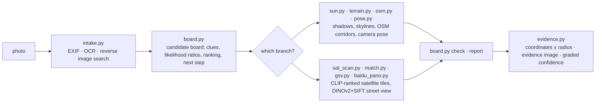

<div align="center">

# 🧭 geo-sleuth

**An agent skill that finds where a photo was taken — and shows its work.**

<p align="center">
  <a href="README.md"></a>
  <a href="README.zh-CN.md"></a>
</p>

<p align="center">
  <a href="LICENSE"></a>
  <a href="https://www.python.org/downloads/"></a>
  <a href="https://agentskills.io"></a>
  <a href="CONTRIBUTING.md"></a>
  <a href="https://github.com/Oldcircle/geo-sleuth/stargazers"></a>
</p>

<p align="center">
  <b>Works with</b><br>
  <a href="https://code.claude.com/docs/en/skills"></a>
  <a href="https://developers.openai.com/codex/skills"></a>
  <a href="https://cursor.com/docs/skills"></a>
  <a href="https://geminicli.com/docs/cli/skills/"></a>
  <a href="https://opencode.ai/docs/skills/"></a>
  <a href="https://docs.github.com/en/copilot/concepts/agents/about-agent-skills"></a>
  <br><sub>…and any other agent that reads <code>SKILL.md</code> and runs shell commands.</sub>
</p>


*No text. No plates. No landmarks. One bridge, one mountain. Located to within 2 m.*

</div>

---

## Quick start

```bash
npx skills add Oldcircle/geo-sleuth
```

Pick your agents when prompted. Then hand your agent a photo and say:

> find where this photo was taken

On first use, ask the agent to run `doctor.py` from the installed skill’s `scripts/` folder and address any failed checks (see [Requirements and setup](#requirements-and-setup)). That is the whole interface. The agent reads `SKILL.md`, runs the scripts, and comes back with the camera position, the direction it was facing and a satellite evidence image. Prefer to copy the folder yourself? See [Installation](#installation).

## Why geo-sleuth

- **One photo, one sentence.** Give your agent a photo and say *find where this photo was taken*. You get back the camera position, the direction it was facing, and a satellite evidence image.
- **It works when there is nothing to read.** No sign, no plate, no landmark: OpenStreetMap geometry, elevation data, satellite tiles and street view carry the search on their own.
- **Geometry instead of guesswork.** Pier spacing becomes a distance ruler, shadows become a bearing, a ridge line becomes a fingerprint that elevation data can be matched against.
- **Every claim points at a file.** A conclusion has to name the command that ran in the session and the file it produced. Population and fame are not evidence.
- **Scripts rank, the model judges.** Twenty single-purpose scripts search, score and sort; the model only picks among the top few.
- **One skill, every agent.** A standard Agent Skill — `SKILL.md` plus plain Python scripts — so the same folder runs in Claude Code, Codex, Cursor, Gemini CLI, OpenCode and GitHub Copilot.
- **Answers carry an error radius.** Coordinates ± radius, the camera heading, an evidence image and a graded confidence.

## Cases

None of these photos had GPS data. Each case lists what the skill read from the photo, how it narrowed the search, and how far the result landed from the confirmed camera position.

<table>
<tr>
<td width="33%" align="center"><a href="#1-a-rice-paddy-and-a-viaduct"></a></td>
<td width="33%" align="center"><a href="#2-a-desert-skyline-one-degree-off"></a></td>
<td width="33%" align="center"><a href="#3-a-cherry-tree-on-a-vancouver-street"></a></td>
</tr>
<tr>
<td><b>1 · Rice paddy and viaduct</b><br><sub>Railway bridges × skyline × pier count.</sub></td>
<td><b>2 · Desert skyline</b><br><sub>Power lines × skyline × a phone tilted by 1°.</sub></td>
<td><b>3 · Cherry street</b><br><sub>Street-tree open data × shadows × street view.</sub></td>
</tr>
<tr>
<td align="center"><b>±2 m</b><br><sub>Qingyuan, Guangdong</sub></td>
<td align="center"><b>within 100 m</b><br><sub>Da Qaidam, Qinghai</sub></td>
<td align="center"><b>3 m</b><br><sub>Vancouver, Canada</sub></td>
</tr>
</table>

### 1. A rice paddy and a viaduct

A phone photo with the EXIF stripped: a white oven at the edge of a harvested rice paddy, a long viaduct in the distance, a steep mountain on the right. Not a single character in the frame. One message to an agent with this skill installed, and it came back with the camera position and the direction the camera was facing.

**photo → 27,335 → 171 → 14,372 → 22 → 3 → 1 → ±2 m**

| Step | What it did | Candidates left |
|---|---|---|
| **Read the photo** | Poles on the viaduct are catenary masts, so it is an electrified railway. Pier spacing used as a ruler (32 m span *assumed*): the left segment is about 0.5 km away, the right one over 1 km. A steep mountain about 3 km away. Rice harvested but grass still green, so no frost yet. | South China, as a bet, not a proof |
| **Region scan** | Pulled every railway bridge in the region from OpenStreetMap: **27,335 segments**. Sampled a point every 400 m and computed the 360° horizon from elevation data at each one. Kept points with flat ground nearby, a clear mountain within a few km, and a flat horizon next to it. | **171 sites** |
| **Skyline fit** | Placed candidate camera positions around each site and rendered the ridge line seen from each one: **14,372 positions**. The top 20 were within 0.1° of each other, so it added a constraint: the bridge must be near on the left and far on the right. | **22** |
| **Overlay check** | Drew the top three ridge lines back onto the photo. Score #1 (Fuzhou) had a bump hidden behind the oven, which is why it scored well. #3 (Huizhou) sloped where the photo is flat. #2 (Qingyuan) fit from the foot of the mountain to the edge of the frame. | **1** |
| **Pier count** | 17 piers in the photo become 17 bearings from the camera. Where they hit the railway line, the intersections must be evenly spaced. Combined with the skyline: first a band about 300 m long, then a single spot. | **±2 m** |

<div align="center">
<br>
<sub>Piers as a ruler: wide spacing on the left means near, tight spacing on the right means far.</sub><br><br>
 <br>
<sub>Left: the top three ridge lines drawn onto the photo. Right: the evidence image the skill produced.</sub>
</div>

<details>
<summary>More figures from this run</summary>
<br>
<br>
<sub>Region scan: every railway bridge in the region (grey), sites that pass the horizon test (orange).</sub><br><br>
<br>
<sub>Pier count: bearings to the 17 piers intersect the line; only one camera position makes the spacing even.</sub><br><br>
<sub>The run took about 72 minutes end to end, roughly half of it waiting on computation.</sub>
</details>

### 2. A desert skyline, one degree off

A sand dune in the foreground, a range of bare dark mountains behind it, and a few pylons at the foot of the range. There is no text, road or building in the frame, and reverse image search returned only generic desert photos from northwest China.

<div align="center"></div>

**photo → 1,537 sites → stuck around 10 px → solve a 1° tilt → 1 site → one dune**

| Step | What it did | Left |
|---|---|---|
| **Read the photo** | The pylons are the only man-made objects, so the camera is within a few kilometres of a power line. Sand, gravel and bare rock point to northwest China. | 4 provinces |
| **Power lines × terrain** | `osm.py geom` pulled every power line in Xinjiang, Gansu, Ningxia and Qinghai. `terrain.py scan` worked along them with elevation data and kept the places where mountains fill the view. | **1,537 sites** |
| **Skyline fit** | `terrain.py ridge` traced the ridge in the photo, and `terrain.py fit` compared it with the ridge seen from each site. In Qinghai the top 25 sites all scored between 9.6 and 11.7 px; the true site was 9th. | **stuck** |
| **The tilt** | A phone held 1° off level moves the ridge at the edge of a 2048 px frame by 1024 × tan 1° ≈ 18 px, about 10 px on average, which is the size of the gap between the sites. At the true site the error across the frame lies on a line whose slope is tan θ, with θ ≈ 1°. `fit` was changed to solve the roll together with the horizon offset. | |
| **Fit again** | With the roll solved, the true site went from 11.1 to 6.2 px. The next best site was at 9.4 px. | **1 site** |
| **Satellite** | Within 1 km along the line of sight there are three crescent dunes and a tent camp. A 750/330/110 kV bundle runs 1–2 km to the east, which is why the pylons appear only on the left of the photo. The camera stood on the crest of the dune west of the camp, facing 205°. | **one dune** |

<div align="center">
<br>
<sub>Power lines from OSM (gold), sites where mountains fill the view (orange), and the camera (red star). Xinjiang's sites are not drawn.</sub><br><br>
<br>
<sub>The true site, before and after solving the roll. Top: the error grows from one side of the frame to the other, and its slope gives the angle. Bottom: with the roll solved, the trend is gone.</sub><br><br>
<br>
<sub>Skyline error per site. Assuming a level camera, the true site sits inside the pack; with the roll solved, it is the only one below 9 px.</sub><br><br>
<br>
<sub>Evidence image. The OSM power lines (gold) run over the pylons visible in the satellite image.</sub>
</div>

**Blind re-run.** Later we gave the photo to a new agent running the current skill, with one hint: it is in China. It scanned the 5,334 power lines in Qinghai, fit 792 sites, and picked one at 0.224° against 0.357° for the next. It ended on the same dune crest, **87 m from the confirmed camera position**, after 32 minutes. The roll fit added for this photo is now part of `terrain.py fit`; [Contributing](#contributing) explains why this case is the reference for changes to the core scripts.

### 3. A cherry tree on a Vancouver street

A flowering cherry over a sidewalk. The plates and street furniture place it in Vancouver. Finding the street is the hard part, because the city has close to ten thousand blocks.

**photo → Vancouver → 1,095 big cherries → 97 blocks → 72 slope checks → W 60th Ave → 3 m**

| Step | What it did | Left |
|---|---|---|
| **Read the photo** | White-and-blue BC plates, a dark-green streetlight in a grass boulevard, Vancouver Special houses. | **Vancouver** |
| **Street-tree data** | Vancouver publishes every street tree with species, trunk diameter and address. The candidates came from this data rather than from well-known cherry streets: flowering cherries with a trunk of at least 40 cm, then blocks with at least three of them. | **1,095 trees, 97 blocks** |
| **Shadows and slope** | The cars' shadows fall to the left and toward the camera, so the sun is ahead and to the right. The yards on the camera side sit above the sidewalk behind rock walls, so that side of the street is uphill. The agent measured the cross-slope of 72 blocks from elevation data and checked which side the big trees stand on. | **a few blocks** |
| **Tree by tree** | On the 100 block of W 60th Ave, the north side is lined with large cherries. On the south side, the trees 30–60 m ahead are 7.6 cm saplings, and the next large one is about 75 m away. The photo shows the same thing: nothing tall on the near right and pink canopy in the distance. | **1 block** |
| **Street view** | The 2009 and 2024 captures show the rock retaining wall with stone steps, the green streetlight and the white house. The house with a rooftop deck is in the 2024 capture and in the photo. The camera was on the north sidewalk, facing east. | **3 m** |

<div align="center">
 <br>
<sub>Left: all 184,517 street trees with coordinates in the city's data, the 1,095 large flowering cherries and the 97 candidate blocks. Right: what the photo gives away.</sub><br><br>
<br>
<sub>The photo was taken from the sidewalk and the street view car drove down the middle of the road, so the angles differ.</sub><br><br>
<br>
<sub>Evidence image. Pink rings are large cherries from the city's data, green rings are saplings.</sub>
</div>

**Blind re-run.** The table above comes from a blind run: a new agent running the current skill, given the photo and no hint. It finished in 53 minutes, **3 m from the confirmed camera position**.

## Installation

geo-sleuth is a standard [Agent Skill](https://agentskills.io): one folder holding `SKILL.md`, `scripts/`, `references/` and `data/`. Install it with the [`skills`](https://github.com/vercel-labs/skills) CLI, or copy the folder yourself.

**All six agents, user-wide, one command:**

```bash
npx skills add Oldcircle/geo-sleuth -g -a claude-code -a codex -a cursor -a gemini-cli -a opencode -a github-copilot -y
```

**By hand:**

```bash
git clone https://github.com/Oldcircle/geo-sleuth
mkdir -p ~/.agents/skills ~/.claude/skills
cp -r geo-sleuth/skills/geo-sleuth ~/.agents/skills/              # Codex, Cursor, Gemini CLI, OpenCode, GitHub Copilot
ln -s ~/.agents/skills/geo-sleuth ~/.claude/skills/geo-sleuth     # Claude Code
```

`~/.agents/skills/` is read by Codex, Cursor, Gemini CLI, OpenCode and GitHub Copilot, so one copy there covers all five. Each agent's own folders, from its docs:

| Agent | User-wide | Per project |
|---|---|---|
| [Claude Code](https://code.claude.com/docs/en/skills) | `~/.claude/skills/` | `.claude/skills/` |
| [Codex](https://developers.openai.com/codex/skills) | `~/.agents/skills/` | `.agents/skills/` |
| [Cursor](https://cursor.com/docs/skills) | `~/.cursor/skills/` or `~/.agents/skills/` | `.cursor/skills/` or `.agents/skills/` |
| [Gemini CLI](https://geminicli.com/docs/cli/skills/) | `~/.gemini/skills/` or `~/.agents/skills/` | `.gemini/skills/` or `.agents/skills/` |
| [OpenCode](https://opencode.ai/docs/skills/) | `~/.config/opencode/skills/` or `~/.agents/skills/` | `.opencode/skills/` or `.agents/skills/` |
| [GitHub Copilot](https://docs.github.com/en/copilot/concepts/agents/about-agent-skills) | `~/.copilot/skills/` or `~/.agents/skills/` | `.github/skills/` or `.agents/skills/` |

Any other agent that reads `SKILL.md` and runs shell commands works the same way: put the folder where it looks for skills.

## How it works

The work is split into three layers. Scripts decide, scripts perceive and rank, the model only judges among the top few.


```mermaid
flowchart LR
  A["photo"] --> B["intake.py<br/>EXIF · OCR · reverse image search"]
  B --> C["board.py<br/>candidate board: clues, likelihood ratios, ranking, next step"]
  C --> D{"which branch?"}
  D --> E["sun.py · terrain.py · osm.py · pose.py<br/>shadows, skylines, OSM corridors, camera pose"]
  D --> F["sat_scan.py · match.py · gsv.py · baidu_pano.py<br/>CLIP-ranked satellite tiles, DINOv2+SIFT street view"]
  E --> G["board.py check · report"]
  F --> G
  G --> H["evidence.py<br/>coordinates ± radius · evidence image · graded confidence"]
```

| Layer | Who | Tools |
|---|---|---|
| **Decide**: which candidates, how evidence scores, what can be excluded, where to scan next | scripts (the candidate board) | `board.py` |
| **Perceive**: read text, look up tables, find targets in satellite tiles, compare street view | scripts rank first, a person looks at the top few | `intake.py` `ocr.py` `clues.py` `sat_scan.py` `match.py` `geo.py` |
| **Judge**: pull clues from the frame, propose hypotheses, pick among the ranked few | the model | `SKILL.md` + `references/` |

Every conclusion has to point at a command that actually ran in the session and the file it produced. Exclusions need read or computed evidence; observations and guesses can only lower a candidate's weight.

## Toolbox

Twenty-odd scripts, one job each. The full table with data sources is in `skills/geo-sleuth/references/data-sources.md`.

| What it does | Script |
|---|---|
| Environment checks, browser launch and optional network probes | `doctor.py` |
| EXIF: GPS, capture time, equivalent focal length, heading | `exif.py` |
| OCR on the whole image, zoomed crops and tiles (Apple Vision on macOS, RapidOCR elsewhere) | `ocr.py` |
| Reverse image search on Baidu and Yandex, similar images tiled into a numbered sheet; keyword image search | `revimg.py` |
| Steps 0–3 in one command: metadata, edge crops, variants, OCR, reverse search → `intake.md` | `intake.py` |
| Zoom crops, edge and corner crops, tiling, pixel columns of evenly spaced structures such as piers | `imgprep.py` |
| Lookup tables: calling codes, driving side, dependent territories worldwide; plate prefixes, area codes and admin divisions from region packs | `clues.py` + `data/` + `regions/` |
| Region packs: list them, print a country's card and clue index, lint a pack | `regions.py` |
| Candidate board: candidates, clues, likelihood ratios, exclusion, ranking, scan order, pre-report checks | `board.py` |
| Gazetteer: list sub-divisions with bounding boxes, built-up area extent | `gazetteer.py` |
| Place, compound or shop name → coordinate candidates, every namesake listed | `poi.py` |
| Sun and shadows: latitude band, time of day, street orientation, heading from lit faces, true bearings | `sun.py` |
| OSM Overpass: feature co-occurrence, line-to-point, route corridors, line intersections, street grid templates | `osm.py` |
| Satellite tile mosaics, markers, numbered thumbnail sheets | `tiles.py` |
| CLIP zero-shot scoring of satellite grid cells or candidate points (tracks, factories, silos, dams…) | `sat_scan.py` |
| Baidu panoramas / Google Street View: find points, render headings, thumbnail sheets, historical batches | `baidu_pano.py` `gsv.py` |
| Rank candidate ground-level images against the photo: DINOv2 global similarity + SIFT inliers | `match.py` |
| Elevation: synthetic mountain views, skyline overlays, profiles; linear feature × terrain scan, ridge extraction, batch skyline scoring | `terrain.py` |
| Multi-point camera pose: lat/lon, height, heading, pitch, roll, with error radius | `pose.py` |
| Bearings, distances, line-of-sight intersections, alignment lines, frame/occlusion checks, camera position from evenly spaced structures | `geo.py` |
| Evidence image: satellite tile + camera fan + comparison grid | `evidence.py` |

The steps from case 1 (region scan, batch skyline scoring, camera position from pier spacing) are built into the skill as subcommands: `terrain.py scan / ridge / fit`, `imgprep.py piers`, `geo.py spacing`; case scripts tuned to that photo are kept in `examples/rail-skyline-session/`. The tilt from case 2 is solved by `terrain.py fit` itself (`--roll-max`, default 1°); `examples/desert-roll-fix/` reproduces the before and after.

## Benchmarks

Per-operator measurements:

| Script | Test | Result |
|---|---|---|
| `match.py` | 8 cases: a historical Baidu panorama batch rendered as the photo, panoramas within 150 m as candidates (Shenzhen) | ground truth ranked 1/2/4/1/1 and 5/1/6, all in the top 6, half at #1 |
| `sat_scan.py` | 4×8 km, 364 cells at z17, 40 OSM-tagged running tracks as ground truth, multi-scale (Shenzhen) | recall@20 17/40, @30 22/40, @100 32/40, median rank 23 |
| `terrain.py scan / fit` + `geo.py spacing` | bounded re-run on the case photo above | true cluster ranks #1, final position about 2 m from ground truth |
| `terrain.py fit --roll-max` | 8 synthetic skyline cases (random heading, focal length, ±1° roll) | median position error 324 → 238 m (untilted cases 324 → 89 m, tilted 1,695 → 265 m) |
| `terrain.py fit --roll-max` | the 12 best sites from the desert case | true site #8 at 12.0 px → #1 at 6.2 px (runner-up 9.9 px) |
| `clues.py` | 6 tables, 9 values spot-checked | 9/9 correct |

End to end, blind re-runs with a fresh agent that had only the photo (and the hint shown):

| Case | Hint | Result | Time |
|---|---|---|---|
| [Desert skyline](#2-a-desert-skyline-one-degree-off) | "it is in China" | 87 m from the confirmed camera position | 32 min |
| [Cherry street](#3-a-cherry-tree-on-a-vancouver-street) | none | 3 m from the confirmed camera position | 53 min |

Both photos had been solved before and lessons from them are in the skill, so these are regression checks, not accuracy on unseen photos.

The method comes from breaking down 14 videos by online-geolocation creators, 22 puzzles and a set of real runs, then turning what works into rules and scripts. v2 moves every rule that can be code into `board.py`, so the rules get executed, not just read.

## Requirements and setup

You need Python 3.10+, [`uv`](https://docs.astral.sh/uv/), `curl`, and an agent that can run shell commands. Each script declares its own dependencies; use `uv run`, which installs them on first use. Keep the complete skill folder, including `data/` and the helper modules in `scripts/`.

Reverse image search requires **Google Chrome or Playwright Chromium**. The scripts try Chrome first and automatically fall back to Chromium. If neither is installed:

```bash
uvx playwright install chromium
```

Linux may also need browser system libraries: `uvx playwright install --with-deps chromium`. See the [Playwright browser setup guide](https://playwright.dev/python/docs/browsers). After a Playwright upgrade, rerun the installer if it reports a missing browser executable.

From a clone of this repository, run these commands (also work in PowerShell):

```bash
uv run skills/geo-sleuth/scripts/doctor.py
uv run skills/geo-sleuth/scripts/doctor.py --network
```

For an installed skill, use its actual `scripts/doctor.py` path, or ask your agent to run it. The local check tests Python, uv, curl, bundled lookup tables, a writable working directory and an actual browser launch. `--network` also probes the services without uploading photos. `--json` produces machine-readable diagnostics. Exit code 1 means a failed check; warnings identify optional features that may not work. uv may fetch Playwright on the first run; doctor does not load OCR or ML models. Passing an endpoint probe does not guarantee image uploads, model downloads, imagery coverage or freedom from CAPTCHAs.

To check the local processing pipeline on your own image before using online search:

```bash
uv run skills/geo-sleuth/scripts/intake.py photo.jpg --out-dir intake --no-rev
```

Open `intake/intake.md`, then inspect the listed crops and OCR output. This checks metadata, image preparation and OCR; it does not perform reverse image search. Omit `--no-rev` for the full intake. On macOS OCR prefers Apple Vision; other systems use RapidOCR, also available as a fallback. `match.py` and `sat_scan.py` install ML packages and download model weights on first use; allow extra time and disk space. uv and model downloads still need network access even when a particular processing step works locally.

### Troubleshooting

| Symptom | Next step |
|---|---|
| `uv` or `curl` not found | Install the missing command, reopen the terminal, rerun doctor. |
| Browser launch fails | Install Chrome or Playwright Chromium; inspect the doctor's error. Use `intake.py --no-rev` for local processing meanwhile. |
| HTTP 403/429 or CAPTCHA | Inspect the saved screenshot; retry later or use a supported manual browser workflow. |
| A service times out | Run `doctor.py --network`; check the service and your connection. |
| A model fails to load | Check disk space, the download error and Hugging Face reachability. First-run downloads can be slow. |
| Intake has failed or skipped steps | Read `intake.md`; failed search is not evidence that there is no matching image. |
| A Chinese place name or OCR excerpt appears | Source evidence stays in its original language. Ask the agent to explain it in your language. |

Language: maintained instructions, CLI help, errors, generated report headings and default evidence labels are in **English**. Source text (OCR, place names, search responses and screenshots) is preserved rather than rewritten; the agent explains it and writes the final report in your language. The last version with Chinese instructions is frozen at the [`zh-final`](https://github.com/Oldcircle/geo-sleuth/tree/zh-final) tag and is no longer updated.

## Roadmap

- [ ] Operator-level test on synthetic terrain cases for `terrain.py scan / fit`
- [ ] Google Lens as a third reverse-search engine
- [ ] CI on Linux and Windows
- [ ] A public blind-test set of unseen photos with an end-to-end accuracy number

## Contributing

Issues and pull requests are welcome, see [CONTRIBUTING.md](CONTRIBUTING.md).

| You have | Where it goes | Bar |
|---|---|---|
| A clue that separates countries | `references/clues/global.md` | a source and a counterexample |
| Clues, tables or services for one country | a region pack, `regions/<cc>/` ([contract](skills/geo-sleuth/regions/README.md)) | data and docs only; `regions.py lint` prints `ok` |
| A change to the core scripts | its own PR | a photo it fails on before and solves after, plus no regression elsewhere |
| A run that went wrong | an issue | the first step that went off |

The [desert case](#2-a-desert-skyline-one-degree-off) is the model for core changes: the skill was stuck on a real photo (top 25 sites within 9.6–11.7 px), the change was general rather than tuned to that photo (solve camera roll in `terrain.py fit`, capped at 1°, `--roll-max 0` gives the old output), the same photo was then solved (the true site broke away at 6.2 px), and it held up on cases it was not built for (8 synthetic skylines, an earlier real case). `examples/desert-roll-fix/` reruns the before and after with two commands.

## Star History

<a href="https://star-history.com/#Oldcircle/geo-sleuth&Date">
  
</a>

## Acknowledgements

- OpenStreetMap contributors (ODbL). No OSM data ships in this repository; the scripts query it live. Credit © OpenStreetMap contributors when you publish query results.
- AWS Terrain Tiles (Terrarium elevation).
- [modood/Administrative-divisions-of-China](https://github.com/modood/Administrative-divisions-of-China).
- DINOv2 (Meta AI), CLIP (OpenAI).
- Sources and licences for the lookup tables are in `skills/geo-sleuth/data/README.md`.

## License

MIT, see [LICENSE](LICENSE). Tables in `data/` derived from Wikipedia are CC BY-SA 4.0; see `skills/geo-sleuth/data/README.md`.

<sub>**Responsible use:** run it on your own photos or ones you have permission to analyze, never to find people who have not agreed to be found.</sub>
