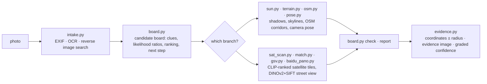

<div align="center">

# 🧭 geo-sleuth

**Uma skill para agentes que descobre onde uma foto foi tirada — e mostra o seu trabalho.**

<p align="center">
  <a href="README.md"></a>
  <a href="README.zh-CN.md"></a>
  <a href="README.zh-TW.md"></a>
  <a href="README.ja.md"></a>
  <a href="README.ko.md"></a>
  <a href="README.es.md"></a>
  <a href="README.fr.md"></a>
  <a href="README.de.md"></a>
  <a href="README.ru.md"></a>
  <a href="README.pt-BR.md"></a>
</p>

<p align="center">
  <a href="LICENSE"></a>
  <a href="https://www.python.org/downloads/"></a>
  <a href="https://agentskills.io"></a>
  <a href="CONTRIBUTING.md"></a>
  <a href="https://github.com/Oldcircle/geo-sleuth/stargazers"></a>
</p>

<p align="center">
  <b>Funciona com</b><br>
  <a href="https://code.claude.com/docs/en/skills"></a>
  <a href="https://developers.openai.com/codex/skills"></a>
  <a href="https://cursor.com/docs/skills"></a>
  <a href="https://geminicli.com/docs/cli/skills/"></a>
  <a href="https://opencode.ai/docs/skills/"></a>
  <a href="https://docs.github.com/en/copilot/concepts/agents/about-agent-skills"></a>
  <br><sub>…e com qualquer outro agente que leia <code>SKILL.md</code> e execute comandos de shell.</sub>
</p>


*Sem texto. Sem placas. Sem pontos de referência. Uma ponte, uma montanha. Localizada com precisão de 2 m.*

</div>

---

## Início rápido

```bash
npx skills add Oldcircle/geo-sleuth
```

Escolha seus agentes quando for solicitado. Depois, entregue uma foto ao seu agente e diga:

> descubra onde esta foto foi tirada

Essa é toda a interface. O agente lê o `SKILL.md`, executa os scripts e volta com a posição da câmera, a direção para a qual ela apontava e uma imagem de satélite como evidência. Prefere copiar a pasta você mesmo? Veja [Instalação](#instalação).

## Por que geo-sleuth

- **Uma foto, uma frase.** Entregue uma foto ao seu agente e diga: *descubra onde esta foto foi tirada*. Você recebe de volta a posição da câmera, a direção para a qual ela apontava e uma imagem de satélite como evidência.
- **Funciona quando não há nada para ler.** Sem placa, sem letreiro, sem marco: a geometria do OpenStreetMap, dados de elevação, imagens de satélite e street view conduzem a busca sozinhos.
- **Geometria em vez de suposição.** O espaçamento entre pilares vira uma régua de distância, sombras viram um azimute, uma linha de cume vira uma impressão digital que pode ser comparada a dados de elevação.
- **Toda afirmação aponta para um arquivo.** Uma conclusão precisa citar o comando executado na sessão e o arquivo que ele produziu. População e fama não são evidência.
- **Os scripts classificam, o modelo julga.** Vinte scripts de propósito único buscam, pontuam e ordenam; o modelo só escolhe entre os melhores colocados.
- **Uma skill, todos os agentes.** Uma Agent Skill padrão — `SKILL.md` e scripts Python comuns — e por isso a mesma pasta roda no Claude Code, Codex, Cursor, Gemini CLI, OpenCode e GitHub Copilot.
- **As respostas trazem um raio de erro.** Coordenadas ± raio, a direção da câmera, uma imagem de evidência e uma confiança graduada.

## O caso: uma foto, nada para ler

Uma foto de celular com o EXIF removido: um forno branco na borda de um arrozal já colhido, um longo viaduto ao fundo, uma montanha íngreme à direita. Nenhum caractere sequer no quadro. Uma mensagem a um agente com essa skill instalada, e ele retornou com a posição da câmera e a direção para a qual ela apontava.

**foto → 27,335 → 171 → 14,372 → 22 → 3 → 1 → ±2 m**

| Etapa | O que foi feito | Candidatos restantes |
|---|---|---|
| **Ler a foto** | Os postes no viaduto são mastros de catenária, então é uma ferrovia eletrificada. O espaçamento entre pilares foi usado como régua (vão de 32 m, *presumido*): o segmento esquerdo está a cerca de 0.5 km de distância, o direito a mais de 1 km. Uma montanha íngreme a cerca de 3 km. O arroz já foi colhido, mas a grama ainda está verde, então ainda não houve geada. | sul da China, como um palpite, não uma prova |
| **Varredura da região** | Todas as pontes ferroviárias da região extraídas do OpenStreetMap: **27,335 segmentos**. Um ponto amostrado a cada 400 m, com o horizonte de 360° calculado a partir de dados de elevação em cada um. Mantidos os pontos com terreno plano nas proximidades, uma montanha nítida a poucos km e um horizonte plano ao lado dela. | **171 locais** |
| **Ajuste do perfil do horizonte** | Posições candidatas de câmera foram colocadas ao redor de cada local, renderizando a linha de cume vista de cada uma: **14,372 posições**. As 20 melhores ficaram a até 0.1° umas das outras, então foi adicionada uma restrição: a ponte precisa estar perto à esquerda e longe à direita. | **22** |
| **Verificação por sobreposição** | As três linhas de cume mais bem colocadas foram desenhadas de volta sobre a foto. A #1 (Fuzhou) tinha uma elevação escondida atrás do forno, por isso pontuou bem. A #3 (Huizhou) inclinava onde a foto é plana. A #2 (Qingyuan) encaixou do sopé da montanha até a borda do quadro. | **1** |
| **Contagem de pilares** | 17 pilares na foto viram 17 azimutes a partir da câmera. Onde cruzam a linha férrea, as interseções devem ficar uniformemente espaçadas. Combinado com o perfil do horizonte: primeiro uma faixa de cerca de 300 m de comprimento, depois um único ponto. | **±2 m** |

<div align="center">
<br>
<sub>Pilares como régua: espaçamento largo à esquerda significa perto, espaçamento apertado à direita significa longe.</sub><br><br>
 <br>
<sub>Esquerda: as três linhas de cume mais bem colocadas desenhadas sobre a foto. Direita: a imagem de evidência produzida pela skill.</sub>
</div>

<details>
<summary>Mais imagens desta execução</summary>
<br>
<br>
<sub>Varredura da região: todas as pontes ferroviárias da região (em cinza), locais que passaram no teste do horizonte (em laranja).</sub><br><br>
<br>
<sub>Contagem de pilares: os azimutes dos 17 pilares cruzam a linha; apenas uma posição de câmera deixa o espaçamento uniforme.</sub><br><br>
<sub>A execução levou cerca de 72 minutos de ponta a ponta, aproximadamente metade disso esperando o processamento.</sub>
</details>

## Instalação

O geo-sleuth é uma [Agent Skill](https://agentskills.io) padrão: uma pasta com `SKILL.md`, `scripts/`, `references/` e `data/`. Instale com a CLI [`skills`](https://github.com/vercel-labs/skills) ou copie a pasta você mesmo.

**Os seis agentes, no nível do usuário, com um só comando:**

```bash
npx skills add Oldcircle/geo-sleuth -g -a claude-code -a codex -a cursor -a gemini-cli -a opencode -a github-copilot -y
```

**Manualmente:**

```bash
git clone https://github.com/Oldcircle/geo-sleuth
mkdir -p ~/.agents/skills ~/.claude/skills
cp -r geo-sleuth/skills/geo-sleuth ~/.agents/skills/              # Codex, Cursor, Gemini CLI, OpenCode, GitHub Copilot
ln -s ~/.agents/skills/geo-sleuth ~/.claude/skills/geo-sleuth     # Claude Code
```

`~/.agents/skills/` é lido pelo Codex, Cursor, Gemini CLI, OpenCode e GitHub Copilot, então uma única cópia ali serve para os cinco. As pastas próprias de cada agente, segundo a documentação de cada um:

| Agente | Nível do usuário | Por projeto |
|---|---|---|
| [Claude Code](https://code.claude.com/docs/en/skills) | `~/.claude/skills/` | `.claude/skills/` |
| [Codex](https://developers.openai.com/codex/skills) | `~/.agents/skills/` | `.agents/skills/` |
| [Cursor](https://cursor.com/docs/skills) | `~/.cursor/skills/` ou `~/.agents/skills/` | `.cursor/skills/` ou `.agents/skills/` |
| [Gemini CLI](https://geminicli.com/docs/cli/skills/) | `~/.gemini/skills/` ou `~/.agents/skills/` | `.gemini/skills/` ou `.agents/skills/` |
| [OpenCode](https://opencode.ai/docs/skills/) | `~/.config/opencode/skills/` ou `~/.agents/skills/` | `.opencode/skills/` ou `.agents/skills/` |
| [GitHub Copilot](https://docs.github.com/en/copilot/concepts/agents/about-agent-skills) | `~/.copilot/skills/` ou `~/.agents/skills/` | `.github/skills/` ou `.agents/skills/` |

Qualquer outro agente que leia `SKILL.md` e execute comandos de shell funciona do mesmo jeito: basta colocar a pasta onde ele procura skills.

## Como funciona

O trabalho é dividido em três camadas. Os scripts decidem, os scripts percebem e classificam, o modelo apenas julga entre os melhores colocados.



| Camada | Quem | Ferramentas |
|---|---|---|
| **Decidir**: quais candidatos, como as evidências pontuam, o que pode ser excluído, onde buscar em seguida | scripts (o quadro de candidatos) | `board.py` |
| **Perceber**: ler texto, consultar tabelas, encontrar alvos em imagens de satélite, comparar street view | os scripts classificam primeiro, uma pessoa olha os melhores colocados | `intake.py` `ocr.py` `clues.py` `sat_scan.py` `match.py` `geo.py` |
| **Julgar**: extrair pistas do quadro, propor hipóteses, escolher entre os melhores classificados | o modelo | `SKILL.md` + `references/` |

Toda conclusão precisa apontar para um comando que de fato foi executado na sessão e para o arquivo que ele produziu. Exclusões exigem evidência lida ou calculada; observações e suposições só podem reduzir o peso de um candidato.

## Caixa de ferramentas

Vinte scripts, uma tarefa cada. A tabela completa com as fontes de dados está em `skills/geo-sleuth/references/data-sources.md`.

| O que faz | Script |
|---|---|
| EXIF: GPS, horário de captura, distância focal equivalente, direção | `exif.py` |
| OCR na imagem inteira, recortes ampliados e tiles (Apple Vision no macOS, RapidOCR nos demais) | `ocr.py` |
| Busca reversa de imagens no Baidu e Yandex, imagens semelhantes organizadas em uma folha numerada; busca de imagens por palavra-chave | `revimg.py` |
| Etapas 0–3 em um comando: metadados, recortes de borda, variantes, OCR, busca reversa → `intake.md` | `intake.py` |
| Recortes com zoom, recortes de borda e canto, divisão em tiles, colunas de pixels de estruturas uniformemente espaçadas como pilares | `imgprep.py` |
| Tabelas de consulta: prefixos de placas, códigos de área de telefone fixo, códigos de discagem internacional, lado de direção, territórios dependentes, divisões administrativas | `clues.py` + `data/` |
| Quadro de candidatos: candidatos, pistas, razões de verossimilhança, exclusão, classificação, ordem de varredura, verificações pré-relatório | `board.py` |
| Gazetteer: lista subdivisões com caixas delimitadoras, extensão da área construída | `gazetteer.py` |
| Nome de local, condomínio ou loja → candidatos de coordenadas, cada homônimo listado | `poi.py` |
| Sol e sombras: faixa de latitude, hora do dia, orientação da rua, direção a partir de fachadas iluminadas, azimutes verdadeiros | `sun.py` |
| OSM Overpass: coocorrência de feições, linha-para-ponto, corredores de rota, interseções de linhas, modelos de malha viária | `osm.py` |
| Mosaicos de tiles de satélite, marcadores, folhas de miniaturas numeradas | `tiles.py` |
| Pontuação zero-shot via CLIP de células da grade de satélite ou pontos candidatos (pistas, fábricas, silos, barragens…) | `sat_scan.py` |
| Panoramas do Baidu / Google Street View: encontrar pontos, renderizar direções, folhas de miniaturas, lotes históricos | `baidu_pano.py` `gsv.py` |
| Classificar imagens candidatas em nível do solo contra a foto: similaridade global DINOv2 + inliers SIFT | `match.py` |
| Elevação: vistas sintéticas de montanhas, sobreposições de perfil do horizonte, perfis; varredura de feição linear × terreno, extração de linha de cume, pontuação de perfil em lote | `terrain.py` |
| Pose de câmera multiponto: lat/lon, altura, direção, arfagem, rolagem, com raio de erro | `pose.py` |
| Azimutes, distâncias, interseções de linha de visada, linhas de alinhamento, verificações de quadro/oclusão, posição da câmera a partir de estruturas uniformemente espaçadas | `geo.py` |
| Imagem de evidência: tile de satélite + leque da câmera + grade de comparação | `evidence.py` |

As três etapas do caso acima (varredura da região, pontuação de perfil em lote, posição da câmera a partir do espaçamento entre pilares) vêm embutidas no skill como subcomandos: `terrain.py scan / ridge / fit`, `imgprep.py piers`, `geo.py spacing`. Os scripts do caso, ajustados para aquela foto, ficam em `examples/rail-skyline-session/` como referência.

## Avaliação

Medições por operador:

| Script | Teste | Resultado |
|---|---|---|
| `match.py` | 8 casos: um lote histórico de panoramas do Baidu renderizado como a foto, panoramas dentro de 150 m como candidatos (Shenzhen) | o gabarito ficou classificado em 1/2/4/1/1 e 5/1/6, todos no top 6, metade em #1 |
| `sat_scan.py` | 4×8 km, 364 células em z17, 40 pistas de corrida marcadas no OSM como gabarito, multiescala (Shenzhen) | recall@20 17/40, @30 22/40, @100 32/40, rank mediano 23 |
| `terrain.py scan / fit` + `geo.py spacing` | nova execução limitada sobre a foto do caso acima | o cluster verdadeiro ficou em #1, posição final a cerca de 2 m da localização real |
| `clues.py` | 6 tabelas, 9 valores verificados por amostragem | 9/9 corretos |

O método vem de decompor 14 vídeos de criadores de geolocalização online, 22 quebra-cabeças e uma série de execuções reais, e transformar o que funciona em regras e scripts. A v2 move para `board.py` toda regra que pode virar código, para que as regras sejam executadas, e não apenas lidas.

## Requisitos

Python 3.10+, [`uv`](https://docs.astral.sh/uv/) e um agente capaz de executar comandos de shell. Cada script declara as próprias dependências, e o `uv run` as instala no primeiro uso.

Opcional: Google Chrome para a busca reversa de imagens (`uvx playwright install chromium` também funciona) e `export GEO_PROXY=socks5h://127.0.0.1:<port>` para fazer todos os scripts que acessam a rede passarem por um proxy.

## Roteiro

- [ ] Teste em nível de operador em casos sintéticos de terreno para `terrain.py scan / fit`
- [ ] Google Lens como um terceiro mecanismo de busca reversa
- [ ] CI em Linux e Windows
- [ ] Um conjunto público de teste cego com fotos nunca vistas e um número de precisão de ponta a ponta

## Contribuindo

Issues e pull requests são bem-vindos, veja [CONTRIBUTING.md](CONTRIBUTING.md). As contribuições mais úteis são uma pista transferível para `references/clues/` (com fonte), uma nova fonte de dados com sua licença, ou uma execução com sua própria foto em que a skill errou, explicando o motivo.

## Histórico de Estrelas

<a href="https://star-history.com/#Oldcircle/geo-sleuth&Date">
  
</a>

## Agradecimentos

- Contribuidores do OpenStreetMap (ODbL). Nenhum dado do OSM é distribuído neste repositório; os scripts o consultam ao vivo. Credite © OpenStreetMap contributors ao publicar resultados de consultas.
- AWS Terrain Tiles (elevação Terrarium).
- [modood/Administrative-divisions-of-China](https://github.com/modood/Administrative-divisions-of-China).
- DINOv2 (Meta AI), CLIP (OpenAI).
- Fontes e licenças das tabelas de consulta estão em `skills/geo-sleuth/data/README.md`.

## Licença

MIT, veja [LICENSE](LICENSE). As tabelas em `data/` derivadas da Wikipedia estão sob CC BY-SA 4.0; veja `skills/geo-sleuth/data/README.md`.

<sub>**Uso responsável:** use em suas próprias fotos ou em fotos que você tenha permissão para analisar, nunca para encontrar pessoas que não concordaram em ser encontradas.</sub>
