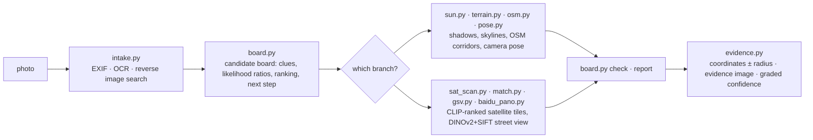

<div align="center">

# 🧭 geo-sleuth

**Скилл для ИИ-агентов, который находит, где было сделано фото, — и показывает свою работу.**

<p align="center">
  <a href="README.md"></a>
  <a href="README.zh-CN.md"></a>
  <a href="README.zh-TW.md"></a>
  <a href="README.ja.md"></a>
  <a href="README.ko.md"></a>
  <a href="README.es.md"></a>
  <a href="README.fr.md"></a>
  <a href="README.de.md"></a>
  <a href="README.ru.md"></a>
  <a href="README.pt-BR.md"></a>
</p>

<p align="center">
  <a href="LICENSE"></a>
  <a href="https://www.python.org/downloads/"></a>
  <a href="https://agentskills.io"></a>
  <a href="CONTRIBUTING.md"></a>
  <a href="https://github.com/Oldcircle/geo-sleuth/stargazers"></a>
</p>

<p align="center">
  <b>Работает с</b><br>
  <a href="https://code.claude.com/docs/en/skills"></a>
  <a href="https://developers.openai.com/codex/skills"></a>
  <a href="https://cursor.com/docs/skills"></a>
  <a href="https://geminicli.com/docs/cli/skills/"></a>
  <a href="https://opencode.ai/docs/skills/"></a>
  <a href="https://docs.github.com/en/copilot/concepts/agents/about-agent-skills"></a>
  <br><sub>…и с любым другим агентом, который читает <code>SKILL.md</code> и выполняет команды оболочки.</sub>
</p>


*Ни текста. Ни номеров. Ни ориентиров. Один мост, одна гора. Определено с точностью до 2 m.*

</div>

---

## Быстрый старт

```bash
npx skills add Oldcircle/geo-sleuth
```

Когда установщик спросит, выберите своих агентов. Затем дайте агенту фото и скажите:

> найди, где было сделано это фото

Это весь интерфейс. Агент читает `SKILL.md`, запускает скрипты и возвращает позицию камеры, направление съёмки и спутниковый снимок-доказательство. Хотите скопировать папку вручную? См. раздел [Установка](#установка).

## Почему geo-sleuth

- **Одно фото, одна фраза.** Дайте агенту фото и скажите: *найди, где было сделано это фото*. В ответ — позиция камеры, направление съёмки и спутниковый снимок-доказательство.
- **Работает, даже если читать нечего.** Ни вывески, ни номера, ни ориентира: геометрия OpenStreetMap, данные о высотах, спутниковые тайлы и панорамы улиц ведут поиск сами.
- **Геометрия вместо догадок.** Расстояние между опорами становится линейкой, тени — пеленгом, линия хребта — отпечатком, который можно сверить с данными о высотах.
- **Каждое утверждение указывает на файл.** Вывод обязан называть команду, выполненную в сессии, и файл, который она создала. Численность населения и известность места доказательством не являются.
- **Скрипты ранжируют, модель судит.** Двадцать узкоспециализированных скриптов ищут, оценивают и сортируют; модель выбирает только среди нескольких лучших.
- **Один скилл — любой агент.** Это стандартный Agent Skill из `SKILL.md` и обычных скриптов на Python, поэтому одна и та же папка работает в Claude Code, Codex, Cursor, Gemini CLI, OpenCode и GitHub Copilot.
- **Ответы несут радиус погрешности.** Координаты ± радиус, направление камеры, снимок-доказательство и оценка уверенности.

## Кейс: одно фото, нечего читать

Фото с телефона без EXIF: белая печь на краю убранного рисового поля, вдали длинный виадук, справа крутая гора. Ни единого символа в кадре. Одно сообщение агенту с установленным скиллом — и в ответ пришли позиция камеры и направление, куда она смотрела.

**фото → 27,335 → 171 → 14,372 → 22 → 3 → 1 → ±2 m**

| Шаг | Что было сделано | Осталось кандидатов |
|---|---|---|
| **Прочитать фото** | Столбы на виадуке — это опоры контактной сети, значит, дорога электрифицирована. Расстояние между опорами использовано как линейка (пролёт 32 m, *предположительно*): левый отрезок примерно в 0.5 km, правый — более чем в 1 km. Крутая гора примерно в 3 km. Рис уже убран, но трава ещё зелёная, значит заморозков ещё не было. | Южный Китай, как догадка, а не доказательство |
| **Скан региона** | Извлечены все железнодорожные мосты региона из OpenStreetMap: **27,335 сегментов**. Точка отбиралась каждые 400 m, и в каждой вычислялся 360°-горизонт по данным о высотах. Оставлены точки с ровной землёй поблизости, чёткой горой в пределах нескольких km и ровным горизонтом рядом с ней. | **171 участок** |
| **Подгонка линии горизонта** | Вокруг каждого участка расставлены возможные позиции камеры, и для каждой отрисован видимый оттуда горный хребет: **14,372 позиции**. Топ-20 отличались друг от друга не более чем на 0.1°, поэтому добавилось условие: мост должен быть близко слева и далеко справа. | **22** |
| **Проверка наложением** | Три лучшие линии хребта нарисованы поверх фото. Кандидат №1 (Фучжоу) имел выступ, скрытый за печью, — из-за этого он и получил высокую оценку. №3 (Хуэйчжоу) шёл под уклон там, где на фото ровно. №2 (Цинъюань) совпал от подножия горы до края кадра. | **1** |
| **Подсчёт опор** | 17 опор на фото превращаются в 17 пеленгов от камеры. Там, где они пересекают железнодорожную линию, пересечения должны быть равномерно распределены. В сочетании с линией горизонта: сначала полоса длиной около 300 m, затем единственная точка. | **±2 m** |

<div align="center">
<br>
<sub>Опоры как линейка: широкий интервал слева значит близко, узкий интервал справа значит далеко.</sub><br><br>
 <br>
<sub>Слева: три лучшие линии хребта, нарисованные поверх фото. Справа: снимок-доказательство, созданный скиллом.</sub>
</div>

<details>
<summary>Больше иллюстраций из этого прогона</summary>
<br>
<br>
<sub>Скан региона: все железнодорожные мосты региона (серым), участки, прошедшие тест по горизонту (оранжевым).</sub><br><br>
<br>
<sub>Подсчёт опор: пеленги на 17 опор пересекают линию; только одна позиция камеры даёт равномерный интервал.</sub><br><br>
<sub>Весь прогон занял около 72 минут, примерно половина из них — ожидание вычислений.</sub>
</details>

## Установка

geo-sleuth — стандартный [Agent Skill](https://agentskills.io): одна папка с `SKILL.md`, `scripts/`, `references/` и `data/`. Установите его через CLI [`skills`](https://github.com/vercel-labs/skills) или скопируйте папку вручную.

**Одной командой — сразу для всех шести агентов, на уровне пользователя:**

```bash
npx skills add Oldcircle/geo-sleuth -g -a claude-code -a codex -a cursor -a gemini-cli -a opencode -a github-copilot -y
```

**Вручную:**

```bash
git clone https://github.com/Oldcircle/geo-sleuth
mkdir -p ~/.agents/skills ~/.claude/skills
cp -r geo-sleuth/skills/geo-sleuth ~/.agents/skills/              # Codex, Cursor, Gemini CLI, OpenCode, GitHub Copilot
ln -s ~/.agents/skills/geo-sleuth ~/.claude/skills/geo-sleuth     # Claude Code
```

`~/.agents/skills/` читают Codex, Cursor, Gemini CLI, OpenCode и GitHub Copilot, поэтому одной копии там хватает на все пять. Собственные папки каждого агента по его документации:

| Агент | Для пользователя | Для проекта |
|---|---|---|
| [Claude Code](https://code.claude.com/docs/en/skills) | `~/.claude/skills/` | `.claude/skills/` |
| [Codex](https://developers.openai.com/codex/skills) | `~/.agents/skills/` | `.agents/skills/` |
| [Cursor](https://cursor.com/docs/skills) | `~/.cursor/skills/` или `~/.agents/skills/` | `.cursor/skills/` или `.agents/skills/` |
| [Gemini CLI](https://geminicli.com/docs/cli/skills/) | `~/.gemini/skills/` или `~/.agents/skills/` | `.gemini/skills/` или `.agents/skills/` |
| [OpenCode](https://opencode.ai/docs/skills/) | `~/.config/opencode/skills/` или `~/.agents/skills/` | `.opencode/skills/` или `.agents/skills/` |
| [GitHub Copilot](https://docs.github.com/en/copilot/concepts/agents/about-agent-skills) | `~/.copilot/skills/` или `~/.agents/skills/` | `.github/skills/` или `.agents/skills/` |

Любой другой агент, который читает `SKILL.md` и выполняет команды оболочки, подключается так же: положите папку туда, где он ищет скиллы.

## Как это работает

Работа разделена на три уровня. Скрипты решают, скрипты воспринимают и ранжируют, модель судит только среди нескольких лучших.



| Уровень | Кто | Инструменты |
|---|---|---|
| **Решать**: какие кандидаты, как оценивать улики, что можно исключить, где сканировать дальше | скрипты (доска кандидатов) | `board.py` |
| **Воспринимать**: читать текст, искать по таблицам, находить цели на спутниковых тайлах, сравнивать панорамы улиц | сначала ранжируют скрипты, затем человек смотрит на несколько лучших | `intake.py` `ocr.py` `clues.py` `sat_scan.py` `match.py` `geo.py` |
| **Судить**: извлекать подсказки из кадра, выдвигать гипотезы, выбирать среди ранжированных нескольких | модель | `SKILL.md` + `references/` |

Каждый вывод обязан указывать на команду, реально выполненную в сессии, и на файл, который она создала. Для исключения нужны прочитанные или вычисленные доказательства; наблюдения и догадки могут только снижать вес кандидата.

## Набор инструментов

Двадцать скриптов, у каждого своя задача. Полная таблица с источниками данных — в `skills/geo-sleuth/references/data-sources.md`.

| Что делает | Скрипт |
|---|---|
| EXIF: GPS, время съёмки, эквивалентное фокусное расстояние, направление | `exif.py` |
| OCR по всему изображению, увеличенным обрезкам и тайлам (Apple Vision на macOS, иначе RapidOCR) | `ocr.py` |
| Обратный поиск изображений в Baidu и Yandex, похожие изображения собираются в пронумерованный лист; поиск изображений по ключевым словам | `revimg.py` |
| Шаги 0–3 одной командой: метаданные, обрезки по краям, варианты, OCR, обратный поиск → `intake.md` | `intake.py` |
| Увеличенные обрезки, обрезки по краям и углам, разбивка на тайлы, пиксельные столбцы равномерно расположенных структур, таких как опоры | `imgprep.py` |
| Справочные таблицы: префиксы автономеров, коды телефонных зон, коды стран, сторона движения, зависимые территории, административное деление | `clues.py` + `data/` |
| Доска кандидатов: кандидаты, улики, отношения правдоподобия, исключение, ранжирование, порядок сканирования, проверки перед отчётом | `board.py` |
| Географический справочник: список административных единиц с ограничивающими рамками, площадь застроенной территории | `gazetteer.py` |
| Название места, комплекса или магазина → кандидаты координат, перечислены все тёзки | `poi.py` |
| Солнце и тени: широтный пояс, время суток, ориентация улицы, направление по освещённым фасадам, истинные пеленги | `sun.py` |
| OSM Overpass: совместная встречаемость объектов, линия-к-точке, коридоры маршрутов, пересечения линий, шаблоны уличной сетки | `osm.py` |
| Мозаики спутниковых тайлов, метки, пронумерованные листы миниатюр | `tiles.py` |
| Zero-shot-оценка CLIP для ячеек спутниковой сетки или точек-кандидатов (трассы, заводы, силосы, плотины…) | `sat_scan.py` |
| Панорамы Baidu / Google Street View: поиск точек, рендер направлений обзора, листы миниатюр, исторические партии снимков | `baidu_pano.py` `gsv.py` |
| Ранжирование наземных изображений-кандидатов относительно фото: глобальное сходство DINOv2 + SIFT-инлайеры | `match.py` |
| Высоты: синтетические виды гор, наложения линии горизонта, профили; скан линейного объекта × рельеф, выделение линии хребта, пакетная оценка линии горизонта | `terrain.py` |
| Поза камеры по нескольким точкам: широта/долгота, высота, направление, тангаж, крен, с радиусом погрешности | `pose.py` |
| Пеленги, расстояния, пересечения линий прямой видимости, линии выравнивания, проверки кадра/перекрытия, позиция камеры по равномерно расположенным структурам | `geo.py` |
| Снимок-доказательство: спутниковый тайл + сектор обзора камеры + сравнительная сетка | `evidence.py` |

Три шага из разобранного выше случая (скан региона, пакетная оценка линии горизонта, позиция камеры по расстоянию между опорами) встроены в skill как подкоманды: `terrain.py scan / ridge / fit`, `imgprep.py piers`, `geo.py spacing`. Скрипты этого случая, настроенные под то фото, лежат в `examples/rail-skyline-session/` для справки.

## Бенчмарки

Измерения по каждому оператору отдельно:

| Скрипт | Тест | Результат |
|---|---|---|
| `match.py` | 8 случаев: партия исторических панорам Baidu отрендерена как фото, панорамы в пределах 150 m как кандидаты (Шэньчжэнь) | эталон занял места 1/2/4/1/1 и 5/1/6, все в топ-6, половина на #1 |
| `sat_scan.py` | 4×8 km, 364 ячейки на z17, 40 помеченных в OSM беговых дорожек как эталон, мультимасштабно (Шэньчжэнь) | recall@20 17/40, @30 22/40, @100 32/40, медианный ранг 23 |
| `terrain.py scan / fit` + `geo.py spacing` | ограниченный повторный прогон на фото из случая выше | верный кластер занял #1, итоговая позиция примерно в 2 м от эталона |
| `clues.py` | 6 таблиц, 9 значений выборочно проверены | 9/9 верно |

Метод построен на разборе 14 видео от авторов, занимающихся онлайн-геолокацией, 22 головоломок и серии реальных прогонов: то, что работает, превращено в правила и скрипты. В v2 каждое правило, которое можно выразить кодом, перенесено в `board.py`, чтобы правила исполнялись, а не просто читались.

## Требования

Python 3.10+, [`uv`](https://docs.astral.sh/uv/) и агент, который умеет выполнять команды оболочки. Каждый скрипт сам объявляет свои зависимости, а `uv run` устанавливает их при первом запуске.

Необязательно: Google Chrome для обратного поиска изображений (подойдёт и `uvx playwright install chromium`) и `export GEO_PROXY=socks5h://127.0.0.1:<port>`, чтобы направить все сетевые скрипты через прокси.

## Дорожная карта

- [ ] Тест на уровне оператора на синтетических рельефных случаях для `terrain.py scan / fit`
- [ ] Google Lens как третий движок обратного поиска
- [ ] CI на Linux и Windows
- [ ] Публичный набор для слепого теста из ранее не встречавшихся фото со сквозной оценкой точности

## Участие в проекте

Issues и pull request'ы приветствуются, см. [CONTRIBUTING.md](CONTRIBUTING.md). Наиболее полезны: переносимая подсказка для `references/clues/` (с указанием источника), новый источник данных с его лицензией или прогон на собственном фото, где скилл ошибся, — с объяснением почему.

## История звёзд

<a href="https://star-history.com/#Oldcircle/geo-sleuth&Date">
  
</a>

## Благодарности

- Участники OpenStreetMap (ODbL). Данные OSM не поставляются в этом репозитории; скрипты запрашивают их вживую. При публикации результатов запросов указывайте © OpenStreetMap contributors.
- AWS Terrain Tiles (высоты Terrarium).
- [modood/Administrative-divisions-of-China](https://github.com/modood/Administrative-divisions-of-China).
- DINOv2 (Meta AI), CLIP (OpenAI).
- Источники и лицензии для справочных таблиц указаны в `skills/geo-sleuth/data/README.md`.

## Лицензия

MIT, см. [LICENSE](LICENSE). Таблицы в `data/`, основанные на Wikipedia, распространяются под CC BY-SA 4.0; см. `skills/geo-sleuth/data/README.md`.

<sub>**Ответственное использование:** запускайте скилл на своих фото или на тех, которые вам разрешили анализировать, и никогда — чтобы найти людей, не давших согласия на то, чтобы их нашли.</sub>
