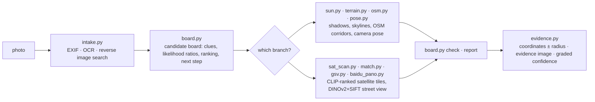

<div align="center">

# 🧭 geo-sleuth

**一个 agent skill，能找到照片的拍摄地点——并展示它的推理过程。**

<p align="center">
  <a href="README.md"></a>
  <a href="README.zh-CN.md"></a>
  <a href="README.zh-TW.md"></a>
  <a href="README.ja.md"></a>
  <a href="README.ko.md"></a>
  <a href="README.es.md"></a>
  <a href="README.fr.md"></a>
  <a href="README.de.md"></a>
  <a href="README.ru.md"></a>
  <a href="README.pt-BR.md"></a>
</p>

<p align="center">
  <a href="LICENSE"></a>
  <a href="https://www.python.org/downloads/"></a>
  <a href="https://agentskills.io"></a>
  <a href="CONTRIBUTING.md"></a>
  <a href="https://github.com/Oldcircle/geo-sleuth/stargazers"></a>
</p>

<p align="center">
  <b>适用于</b><br>
  <a href="https://code.claude.com/docs/en/skills"></a>
  <a href="https://developers.openai.com/codex/skills"></a>
  <a href="https://cursor.com/docs/skills"></a>
  <a href="https://geminicli.com/docs/cli/skills/"></a>
  <a href="https://opencode.ai/docs/skills/"></a>
  <a href="https://docs.github.com/en/copilot/concepts/agents/about-agent-skills"></a>
  <br><sub>……以及其他任何能读取 <code>SKILL.md</code> 并运行 shell 命令的 agent。</sub>
</p>


*没有文字，没有车牌，没有地标。一座桥，一座山。定位误差在 2 米以内。*

</div>

---

## 快速开始

```bash
npx skills add Oldcircle/geo-sleuth
```

按提示勾选你用的 agent。然后把一张照片交给你的 agent，说：

> 找出这张照片是在哪拍的

这就是全部的交互方式。你的 agent 会读取 `SKILL.md`、运行脚本，然后给出机位、镜头朝向和一张卫星证据图。想自己复制文件夹？见[安装](#安装)。

## 为什么是 geo-sleuth

- **一张照片，一句话。** 把照片交给你的 agent，说一句*这张照片是在哪拍的*。你会得到机位、镜头朝向和一张卫星证据图。
- **没有文字线索也能查。** 没有招牌、没有车牌、没有地标：OpenStreetMap 的几何数据、高程数据、卫星图和街景自己就能把搜索推进下去。
- **靠几何，不靠猜。** 桥墩间距变成距离尺，阴影变成方位角，山脊线变成能和高程数据比对的指纹。
- **每个说法都指向一个文件。** 结论必须说出本次会话里跑过的命令、以及它产出的文件。人口和名气都不算证据。
- **脚本排序，模型判断。** 二十个各司一职的脚本负责搜索、打分和排序；模型只在排名靠前的几个里挑。
- **一个 skill，所有 agent 通用。** 这是一个标准的 Agent Skill——`SKILL.md` 加上普通的 Python 脚本——所以同一个文件夹在 Claude Code、Codex、Cursor、Gemini CLI、OpenCode 和 GitHub Copilot 里都能运行。
- **答案自带误差半径。** 坐标 ± 半径、镜头朝向、一张证据图和分档的置信度。

## 案例：一张照片，无字可读

一张手机照片，EXIF 信息已被抹除：收割完的稻田边一个白色烤炉，远处一条长长的高架，右边一座陡峭的山。画面里没有一个字。给装了这个 skill 的 agent 发一条消息，它就给出了机位和镜头朝向。

**照片 → 27,335 → 171 → 14,372 → 22 → 3 → 1 → ±2 m**

| 步骤 | 它做了什么 | 剩余候选 |
|---|---|---|
| **读图** | 高架上的杆子是接触网支柱，说明是电气化铁路。把桥墩间距当尺子用（跨距 32 米，*假设*）：左段距拍摄点约 0.5 公里，右段超过 1 公里。陡峭的山约 3 公里外。稻子已经收割，但草还是绿的，说明还没下霜。 | 华南，是判断，不是证明 |
| **区域扫描** | 从 OpenStreetMap 取出该区域内所有铁路桥：**27,335 段**。每 400 米采样一个点，用高程数据计算每个点 360° 的地平线。保留附近地势平坦、几公里内有明显山峰、且旁边地平线平坦的点。 | **171 处** |
| **天际线拟合** | 在每个候选点周围布置候选机位，渲染每个机位看到的山脊线：**14,372 个机位**。前 20 名彼此相差不到 0.1°，于是加了一条约束：桥必须左近右远。 | **22** |
| **叠图检查** | 把前三名的山脊线画回照片核对。第一名（福州）有一处凸起正好藏在烤炉后面，所以得分高；第三名（惠州）在照片平坦的地方却有坡度；第二名（清远）从山脚到画面边缘都贴合。 | **1** |
| **数桥墩** | 照片里的 17 根桥墩变成从机位出发的 17 条方位线。它们打在铁路线上的交点必须间距均匀。结合天际线结果：先收窄到约 300 米长的一段，再收窄到一个点。 | **±2 m** |

<div align="center">
<br>
<sub>桥墩当尺子：左边间距宽表示近，右边间距密表示远。</sub><br><br>
 <br>
<sub>左：前三名的山脊线画回照片。右：skill 生成的证据图。</sub>
</div>

<details>
<summary>本次实战的更多图</summary>
<br>
<br>
<sub>区域扫描：区域内所有铁路桥（灰色），通过地平线检验的候选点（橙色）。</sub><br><br>
<br>
<sub>数桥墩：17 根桥墩的方位线与铁路线相交；只有一个机位能让间距均匀。</sub><br><br>
<sub>整次运行耗时约 72 分钟，其中大约一半时间在等计算。</sub>
</details>

## 安装

geo-sleuth 是一个标准的 [Agent Skill](https://agentskills.io)：一个文件夹，里面是 `SKILL.md`、`scripts/`、`references/` 和 `data/`。可以用 [`skills`](https://github.com/vercel-labs/skills) 命令行工具安装，也可以自己复制文件夹。

**一条命令，给全部六个 agent 装到用户级目录：**

```bash
npx skills add Oldcircle/geo-sleuth -g -a claude-code -a codex -a cursor -a gemini-cli -a opencode -a github-copilot -y
```

**手动安装：**

```bash
git clone https://github.com/Oldcircle/geo-sleuth
mkdir -p ~/.agents/skills ~/.claude/skills
cp -r geo-sleuth/skills/geo-sleuth ~/.agents/skills/              # Codex, Cursor, Gemini CLI, OpenCode, GitHub Copilot
ln -s ~/.agents/skills/geo-sleuth ~/.claude/skills/geo-sleuth     # Claude Code
```

Codex、Cursor、Gemini CLI、OpenCode 和 GitHub Copilot 都会读取 `~/.agents/skills/`，所以在这里放一份就能同时覆盖这五个。各 agent 自己的目录如下，均摘自其官方文档：

| Agent | 用户级 | 项目级 |
|---|---|---|
| [Claude Code](https://code.claude.com/docs/en/skills) | `~/.claude/skills/` | `.claude/skills/` |
| [Codex](https://developers.openai.com/codex/skills) | `~/.agents/skills/` | `.agents/skills/` |
| [Cursor](https://cursor.com/docs/skills) | `~/.cursor/skills/` 或 `~/.agents/skills/` | `.cursor/skills/` 或 `.agents/skills/` |
| [Gemini CLI](https://geminicli.com/docs/cli/skills/) | `~/.gemini/skills/` 或 `~/.agents/skills/` | `.gemini/skills/` 或 `.agents/skills/` |
| [OpenCode](https://opencode.ai/docs/skills/) | `~/.config/opencode/skills/` 或 `~/.agents/skills/` | `.opencode/skills/` 或 `.agents/skills/` |
| [GitHub Copilot](https://docs.github.com/en/copilot/concepts/agents/about-agent-skills) | `~/.copilot/skills/` 或 `~/.agents/skills/` | `.github/skills/` 或 `.agents/skills/` |

其他任何能读取 `SKILL.md` 并运行 shell 命令的 agent 用法都一样：把文件夹放到它查找 skill 的位置即可。

## 它怎么工作

整个工作分成三层：脚本负责决策，脚本负责感知和排序，模型只在排名靠前的少数几个里做判断。



| 层 | 谁做 | 工具 |
|---|---|---|
| **决策**：候选有哪些、证据怎么打分、什么能排除、下一步扫哪里 | 脚本（候选盘） | `board.py` |
| **感知**：读文字、查表、在卫星图里找目标、比对街景 | 脚本先排序，人只看排名靠前的几个 | `intake.py` `ocr.py` `clues.py` `sat_scan.py` `match.py` `geo.py` |
| **判断**：从画面里提取线索、提出假设、在排好的少数候选里挑选 | 模型 | `SKILL.md` + `references/` |

每个结论都必须对应本次会话里真正跑过的命令、以及它产出的文件。排除需要读到或算出的证据；观察和猜测只能降低候选的权重。

## 工具箱

二十个脚本，一个脚本干一件事。完整表格（含数据来源）在 `skills/geo-sleuth/references/data-sources.md`。

| 能做什么 | 脚本 |
|---|---|
| EXIF：GPS、拍摄时间、等效焦距、朝向 | `exif.py` |
| 整图、放大裁图和切块的 OCR（macOS 上用 Apple Vision，其他系统用 RapidOCR） | `ocr.py` |
| 百度和 Yandex 以图搜图，相似图片拼成带编号的图片墙；关键词搜图 | `revimg.py` |
| 一条命令完成第 0–3 步：元数据、边缘裁图、变体、OCR、以图搜图 → 生成 `intake.md` | `intake.py` |
| 放大裁图、边缘和角落裁图、切块、提取桥墩等等间距结构的像素列 | `imgprep.py` |
| 查表：车牌前缀、固话区号、国际电话区号、靠左/靠右行驶、海外属地、行政区划 | `clues.py` + `data/` |
| 候选盘：候选、线索、似然比、排除、排名、扫描顺序、出结论前检查 | `board.py` |
| 地名录：列出下级行政区及其边界框、建成区范围 | `gazetteer.py` |
| 地名、小区名或店名 → 坐标候选，同名点全部列出 | `poi.py` |
| 太阳与影子：纬度带、时刻、街道走向、受光面推朝向、真方位角 | `sun.py` |
| OSM Overpass：要素共现、线转点、路线走廊、线线相交、街道格局模板 | `osm.py` |
| 卫星图拼接、标点、带编号的缩略图 | `tiles.py` |
| 对卫星图网格或候选点做 CLIP 零样本打分（跑道、厂房、筒仓、水坝……） | `sat_scan.py` |
| 百度全景 / Google 街景：找点、渲染朝向、缩略图、历史批次 | `baidu_pano.py` `gsv.py` |
| 把候选实景图与照片排名比对：DINOv2 全局相似度 + SIFT 内点 | `match.py` |
| 高程：合成山体视图、天际线叠图、剖面；线状要素 × 地形扫描、山脊提取、天际线批量打分 | `terrain.py` |
| 多点反解机位：经纬度、高度、朝向、俯仰、横滚，附误差半径 | `pose.py` |
| 方位角、距离、视线相交、对齐线、画框/遮挡检查、由等间距结构反解机位 | `geo.py` |
| 证据图：卫星图 + 机位扇形 + 对比网格 | `evidence.py` |

案例里的三步（区域扫描、天际线批量打分、由桥墩间距反解机位）都已内置在 skill 里，对应子命令：`terrain.py scan / ridge / fit`、`imgprep.py piers`、`geo.py spacing`。按那张照片调好参数的案例脚本放在 `examples/rail-skyline-session/`，供参考。

## 基准测试

按算子分别测量：

| 脚本 | 测试 | 结果 |
|---|---|---|
| `match.py` | 8 个案例：把百度全景历史批次渲染成照片，150 米内的全景作为候选（深圳） | 真值排名为 1/2/4/1/1 和 5/1/6，全部进入前 6，一半排第 1 |
| `sat_scan.py` | 4×8 公里，z17 级 364 格，40 条 OSM 标注的跑道作为真值，多尺度（深圳） | recall@20 为 17/40，@30 为 22/40，@100 为 32/40，中位排名 23 |
| `terrain.py scan / fit` + `geo.py spacing` | 在上面案例照片上做限定范围复跑 | 真值所在的候选簇排第 1，最终位置离真值约 2 m |
| `clues.py` | 6 张表，抽查 9 个值 | 9/9 正确 |

这套方法来自拆解网络定位博主的 14 个视频、22 道题和一批实战记录，再把其中管用的做法写成规则和脚本。v2 把所有能写成代码的规则都放进 `board.py`，让规则真正被执行，而不只是被读一遍。

## 环境要求

Python 3.10+、[`uv`](https://docs.astral.sh/uv/)，以及一个能运行 shell 命令的 agent。依赖写在每个脚本头部，`uv run` 首次运行时会自动安装。

可选：以图搜图用的 Google Chrome（也可以用 `uvx playwright install chromium` 代替），以及用 `export GEO_PROXY=socks5h://127.0.0.1:<port>` 让所有联网脚本都走代理。

## 路线图

- [ ] 针对 `terrain.py scan / fit` 做合成地形案例的算子级测试
- [ ] 把 Google Lens 接入作为第三个识图引擎
- [ ] 在 Linux 和 Windows 上跑 CI
- [ ] 用一批没见过的照片建一套公开的盲测集，给出端到端准确率

## 参与贡献

欢迎提 issue 和 pull request，参见 [CONTRIBUTING.md](CONTRIBUTING.md)。最有用的贡献是：给 `references/clues/` 添加一条可迁移的线索（附来源）、提供一个带许可证的新数据源，或者用你自己的照片跑一次、记录 skill 哪里错了、为什么错。

## Star 历史

<a href="https://star-history.com/#Oldcircle/geo-sleuth&Date">
  
</a>

## 致谢

- OpenStreetMap 贡献者（ODbL）。本仓库不附带 OSM 数据，脚本都是实时查询；发布查询结果时请注明 © OpenStreetMap contributors。
- AWS Terrain Tiles（Terrarium 格式高程数据）。
- [modood/Administrative-divisions-of-China](https://github.com/modood/Administrative-divisions-of-China)。
- DINOv2（Meta AI）、CLIP（OpenAI）。
- 查表数据的来源和许可证见 `skills/geo-sleuth/data/README.md`。

## 许可证

MIT，见 [LICENSE](LICENSE)。`data/` 目录中源自维基百科的表格采用 CC BY-SA 4.0 许可，见 `skills/geo-sleuth/data/README.md`。

<sub>**负责任地使用：** 只用在你自己的照片、或你已获准分析的照片上，绝不要用它去找没有同意被找到的人。</sub>
