<div align="center">

# 🧭 geo-sleuth

**一个 agent skill，能找到照片的拍摄地点——并展示它的推理过程。**

<p align="center">
  <a href="README.md"></a>
  <a href="README.zh-CN.md"></a>
</p>

<p align="center">
  <a href="LICENSE"></a>
  <a href="https://www.python.org/downloads/"></a>
  <a href="https://agentskills.io"></a>
  <a href="CONTRIBUTING.md"></a>
  <a href="https://github.com/Oldcircle/geo-sleuth/stargazers"></a>
</p>

<p align="center">
  <b>适用于</b><br>
  <a href="https://code.claude.com/docs/en/skills"></a>
  <a href="https://developers.openai.com/codex/skills"></a>
  <a href="https://cursor.com/docs/skills"></a>
  <a href="https://geminicli.com/docs/cli/skills/"></a>
  <a href="https://opencode.ai/docs/skills/"></a>
  <a href="https://docs.github.com/en/copilot/concepts/agents/about-agent-skills"></a>
  <br><sub>……以及其他任何能读取 <code>SKILL.md</code> 并运行 shell 命令的 agent。</sub>
</p>

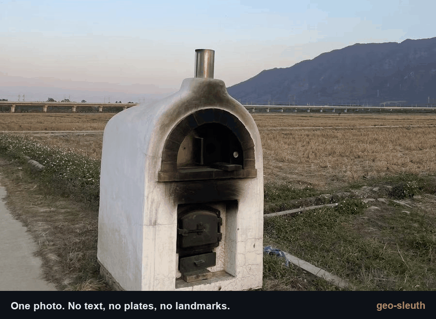

*没有文字，没有车牌，没有地标。一座桥，一座山。定位误差在 2 米以内。*

</div>

---

## 快速开始

```bash
npx skills add Oldcircle/geo-sleuth
```

按提示勾选你用的 agent。然后把一张照片交给你的 agent，说：

> 找出这张照片是在哪拍的

这就是全部的交互方式。你的 agent 会读取 `SKILL.md`、运行脚本，然后给出机位、镜头朝向和一张卫星证据图。想自己复制文件夹？见[安装](#安装)。

## 为什么是 geo-sleuth

- **一张照片，一句话。** 把照片交给你的 agent，说一句*这张照片是在哪拍的*。你会得到机位、镜头朝向和一张卫星证据图。
- **没有文字线索也能查。** 没有招牌、没有车牌、没有地标：OpenStreetMap 的几何数据、高程数据、卫星图和街景自己就能把搜索推进下去。
- **靠几何，不靠猜。** 桥墩间距变成距离尺，阴影变成方位角，山脊线变成能和高程数据比对的指纹。
- **每个说法都指向一个文件。** 结论必须说出本次会话里跑过的命令、以及它产出的文件。人口和名气都不算证据。
- **脚本排序，模型判断。** 二十个各司一职的脚本负责搜索、打分和排序；模型只在排名靠前的几个里挑。
- **一个 skill，所有 agent 通用。** 这是一个标准的 Agent Skill——`SKILL.md` 加上普通的 Python 脚本——所以同一个文件夹在 Claude Code、Codex、Cursor、Gemini CLI、OpenCode 和 GitHub Copilot 里都能运行。
- **答案自带误差半径。** 坐标 ± 半径、镜头朝向、一张证据图和分档的置信度。

## 案例

这几张照片都没有 GPS 信息。每个案例写了 skill 从照片里读到什么、怎么一步步缩小范围、结果离确认的机位有多远。

<table>
<tr>
<td width="33%" align="center"><a href="#1-稻田与高架">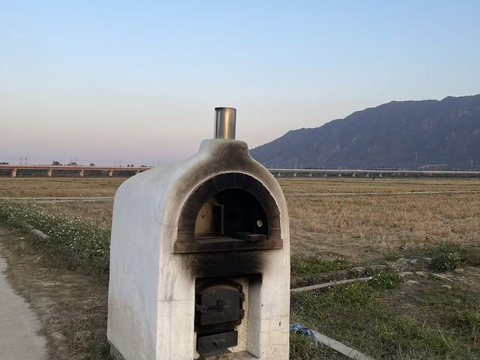</a></td>
<td width="33%" align="center"><a href="#2-沙漠天际线差了一度">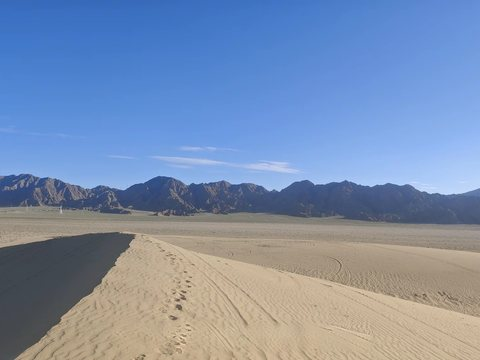</a></td>
<td width="33%" align="center"><a href="#3-温哥华街头的一棵樱花树">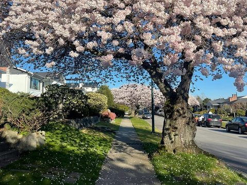</a></td>
</tr>
<tr>
<td><b>1 · 稻田与高架</b><br><sub>铁路桥 × 天际线 × 数桥墩。</sub></td>
<td><b>2 · 沙漠天际线</b><br><sub>高压线 × 天际线 × 手机歪了 1°。</sub></td>
<td><b>3 · 樱花街</b><br><sub>行道树开放数据 × 影子 × 街景。</sub></td>
</tr>
<tr>
<td align="center"><b>±2 m</b><br><sub>广东清远</sub></td>
<td align="center"><b>100 m 以内</b><br><sub>青海大柴旦</sub></td>
<td align="center"><b>3 m</b><br><sub>加拿大温哥华</sub></td>
</tr>
</table>

### 1. 稻田与高架

一张手机照片，EXIF 信息已被抹除：收割完的稻田边一个白色烤炉，远处一条长长的高架，右边一座陡峭的山。画面里没有一个字。给装了这个 skill 的 agent 发一条消息，它就给出了机位和镜头朝向。

**照片 → 27,335 → 171 → 14,372 → 22 → 3 → 1 → ±2 m**

| 步骤 | 它做了什么 | 剩余候选 |
|---|---|---|
| **读图** | 高架上的杆子是接触网支柱，说明是电气化铁路。把桥墩间距当尺子用（跨距 32 米，*假设*）：左段距拍摄点约 0.5 公里，右段超过 1 公里。陡峭的山约 3 公里外。稻子已经收割，但草还是绿的，说明还没下霜。 | 华南，是判断，不是证明 |
| **区域扫描** | 从 OpenStreetMap 取出该区域内所有铁路桥：**27,335 段**。每 400 米采样一个点，用高程数据计算每个点 360° 的地平线。保留附近地势平坦、几公里内有明显山峰、且旁边地平线平坦的点。 | **171 处** |
| **天际线拟合** | 在每个候选点周围布置候选机位，渲染每个机位看到的山脊线：**14,372 个机位**。前 20 名彼此相差不到 0.1°，于是加了一条约束：桥必须左近右远。 | **22** |
| **叠图检查** | 把前三名的山脊线画回照片核对。第一名（福州）有一处凸起正好藏在烤炉后面，所以得分高；第三名（惠州）在照片平坦的地方却有坡度；第二名（清远）从山脚到画面边缘都贴合。 | **1** |
| **数桥墩** | 照片里的 17 根桥墩变成从机位出发的 17 条方位线。它们打在铁路线上的交点必须间距均匀。结合天际线结果：先收窄到约 300 米长的一段，再收窄到一个点。 | **±2 m** |

<div align="center">
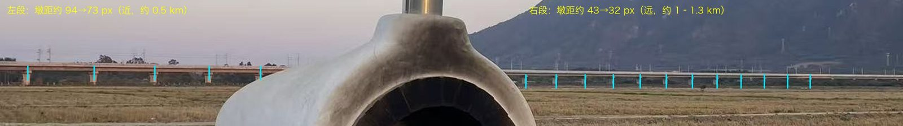<br>
<sub>桥墩当尺子：左边间距宽表示近，右边间距密表示远。</sub><br><br>
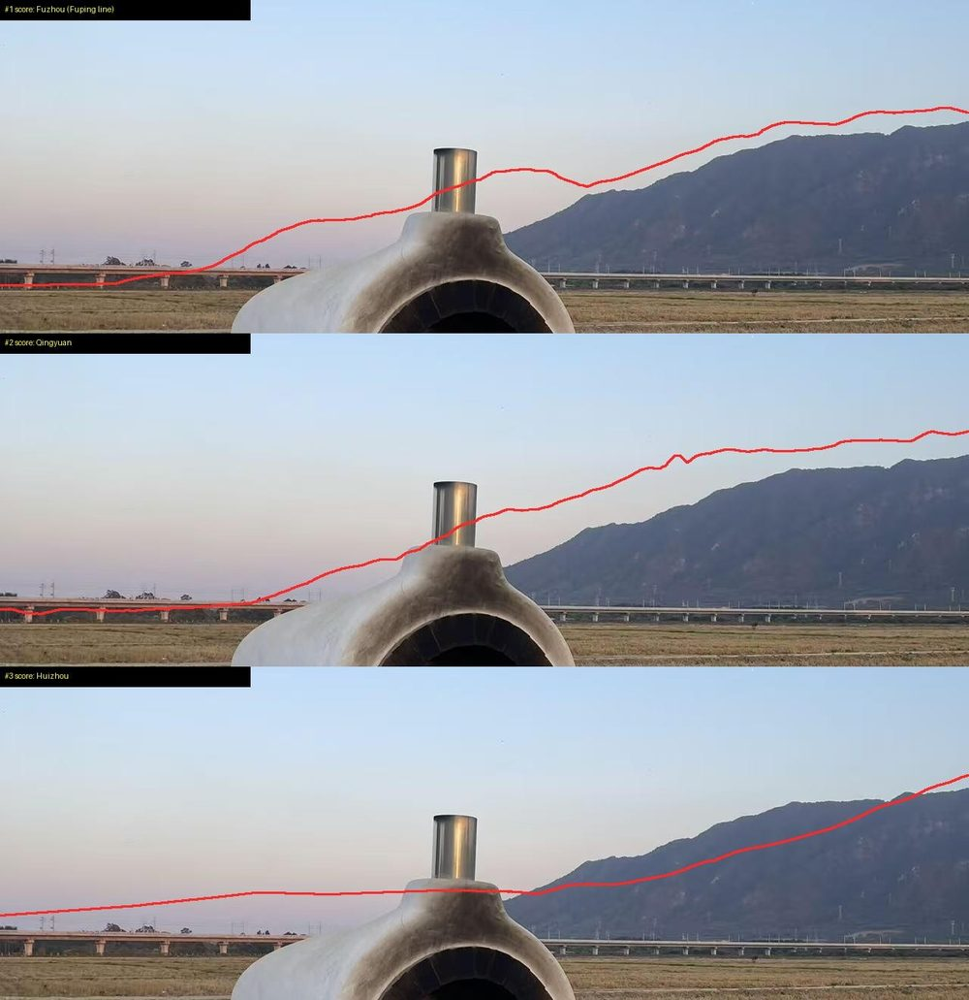 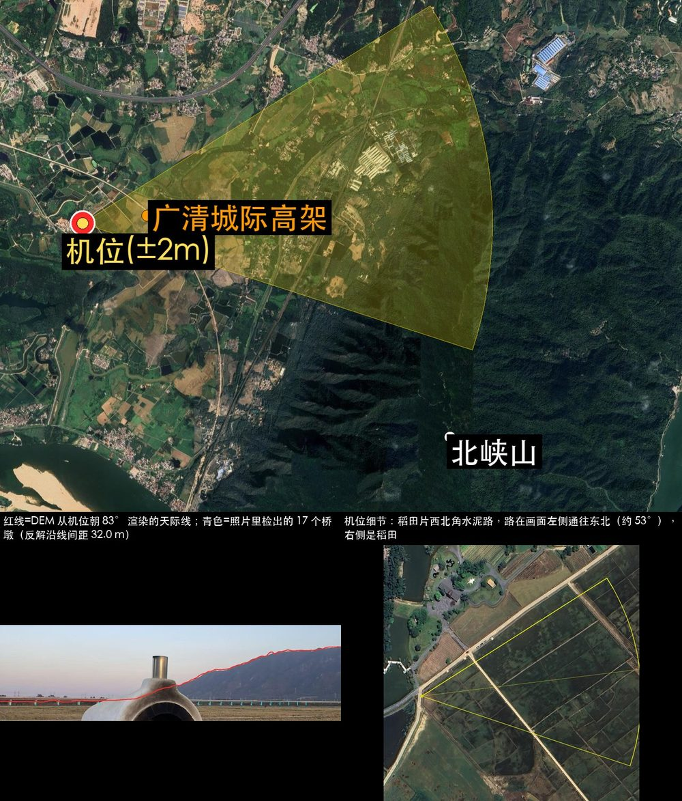<br>
<sub>左：前三名的山脊线画回照片。右：skill 生成的证据图。</sub>
</div>

<details>
<summary>本次实战的更多图</summary>
<br>
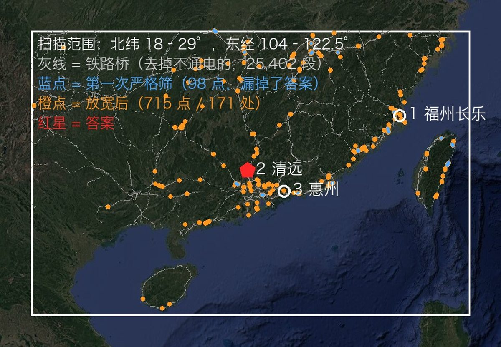<br>
<sub>区域扫描：区域内所有铁路桥（灰色），通过地平线检验的候选点（橙色）。</sub><br><br>
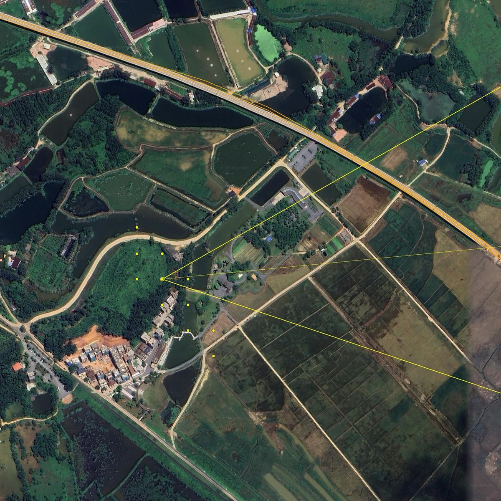<br>
<sub>数桥墩：17 根桥墩的方位线与铁路线相交；只有一个机位能让间距均匀。</sub><br><br>
<sub>整次运行耗时约 72 分钟，其中大约一半时间在等计算。</sub>
</details>

### 2. 沙漠天际线差了一度

前景是一道沙丘，后面一排深色裸山，山脚有几座电塔。画面里没有字、路和房子，以图搜图只搜到一些泛泛的西北沙漠照片。

<div align="center">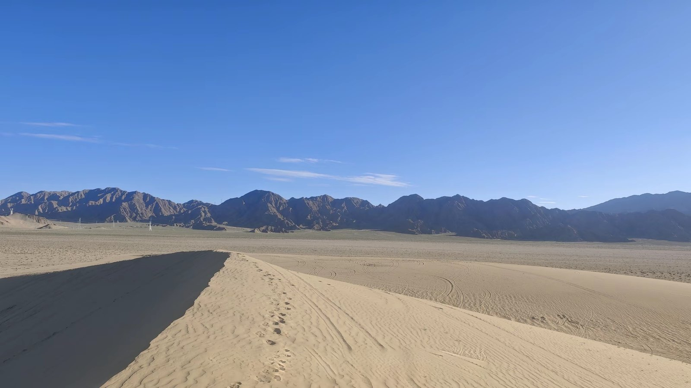</div>

**照片 → 1,537 处 → 卡在 10 px 上下 → 解出 1° 歪斜 → 1 处 → 一道沙脊**

| 步骤 | 它做了什么 | 剩余 |
|---|---|---|
| **读图** | 电塔是画面里唯一的人造物，所以机位离某条高压线不过几公里。沙、戈壁和裸岩指向中国西北。 | 4 省 |
| **高压线 × 地形** | `osm.py geom` 拉出新疆、甘肃、宁夏、青海的全部高压线，`terrain.py scan` 沿线用高程数据算，留下山能占满视野的地方。 | **1,537 处** |
| **天际线拟合** | `terrain.py ridge` 描出照片里的山脊，`terrain.py fit` 和每处看到的山脊逐一比对。青海前 25 处都在 9.6–11.7 px 之间，真值排第 9。 | **卡住** |
| **歪斜** | 手机歪 1°，2048 px 宽的画面边缘山脊偏 1024 × tan 1° ≈ 18 px，平均约 10 px，正好是候选之间的差距。在真值处，误差沿画面横向落在一条直线上，斜率是 tan θ，θ ≈ 1°。于是 `fit` 改成和地平线偏移一起解横滚。 | |
| **重新拟合** | 解了横滚之后，真值从 11.1 px 降到 6.2 px，第二名是 9.4 px。 | **1 处** |
| **卫星图** | 视线方向 1 km 内有三座新月形沙丘和一片帐篷营地，东边 1–2 km 是 750/330/110 kV 线束，所以电塔只出现在照片左半边。机位在营地西边那座沙丘的脊上，朝 205°。 | **一道沙脊** |

<div align="center">
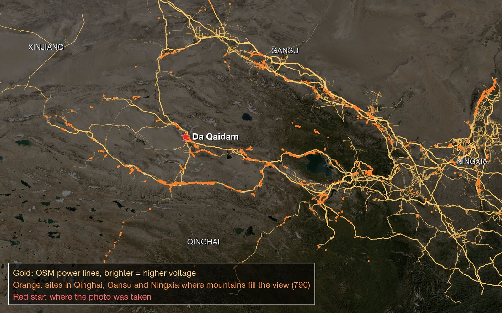<br>
<sub>OSM 高压线（金色）、山能占满视野的候选处（橙色）和机位（红星）。新疆的候选处没有画。</sub><br><br>
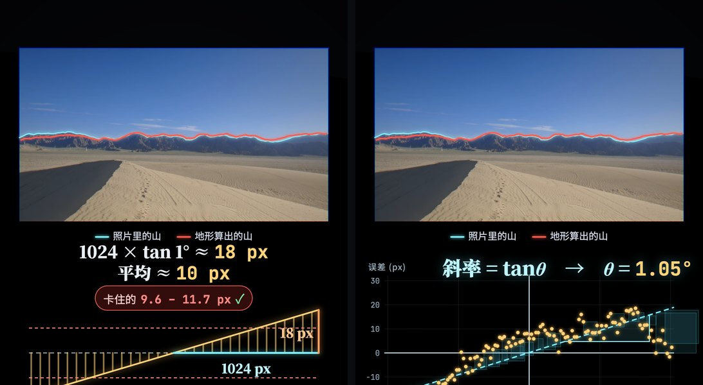<br>
<sub>真值处解横滚前后。上：误差从画面一侧到另一侧逐渐变大，斜率给出角度。下：解了横滚，这个趋势没有了。</sub><br><br>
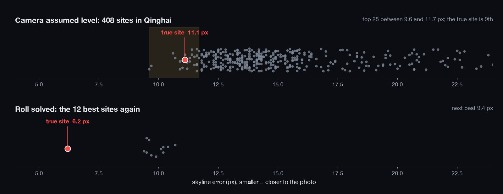<br>
<sub>每处的天际线误差。假设手机水平时，真值混在一堆候选里；解了横滚，只有它低于 9 px。</sub><br><br>
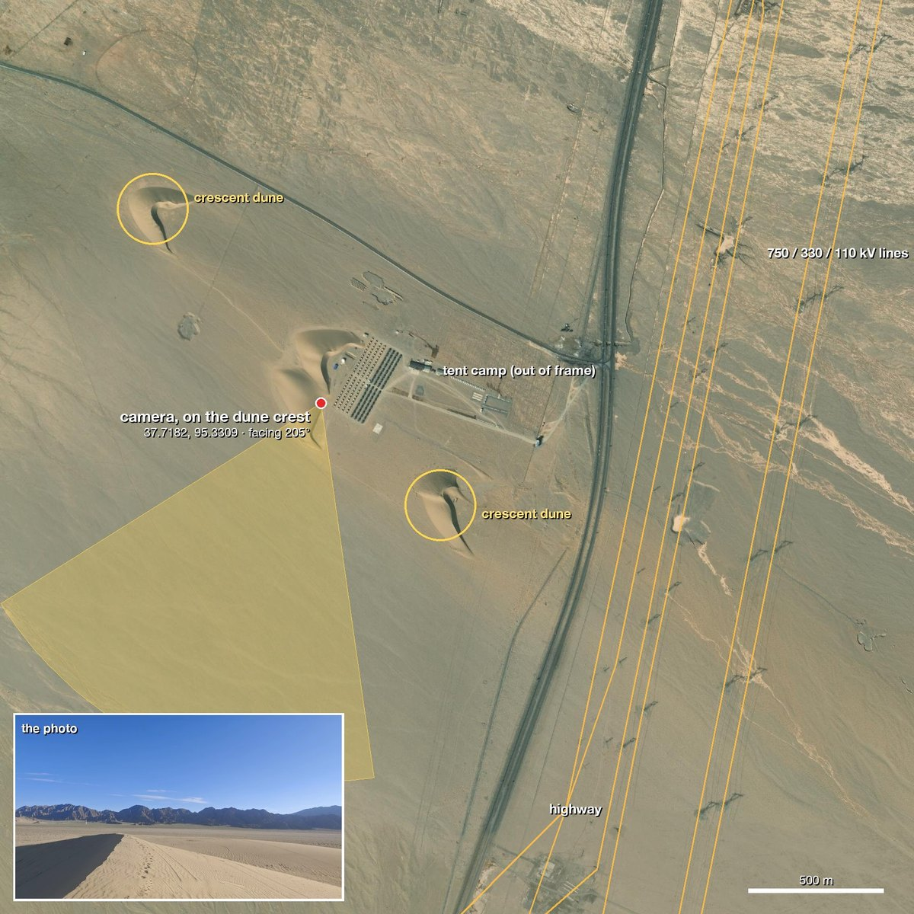<br>
<sub>证据图。OSM 高压线（金色）和卫星图上的电塔对得上。</sub>
</div>

**盲测复跑。** 后来我们把照片交给一个新开的 agent，用现在的 skill，只给一句提示：在中国。它扫了青海 5,334 条高压线，拟合 792 处，选出的一处误差 0.224°，第二名 0.357°。最后落在同一道沙脊上，**距确认的机位 87 m**，用时 32 分钟。为这张照片加的横滚拟合现在已经是 `terrain.py fit` 的一部分；为什么用这个案例做核心改动的范本，见[参与贡献](#参与贡献)。

### 3. 温哥华街头的一棵樱花树

人行道上方一棵盛开的樱花。车牌和街道设施说明是温哥华，难的是找到哪条街：温哥华有将近一万段街。

**照片 → 温哥华 → 1,095 棵大樱花 → 97 段街 → 72 段测横坡 → 西 60 街 → 3 m**

| 步骤 | 它做了什么 | 剩余 |
|---|---|---|
| **读图** | BC 省白底蓝字车牌、草坪隔离带里的墨绿色路灯杆、Vancouver Special 式住宅。 | **温哥华** |
| **行道树数据** | 温哥华公开了每一棵行道树的树种、胸径和门牌。候选从数据里来，没有去挑有名的樱花街：先取胸径 ≥ 40 cm 的观赏樱，再取至少有三棵的街段。 | **1,095 棵，97 段** |
| **影子和坡** | 车影落向左前方、朝着镜头，太阳在前方偏右。镜头这一侧的院子高出人行道、砌着石墙，这一侧是坡上。agent 用高程数据测了 72 段街的横坡，再对数据里大树长在街的哪一侧。 | **几段** |
| **一棵棵对** | 西 60 街 100 号段，北侧是一排大樱花；南侧往前 30–60 m 都是 7.6 cm 的小树，下一棵大的在约 75 m 外。照片里也是这样：右侧近处没有高树，远处是粉色树冠。 | **1 段** |
| **街景** | 2009 年和 2024 年两期街景都能看到砌石挡土墙和石阶、绿色路灯杆和白房子。带屋顶露台的那栋房子在 2024 年那期和照片里都有。机位在北侧人行道，朝东。 | **3 m** |

<div align="center">
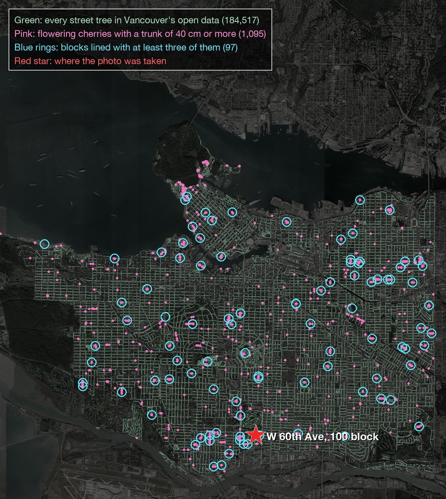 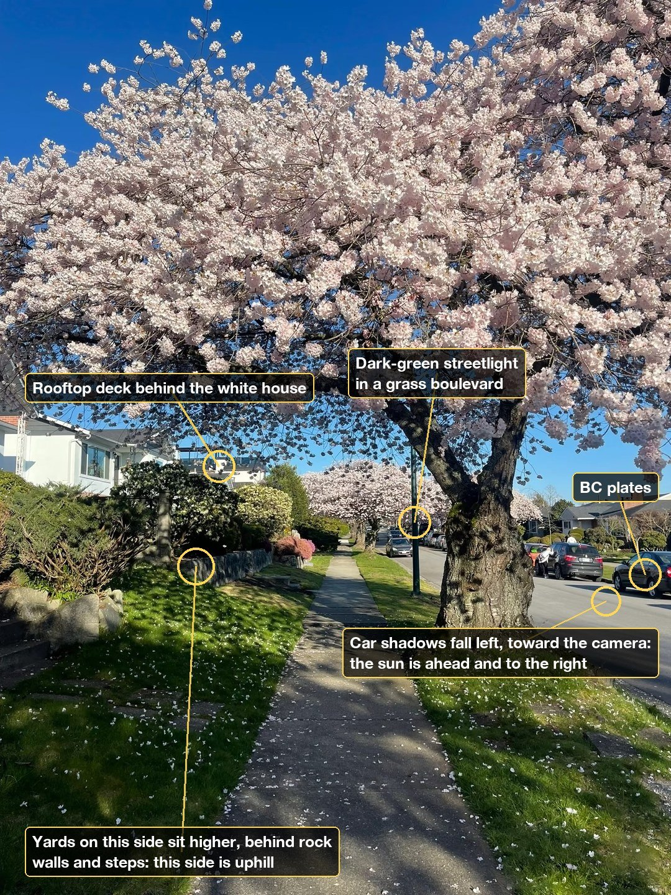<br>
<sub>左：市政数据里有坐标的 184,517 棵行道树、1,095 棵大樱花和 97 段候选街。右：照片透露了什么。</sub><br><br>
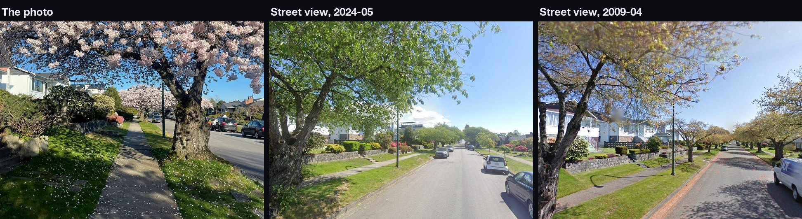<br>
<sub>照片是在人行道上拍的，街景车走在路中间，所以角度不同。</sub><br><br>
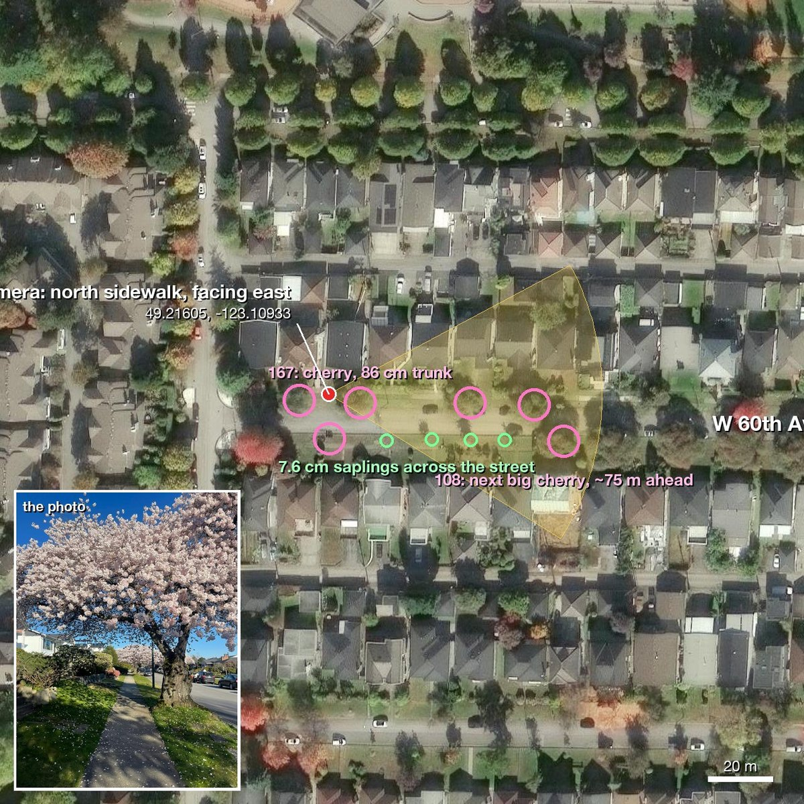<br>
<sub>证据图。粉圈是市政数据里的大樱花，绿圈是小树。</sub>
</div>

**盲测复跑。** 上表就是盲测的过程：新开一个 agent，用现在的 skill，只给照片，不给提示。53 分钟后给出的机位**距确认位置 3 m**。

## 安装

geo-sleuth 是一个标准的 [Agent Skill](https://agentskills.io)：一个文件夹，里面是 `SKILL.md`、`scripts/`、`references/` 和 `data/`。可以用 [`skills`](https://github.com/vercel-labs/skills) 命令行工具安装，也可以自己复制文件夹。

**一条命令，给全部六个 agent 装到用户级目录：**

```bash
npx skills add Oldcircle/geo-sleuth -g -a claude-code -a codex -a cursor -a gemini-cli -a opencode -a github-copilot -y
```

**手动安装：**

```bash
git clone https://github.com/Oldcircle/geo-sleuth
mkdir -p ~/.agents/skills ~/.claude/skills
cp -r geo-sleuth/skills/geo-sleuth ~/.agents/skills/              # Codex, Cursor, Gemini CLI, OpenCode, GitHub Copilot
ln -s ~/.agents/skills/geo-sleuth ~/.claude/skills/geo-sleuth     # Claude Code
```

Codex、Cursor、Gemini CLI、OpenCode 和 GitHub Copilot 都会读取 `~/.agents/skills/`，所以在这里放一份就能同时覆盖这五个。各 agent 自己的目录如下，均摘自其官方文档：

| Agent | 用户级 | 项目级 |
|---|---|---|
| [Claude Code](https://code.claude.com/docs/en/skills) | `~/.claude/skills/` | `.claude/skills/` |
| [Codex](https://developers.openai.com/codex/skills) | `~/.agents/skills/` | `.agents/skills/` |
| [Cursor](https://cursor.com/docs/skills) | `~/.cursor/skills/` 或 `~/.agents/skills/` | `.cursor/skills/` 或 `.agents/skills/` |
| [Gemini CLI](https://geminicli.com/docs/cli/skills/) | `~/.gemini/skills/` 或 `~/.agents/skills/` | `.gemini/skills/` 或 `.agents/skills/` |
| [OpenCode](https://opencode.ai/docs/skills/) | `~/.config/opencode/skills/` 或 `~/.agents/skills/` | `.opencode/skills/` 或 `.agents/skills/` |
| [GitHub Copilot](https://docs.github.com/en/copilot/concepts/agents/about-agent-skills) | `~/.copilot/skills/` 或 `~/.agents/skills/` | `.github/skills/` 或 `.agents/skills/` |

其他任何能读取 `SKILL.md` 并运行 shell 命令的 agent 用法都一样：把文件夹放到它查找 skill 的位置即可。

## 它怎么工作

整个工作分成三层：脚本负责决策，脚本负责感知和排序，模型只在排名靠前的少数几个里做判断。

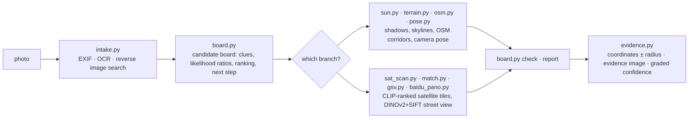
```mermaid
flowchart LR
  A["photo"] --> B["intake.py<br/>EXIF · OCR · reverse image search"]
  B --> C["board.py<br/>candidate board: clues, likelihood ratios, ranking, next step"]
  C --> D{"which branch?"}
  D --> E["sun.py · terrain.py · osm.py · pose.py<br/>shadows, skylines, OSM corridors, camera pose"]
  D --> F["sat_scan.py · match.py · gsv.py · baidu_pano.py<br/>CLIP-ranked satellite tiles, DINOv2+SIFT street view"]
  E --> G["board.py check · report"]
  F --> G
  G --> H["evidence.py<br/>coordinates ± radius · evidence image · graded confidence"]
```

| 层 | 谁做 | 工具 |
|---|---|---|
| **决策**：候选有哪些、证据怎么打分、什么能排除、下一步扫哪里 | 脚本（候选盘） | `board.py` |
| **感知**：读文字、查表、在卫星图里找目标、比对街景 | 脚本先排序，人只看排名靠前的几个 | `intake.py` `ocr.py` `clues.py` `sat_scan.py` `match.py` `geo.py` |
| **判断**：从画面里提取线索、提出假设、在排好的少数候选里挑选 | 模型 | `SKILL.md` + `references/` |

每个结论都必须对应本次会话里真正跑过的命令、以及它产出的文件。排除需要读到或算出的证据；观察和猜测只能降低候选的权重。

## 工具箱

二十多个脚本，一个脚本干一件事。完整表格（含数据来源）在 `skills/geo-sleuth/references/data-sources.md`。

| 能做什么 | 脚本 |
|---|---|
| EXIF：GPS、拍摄时间、等效焦距、朝向 | `exif.py` |
| 整图、放大裁图和切块的 OCR（macOS 上用 Apple Vision，其他系统用 RapidOCR） | `ocr.py` |
| 百度和 Yandex 以图搜图，相似图片拼成带编号的图片墙；关键词搜图 | `revimg.py` |
| 一条命令完成第 0–3 步：元数据、边缘裁图、变体、OCR、以图搜图 → 生成 `intake.md` | `intake.py` |
| 放大裁图、边缘和角落裁图、切块、提取桥墩等等间距结构的像素列 | `imgprep.py` |
| 查表：全球的国际电话区号、靠左/靠右行驶、海外属地；地区包里的车牌前缀、固话区号、行政区划 | `clues.py` + `data/` + `regions/` |
| 地区包：列出、打印某国的卡片和线索索引、检查格式 | `regions.py` |
| 候选盘：候选、线索、似然比、排除、排名、扫描顺序、出结论前检查 | `board.py` |
| 地名录：列出下级行政区及其边界框、建成区范围 | `gazetteer.py` |
| 地名、小区名或店名 → 坐标候选，同名点全部列出 | `poi.py` |
| 太阳与影子：纬度带、时刻、街道走向、受光面推朝向、真方位角 | `sun.py` |
| OSM Overpass：要素共现、线转点、路线走廊、线线相交、街道格局模板 | `osm.py` |
| 卫星图拼接、标点、带编号的缩略图 | `tiles.py` |
| 对卫星图网格或候选点做 CLIP 零样本打分（跑道、厂房、筒仓、水坝……） | `sat_scan.py` |
| 百度全景 / Google 街景：找点、渲染朝向、缩略图、历史批次 | `baidu_pano.py` `gsv.py` |
| 把候选实景图与照片排名比对：DINOv2 全局相似度 + SIFT 内点 | `match.py` |
| 高程：合成山体视图、天际线叠图、剖面；线状要素 × 地形扫描、山脊提取、天际线批量打分 | `terrain.py` |
| 多点反解机位：经纬度、高度、朝向、俯仰、横滚，附误差半径 | `pose.py` |
| 方位角、距离、视线相交、对齐线、画框/遮挡检查、由等间距结构反解机位 | `geo.py` |
| 证据图：卫星图 + 机位扇形 + 对比网格 | `evidence.py` |

案例 1 的几步（区域扫描、天际线批量打分、由桥墩间距反解机位）都已内置在 skill 里，对应子命令：`terrain.py scan / ridge / fit`、`imgprep.py piers`、`geo.py spacing`；按那张照片调好参数的案例脚本放在 `examples/rail-skyline-session/`。案例 2 的歪斜由 `terrain.py fit` 自己解（`--roll-max`，默认 1°），`examples/desert-roll-fix/` 可以复现修改前后。

## 基准测试

按算子分别测量：

| 脚本 | 测试 | 结果 |
|---|---|---|
| `match.py` | 8 个案例：把百度全景历史批次渲染成照片，150 米内的全景作为候选（深圳） | 真值排名为 1/2/4/1/1 和 5/1/6，全部进入前 6，一半排第 1 |
| `sat_scan.py` | 4×8 公里，z17 级 364 格，40 条 OSM 标注的跑道作为真值，多尺度（深圳） | recall@20 为 17/40，@30 为 22/40，@100 为 32/40，中位排名 23 |
| `terrain.py scan / fit` + `geo.py spacing` | 在上面案例照片上做限定范围复跑 | 真值所在的候选簇排第 1，最终位置离真值约 2 m |
| `terrain.py fit --roll-max` | 8 道合成天际线题（随机朝向、焦距、±1° 横滚） | 位置误差中位 324 → 238 m（不歪的题 324 → 89 m，歪的 1,695 → 265 m） |
| `terrain.py fit --roll-max` | 沙漠案例的 12 个最佳候选处 | 真值从第 8 名、12.0 px → 第 1 名、6.2 px（第 2 名 9.9 px） |
| `clues.py` | 6 张表，抽查 9 个值 | 9/9 正确 |

端到端：新开一个 agent，只给照片（和表里的提示）盲测复跑：

| 案例 | 提示 | 结果 | 用时 |
|---|---|---|---|
| [沙漠天际线](#2-沙漠天际线差了一度) | 「在中国」 | 距确认的机位 87 m | 32 分钟 |
| [樱花街](#3-温哥华街头的一棵樱花树) | 无 | 距确认的机位 3 m | 53 分钟 |

这两张照片以前都解过，从中学到的东西已经写进 skill，所以这是回归检查，不代表没见过的照片上的准确率。

这套方法来自拆解网络定位博主的 14 个视频、22 道题和一批实战记录，再把其中管用的做法写成规则和脚本。v2 把所有能写成代码的规则都放进 `board.py`，让规则真正被执行，而不只是被读一遍。

## 环境要求

需要 Python 3.10+、[`uv`](https://docs.astral.sh/uv/)、`curl`，以及能运行 shell 命令的 agent。每个脚本声明自己的依赖，用 `uv run` 首次运行时安装；安装时保留完整 skill 文件夹，包括 `data/` 和 `scripts/` 中的辅助模块。

以图搜图需要 **Google Chrome 或 Playwright Chromium**，先尝试 Chrome，启动失败则回退到 Chromium。两者都没有时运行 `uvx playwright install chromium`。Linux 缺少系统库时可用 `uvx playwright install --with-deps chromium`；Playwright 升级后若提示缺少浏览器可执行文件，重新运行安装命令。

在仓库根目录自检（PowerShell 也可运行）：

```bash
uv run skills/geo-sleuth/scripts/doctor.py
uv run skills/geo-sleuth/scripts/doctor.py --network
```

已安装 skill 时换成其实际的 `scripts/doctor.py` 路径，或让 agent 运行。自检会检查 Python、uv、curl、查表数据、当前目录写权限，以及浏览器能否实际启动。`--network` 额外探测各服务，不上传照片；`--json` 输出诊断数据。退出码 1 表示有失败项，警告表示部分可选功能受影响。首次运行 uv 可能需要安装 Playwright；自检不加载 OCR 或 ML 模型。网站可达不等于识图上传、模型下载和街景查询一定成功。

先用自己的照片检查本地处理流程：

```bash
uv run skills/geo-sleuth/scripts/intake.py photo.jpg --out-dir intake --no-rev
```

打开 `intake/intake.md`，检查裁图和 OCR 结果；去掉 `--no-rev` 才会在线以图搜图。macOS 优先 Apple Vision，其他系统或回退场景使用 RapidOCR。`match.py`、`sat_scan.py` 首次运行会安装 ML 依赖并下载模型，需预留时间和磁盘空间；首次安装依赖仍需联网。

排错：浏览器启动失败就安装 Chrome / Chromium；HTTP 403/429 或验证码先查看截图、稍后重试；连接超时先跑 `doctor.py --network`。模型加载失败要看磁盘空间、下载错误和 Hugging Face 连通性。`intake.md` 会区分跳过、失败和已完成的步骤；搜索失败不能当作“没有匹配图片”。

语言：维护中的指令、CLI 帮助、报错、报告标题和默认证据标注均为英文。照片 OCR、地名、第三方响应和截图保留原文，agent 负责解释，并用用户的语言写最终报告。中文指令的最后一版冻结在 tag [`zh-final`](https://github.com/Oldcircle/geo-sleuth/tree/zh-final)，不再更新；要装那一版：`npx skills add https://github.com/Oldcircle/geo-sleuth/tree/zh-final/skills/geo-sleuth`。

## 路线图

- [ ] 针对 `terrain.py scan / fit` 做合成地形案例的算子级测试
- [ ] 把 Google Lens 接入作为第三个识图引擎
- [ ] 在 Linux 和 Windows 上跑 CI
- [ ] 用一批没见过的照片建一套公开的盲测集，给出端到端准确率

## 参与贡献

欢迎提 issue 和 pull request，参见 [CONTRIBUTING.md](CONTRIBUTING.md)。

| 你有的是 | 放在哪 | 门槛 |
|---|---|---|
| 能区分国家的线索 | `references/clues/global.md` | 有来源、有反例 |
| 只对一个国家有用的线索、表或服务 | 地区包 `regions/<cc>/`（[契约](skills/geo-sleuth/regions/README.md)） | 只放数据和文档；`regions.py lint` 输出 `ok` |
| 对核心脚本的改动 | 单独一个 PR | 一张改前解不出、改后解出的照片，外加别处没有退步 |
| 一次跑错的记录 | issue | 第一个走偏的步骤 |

[沙漠案例](#2-沙漠天际线差了一度)是核心改动的范本：skill 在一张真实照片上卡住（前 25 处挤在 9.6–11.7 px）；改动是通用的，不是给这张照片调参（在 `terrain.py fit` 里解相机横滚，上限 1°，`--roll-max 0` 给出旧结果）；同一张照片随后解出（真值跳到 6.2 px）；在不是为它设计的题上也站得住（8 道合成天际线、一道更早的实拍题）。`examples/desert-roll-fix/` 用两条命令复现修改前后。

## Star 历史

<a href="https://star-history.com/#Oldcircle/geo-sleuth&Date">
  
</a>

## 致谢

- OpenStreetMap 贡献者（ODbL）。本仓库不附带 OSM 数据，脚本都是实时查询；发布查询结果时请注明 © OpenStreetMap contributors。
- AWS Terrain Tiles（Terrarium 格式高程数据）。
- [modood/Administrative-divisions-of-China](https://github.com/modood/Administrative-divisions-of-China)。
- DINOv2（Meta AI）、CLIP（OpenAI）。
- 查表数据的来源和许可证见 `skills/geo-sleuth/data/README.md`。

## 许可证

MIT，见 [LICENSE](LICENSE)。`data/` 目录中源自维基百科的表格采用 CC BY-SA 4.0 许可，见 `skills/geo-sleuth/data/README.md`。

<sub>**负责任地使用：** 只用在你自己的照片、或你已获准分析的照片上，绝不要用它去找没有同意被找到的人。</sub>
