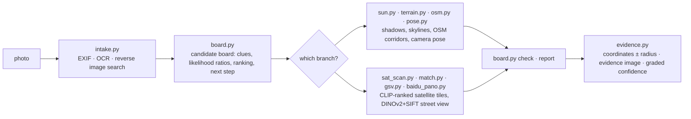

<div align="center">

# 🧭 geo-sleuth

**一個 agent skill，能找到照片的拍攝地點——並展示它的推理過程。**

<p align="center">
  <a href="README.md"></a>
  <a href="README.zh-CN.md"></a>
  <a href="README.zh-TW.md"></a>
  <a href="README.ja.md"></a>
  <a href="README.ko.md"></a>
  <a href="README.es.md"></a>
  <a href="README.fr.md"></a>
  <a href="README.de.md"></a>
  <a href="README.ru.md"></a>
  <a href="README.pt-BR.md"></a>
</p>

<p align="center">
  <a href="LICENSE"></a>
  <a href="https://www.python.org/downloads/"></a>
  <a href="https://agentskills.io"></a>
  <a href="CONTRIBUTING.md"></a>
  <a href="https://github.com/Oldcircle/geo-sleuth/stargazers"></a>
</p>

<p align="center">
  <b>適用於</b><br>
  <a href="https://code.claude.com/docs/en/skills"></a>
  <a href="https://developers.openai.com/codex/skills"></a>
  <a href="https://cursor.com/docs/skills"></a>
  <a href="https://geminicli.com/docs/cli/skills/"></a>
  <a href="https://opencode.ai/docs/skills/"></a>
  <a href="https://docs.github.com/en/copilot/concepts/agents/about-agent-skills"></a>
  <br><sub>……以及其他任何能讀取 <code>SKILL.md</code> 並執行 shell 命令的 agent。</sub>
</p>


*沒有文字，沒有車牌，沒有地標。一座橋，一座山。定位誤差在 2 公尺以內。*

</div>

---

## 快速開始

```bash
npx skills add Oldcircle/geo-sleuth
```

依提示勾選你用的 agent。接著把一張照片交給你的 agent，說：

> 找出這張照片是在哪拍的

這就是全部的互動方式。你的 agent 會讀取 `SKILL.md`、執行指令碼，然後給出機位、鏡頭朝向和一張衛星證據圖。想自己複製資料夾？請見[安裝](#安裝)。

## 為什麼是 geo-sleuth

- **一張照片，一句話。** 把照片交給你的 agent，說一句*這張照片是在哪拍的*。你會得到機位、鏡頭朝向和一張衛星證據圖。
- **沒有文字線索也能查。** 沒有招牌、沒有車牌、沒有地標：OpenStreetMap 的幾何資料、高程資料、衛星圖和街景自己就能把搜尋推進下去。
- **靠幾何，不靠猜。** 橋墩間距變成距離尺，陰影變成方位角，山脊線變成能和高程資料比對的指紋。
- **每個說法都指向一個檔案。** 結論必須說出本次會話裡跑過的命令、以及它產出的檔案。人口和名氣都不算證據。
- **指令碼排序，模型判斷。** 二十個各司一職的指令碼負責搜尋、打分和排序；模型只在排名靠前的幾個裡挑。
- **一個 skill，所有 agent 通用。** 這是一個標準的 Agent Skill——`SKILL.md` 加上一般的 Python 指令碼——所以同一個資料夾在 Claude Code、Codex、Cursor、Gemini CLI、OpenCode 和 GitHub Copilot 裡都能執行。
- **答案自帶誤差半徑。** 座標 ± 半徑、鏡頭朝向、一張證據圖和分級的可信度。

## 案例：一張照片，無字可讀

一張手機照片，EXIF 資訊已被抹除：收割完的稻田邊一個白色烤爐，遠處一條長長的高架，右邊一座陡峭的山。畫面裡沒有一個字。給裝了這個 skill 的 agent 發一條訊息，它就給出了機位和鏡頭朝向。

**照片 → 27,335 → 171 → 14,372 → 22 → 3 → 1 → ±2 m**

| 步驟 | 它做了什麼 | 剩餘候選 |
|---|---|---|
| **讀圖** | 高架上的杆子是接觸網支柱，說明是電氣化鐵路。把橋墩間距當尺子用（跨距 32 公尺，*假設*）：左段距拍攝點約 0.5 公里，右段超過 1 公里。陡峭的山約 3 公里外。稻子已經收割，但草還是綠的，說明還沒下霜。 | 華南，是判斷，不是證明 |
| **區域掃描** | 從 OpenStreetMap 取出該區域內所有鐵路橋：**27,335 段**。每 400 公尺取樣一個點，用高程資料計算每個點 360° 的地平線。保留附近地勢平坦、幾公里內有明顯山峰、且旁邊地平線平坦的點。 | **171 處** |
| **天際線擬合** | 在每個候選點周圍佈置候選機位，渲染每個機位看到的山脊線：**14,372 個機位**。前 20 名彼此相差不到 0.1°，於是加了一條約束：橋必須左近右遠。 | **22** |
| **疊圖檢查** | 把前三名的山脊線畫回照片核對。第一名（福州）有一處凸起正好藏在烤爐後面，所以得分高；第三名（惠州）在照片平坦的地方卻有坡度；第二名（清遠）從山腳到畫面邊緣都貼合。 | **1** |
| **數橋墩** | 照片裡的 17 根橋墩變成從機位出發的 17 條方位線。它們打在鐵路線上的交點必須間距均勻。結合天際線結果：先收窄到約 300 公尺長的一段，再收窄到一個點。 | **±2 m** |

<div align="center">
<br>
<sub>橋墩當尺子：左邊間距寬表示近，右邊間距密表示遠。</sub><br><br>
 <br>
<sub>左：前三名的山脊線畫回照片。右：skill 生成的證據圖。</sub>
</div>

<details>
<summary>本次實戰的更多圖</summary>
<br>
<br>
<sub>區域掃描：區域內所有鐵路橋（灰色），透過地平線檢驗的候選點（橙色）。</sub><br><br>
<br>
<sub>數橋墩：17 根橋墩的方位線與鐵路線相交；只有一個機位能讓間距均勻。</sub><br><br>
<sub>整次執行耗時約 72 分鐘，其中大約一半時間在等計算。</sub>
</details>

## 安裝

geo-sleuth 是一個標準的 [Agent Skill](https://agentskills.io)：一個資料夾，裡面是 `SKILL.md`、`scripts/`、`references/` 和 `data/`。可以用 [`skills`](https://github.com/vercel-labs/skills) 命令列工具安裝，也可以自己複製資料夾。

**一條命令，為全部六個 agent 安裝到使用者層級：**

```bash
npx skills add Oldcircle/geo-sleuth -g -a claude-code -a codex -a cursor -a gemini-cli -a opencode -a github-copilot -y
```

**手動安裝：**

```bash
git clone https://github.com/Oldcircle/geo-sleuth
mkdir -p ~/.agents/skills ~/.claude/skills
cp -r geo-sleuth/skills/geo-sleuth ~/.agents/skills/              # Codex, Cursor, Gemini CLI, OpenCode, GitHub Copilot
ln -s ~/.agents/skills/geo-sleuth ~/.claude/skills/geo-sleuth     # Claude Code
```

Codex、Cursor、Gemini CLI、OpenCode 和 GitHub Copilot 都會讀取 `~/.agents/skills/`，所以在這裡放一份就能同時涵蓋這五個。各 agent 自己的目錄如下，均摘自其官方文件：

| Agent | 使用者層級 | 專案層級 |
|---|---|---|
| [Claude Code](https://code.claude.com/docs/en/skills) | `~/.claude/skills/` | `.claude/skills/` |
| [Codex](https://developers.openai.com/codex/skills) | `~/.agents/skills/` | `.agents/skills/` |
| [Cursor](https://cursor.com/docs/skills) | `~/.cursor/skills/` 或 `~/.agents/skills/` | `.cursor/skills/` 或 `.agents/skills/` |
| [Gemini CLI](https://geminicli.com/docs/cli/skills/) | `~/.gemini/skills/` 或 `~/.agents/skills/` | `.gemini/skills/` 或 `.agents/skills/` |
| [OpenCode](https://opencode.ai/docs/skills/) | `~/.config/opencode/skills/` 或 `~/.agents/skills/` | `.opencode/skills/` 或 `.agents/skills/` |
| [GitHub Copilot](https://docs.github.com/en/copilot/concepts/agents/about-agent-skills) | `~/.copilot/skills/` 或 `~/.agents/skills/` | `.github/skills/` 或 `.agents/skills/` |

其他任何能讀取 `SKILL.md` 並執行 shell 命令的 agent 用法都一樣：把資料夾放到它尋找 skill 的位置即可。

## 它怎麼工作

整個工作分成三層：指令碼負責決策，指令碼負責感知和排序，模型只在排名靠前的少數幾個裡做判斷。



| 層 | 誰做 | 工具 |
|---|---|---|
| **決策**：候選有哪些、證據怎麼打分、什麼能排除、下一步掃哪裡 | 指令碼（候選盤） | `board.py` |
| **感知**：讀文字、查表、在衛星圖裡找目標、比對街景 | 指令碼先排序，人只看排名靠前的幾個 | `intake.py` `ocr.py` `clues.py` `sat_scan.py` `match.py` `geo.py` |
| **判斷**：從畫面裡提取線索、提出假設、在排好的少數候選裡挑選 | 模型 | `SKILL.md` + `references/` |

每個結論都必須對應本次會話裡真正跑過的命令、以及它產出的檔案。排除需要讀到或算出的證據；觀察和猜測只能降低候選的權重。

## 工具箱

二十個指令碼，一個指令碼幹一件事。完整表格（含資料來源）在 `skills/geo-sleuth/references/data-sources.md`。

| 能做什麼 | 指令碼 |
|---|---|
| EXIF：GPS、拍攝時間、等效焦距、朝向 | `exif.py` |
| 整圖、放大裁圖和切塊的 OCR（macOS 上用 Apple Vision，其他系統用 RapidOCR） | `ocr.py` |
| 百度和 Yandex 以圖搜尋，相似圖片拼成帶編號的圖片牆；關鍵字搜圖 | `revimg.py` |
| 一條命令完成第 0–3 步：後設資料、邊緣裁圖、變體、OCR、以圖搜尋 → 生成 `intake.md` | `intake.py` |
| 放大裁圖、邊緣和角落裁圖、切塊、提取橋墩等等間距結構的畫素列 | `imgprep.py` |
| 查表：車牌字首、市話區碼、國際電話區號、靠左/靠右行駛、海外屬地、行政區劃 | `clues.py` + `data/` |
| 候選盤：候選、線索、似然比、排除、排名、掃描順序、出結論前檢查 | `board.py` |
| 地名錄：列出下級行政區及其邊界框、建成區範圍 | `gazetteer.py` |
| 地名、社區名或店名 → 座標候選，同名點全部列出 | `poi.py` |
| 太陽與影子：緯度帶、時刻、街道走向、受光面推朝向、真方位角 | `sun.py` |
| OSM Overpass：要素共現、線轉點、路線走廊、線線相交、街道格局模板 | `osm.py` |
| 衛星圖拼接、標點、帶編號的縮圖 | `tiles.py` |
| 對衛星圖網格或候選點做 CLIP 零樣本打分（跑道、廠房、筒倉、水壩……） | `sat_scan.py` |
| 百度全景 / Google 街景：找點、渲染朝向、縮圖、歷史批次 | `baidu_pano.py` `gsv.py` |
| 把候選實景圖與照片排名比對：DINOv2 全域相似度 + SIFT 內點 | `match.py` |
| 高程：合成山體檢視、天際線疊圖、剖面；線狀要素 × 地形掃描、山脊提取、天際線批次打分 | `terrain.py` |
| 多點反解機位：經緯度、高度、朝向、俯仰、橫滾，附誤差半徑 | `pose.py` |
| 方位角、距離、視線相交、對齊線、畫框/遮擋檢查、由等間距結構反解機位 | `geo.py` |
| 證據圖：衛星圖 + 機位扇形 + 對比網格 | `evidence.py` |

案例裡的三步（區域掃描、天際線批次打分、由橋墩間距反解機位）都已內建在 skill 裡，對應子命令：`terrain.py scan / ridge / fit`、`imgprep.py piers`、`geo.py spacing`。按那張照片調好參數的案例腳本放在 `examples/rail-skyline-session/`，供參考。

## 基準測試

按算子分別測量：

| 指令碼 | 測試 | 結果 |
|---|---|---|
| `match.py` | 8 個案例：把百度全景歷史批次渲染成照片，150 公尺內的全景作為候選（深圳） | 真值排名為 1/2/4/1/1 和 5/1/6，全部進入前 6，一半排第 1 |
| `sat_scan.py` | 4×8 公里，z17 級 364 格，40 條 OSM 標註的跑道作為真值，多尺度（深圳） | recall@20 為 17/40，@30 為 22/40，@100 為 32/40，中位排名 23 |
| `terrain.py scan / fit` + `geo.py spacing` | 在上面案例照片上做限定範圍復跑 | 真值所在的候選簇排第 1，最終位置離真值約 2 m |
| `clues.py` | 6 張表，抽查 9 個值 | 9/9 正確 |

這套方法來自拆解網路定位創作者的 14 部影片、22 道題和一批實戰紀錄，再把其中管用的做法寫成規則和指令碼。v2 把所有能寫成程式碼的規則都放進 `board.py`，讓規則真正被執行，而不只是被讀過一遍。

## 環境要求

Python 3.10+、[`uv`](https://docs.astral.sh/uv/)，以及一個能執行 shell 命令的 agent。每個指令碼都在開頭宣告自己的相依套件，`uv run` 首次執行時會自動安裝。

選用：以圖搜尋用的 Google Chrome（也可以用 `uvx playwright install chromium` 代替），以及用 `export GEO_PROXY=socks5h://127.0.0.1:<port>` 讓所有連網的指令碼都走代理。

## 路線圖

- [ ] 針對 `terrain.py scan / fit` 做合成地形案例的算子級測試
- [ ] 把 Google Lens 接入作為第三個以圖搜尋引擎
- [ ] 在 Linux 和 Windows 上跑 CI
- [ ] 用一批沒見過的照片建立公開的盲測集，給出端到端準確率

## 參與貢獻

歡迎提 issue 和 pull request，參見 [CONTRIBUTING.md](CONTRIBUTING.md)。最有用的貢獻是：給 `references/clues/` 新增一條可遷移的線索（附來源）、提供一個帶許可證的新資料來源，或者用你自己的照片跑一次、記錄 skill 哪裡錯了、為什麼錯。

## Star 歷史

<a href="https://star-history.com/#Oldcircle/geo-sleuth&Date">
  
</a>

## 致謝

- OpenStreetMap 貢獻者（ODbL）。本儲存庫不附帶 OSM 資料，指令碼都是即時查詢；釋出查詢結果時請註明 © OpenStreetMap contributors。
- AWS Terrain Tiles（Terrarium 格式高程資料）。
- [modood/Administrative-divisions-of-China](https://github.com/modood/Administrative-divisions-of-China)。
- DINOv2（Meta AI）、CLIP（OpenAI）。
- 查表資料的來源和許可證見 `skills/geo-sleuth/data/README.md`。

## 許可證

MIT，見 [LICENSE](LICENSE)。`data/` 目錄中源自維基百科的表格採用 CC BY-SA 4.0 許可，見 `skills/geo-sleuth/data/README.md`。

<sub>**負責任地使用：** 只用在你自己的照片、或你已獲准分析的照片上，絕不要用它去找沒有同意被找到的人。</sub>
